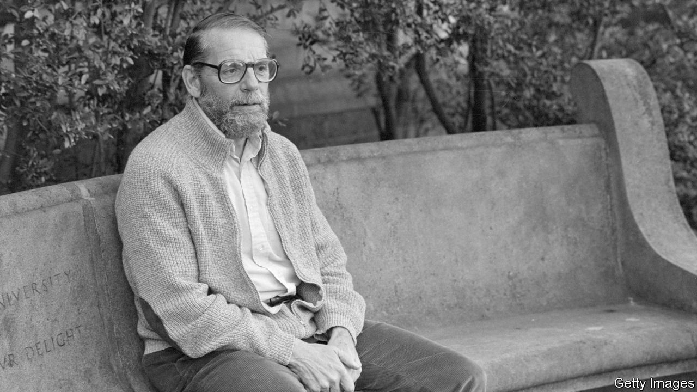

###### A chronicle of stories not told

# John McPhee revisits story ideas he had but never pursued 

##### “Tabula Rasa” is an insightful book by a master of literary non-fiction 

 

> Aug 10th 2023 

 By John McPhee.

To ferret out the best talent, ask practitioners in that field. Attend the doctors’ doctor, seek counsel from the lawyer other lawyers retain. So it goes with journalism. John McPhee, aged 92, is a writer’s writer. A father of literary non-fiction, he has tackled subjects as varied as  and oranges in his 32  and 60 years writing articles for the . His book on geology, “Annals of the Former World”, won the Pulitzer prize for non-fiction in 1999. (He has been a finalist for the prize four times.)

“Tabula Rasa”, Mr McPhee’s latest book, is different from what has come before. It is a compilation of the many “saved-up, bypassed, intended pieces of writing” he flirted with but did not pursue. At the outset, he compares the project to Mark Twain’s autobiography, a series of anecdotes and ruminations dictated in his crepuscular years. Mr McPhee calls his and Twain’s efforts “old-people projects”: attempts to fight mortality by tackling something that defies completion. 

As a young writer, he marvelled at this sort of quest, when Thornton Wilder, an older playwright who left Mr McPhee “moon-, star- and awestruck” at a lunch meeting, described his latest venture. Wilder was cataloguing the 431 surviving plays of Lope de Vega, a Spanish playwright born in 1562. “Why would anyone want to do that?” a perplexed Mr McPhee asked Wilder. Only now, later in life, does he understand: it was something “to do, and do, and do. It beat dying. It was a project meant not to end.” That is why Mr McPhee specifies that “Tabula Rasa” is only “volume one”. He is already working on the next instalment.

Death appears many times in the book, often in the form of people’s near-misses. At the age of 12, he tried to go ice skating with a young friend, Julian, but his mother forced him to attend church instead. Julian and a friend died that day: their corpses were found with their arms outstretched, frozen in place as they tried to climb out after the ice had shattered beneath them. For many years Mr McPhee tried to work out how to write about Julian, “whose future has remained beside me through all my extending past”.

Not all the almost-never-told stories are so sombre. In “Zoom Laude”, Mr McPhee writes amusingly about his time teaching his  course at Princeton at the start of covid-19, with his students forced to do their “free choice” journalism assignments during lockdown. 

Reading Mr McPhee’s discarded ideas is both informative and personal, a bit like riffling through the waste bin at his desk. Younger journalists will enjoy his chapter on how he finally got started at the , suffering 15 years of rejections before his first article was accepted. He evokes a bygone era of journalism, when businessmen, such as the publisher Henry Luce, were more accessible to the press. Contracts at magazines like the specified that staff writers were simply expected to give their “best efforts”. 

“Kill your darlings” is an often-repeated admonition offered to aspiring writers: authors should cut the phrases and characters that delight them yet are not essential to making a point. Deciding which “darlings” of story ideas should be killed off is rarely discussed when teaching writing, however, even though subject choice is surely the most important decision a writer can make. In “Tabula Rasa” Mr McPhee demonstrates why ideas that animate writers often never lead to anything, perhaps wisely. But, as he explores what might have been, Mr McPhee also proves how enjoyable it can be to spend time with such an expert storyteller—even on short journeys that never led anywhere. ■


