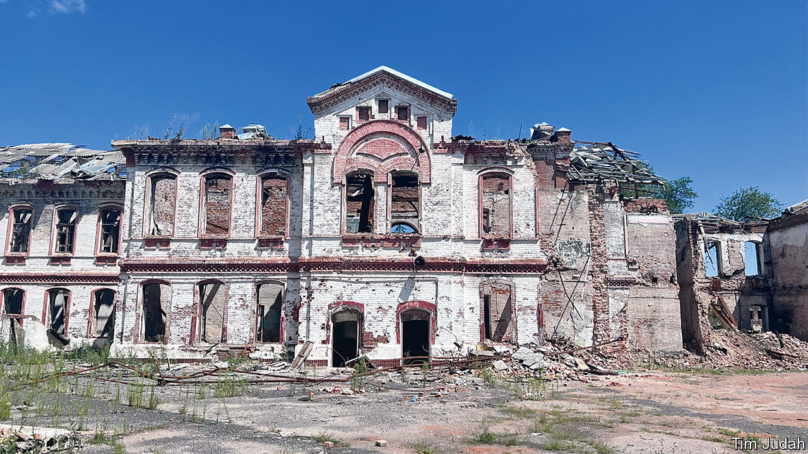
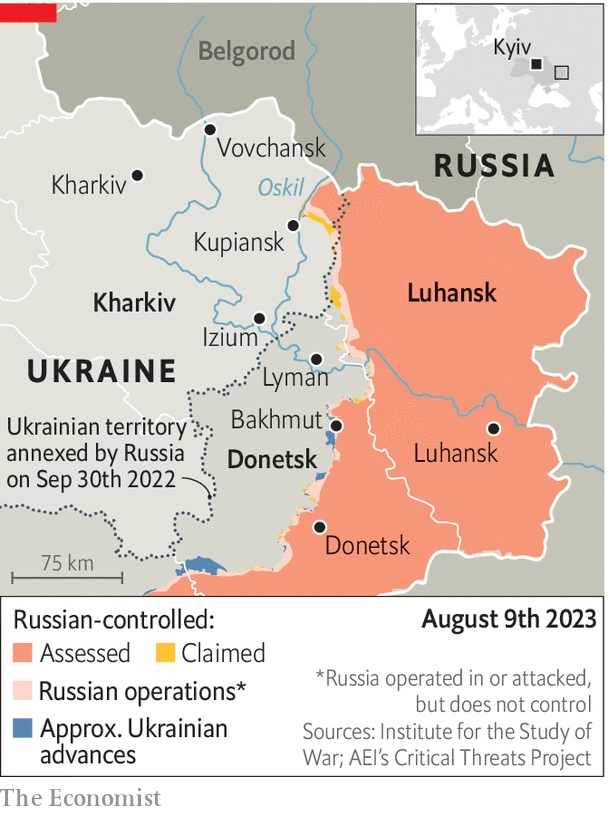

###### Life after occupation

# In north-east Ukraine the war is close, upending daily life 

##### Damage and danger are all around 

 

> Aug 6th 2023 


PEOPLE ACROSS a vast stretch of north-eastern Ukraine face a grim new reality. Much of Kharkiv province was occupied last year by the Russians before being liberated in September. Yet few of those who fled have returned. Those who have, or who never left, find themselves in smashed-up towns or spookily empty villages, living in constant fear of missile attacks—and the return of all-out war. 

In recent weeks several hundred evacuees, including 194 children, from the small town of Vovchansk have passed through the city of Kharkiv before being dispatched elsewhere. Their town, now supposedly free, lies hard by a part of the border where, in May, a Ukrainian-sponsored Russian militia made an incursion into Russia’s Belgorod region. Russia has not stopped shelling over the frontier since its forces were driven out of the area, but the attacks have increased since Ukrainian forces began their  in early June. 

Since the Russians were driven back from the suburbs of Kharkiv, the city, Ukraine’s second biggest, has seen a recovery of sorts. Hundreds of thousands of people who fled at the beginning of the full-scale invasion have returned, although around one-third of the city’s original inhabitants have not, says Nataliya Zubar, a political activist. And of the 1.2m people that she estimates are now in the city, 200,000 have been displaced from elsewhere. They may never return to their homes in small towns, where there are even fewer jobs and opportunities than in Kharkiv, or to rural areas, where mines and unexploded ordnance have made it dangerous to farm. 

 


Another reason that people are not returning is schooling. In Kharkiv, where all education has been online since the invasion began, there is a fierce debate about whether to allow some in-person teaching to resume in September, even though most schools lack proper shelters. 

In Izium, 125km south-east of Kharkiv, there is no such discussion. Volodymyr Matsokin, the deputy mayor, says that four of the town’s nine secondary schools have been destroyed and the rest so badly damaged that they cannot function. In the playground of the once-elegant School 4 (pictured), opened in 1882 and now just a shell, weeds are the only life. But unreliable internet services in front-line towns means that online schooling for the children that remain is a patchy affair. 

On the roads there is a constant flow of troops moving to and from the front. Most people on the streets in Lyman (13km from the current front line) and Kupiansk (7km) are soldiers. Municipal and apartment buildings lie in ruins. There is little work; many of those that remain rely on meagre pensions and social-security payments. 

The fear that began with the invasion has not dissipated with liberation. In Lyman, a Grad missile-launcher speeds through town. Ten minutes later missiles streak overhead towards Russian lines. Outgoing artillery can be heard on the outskirts of Kupiansk. Retaliation can come at any time. On August 5th the Russians struck a blood-transfusion centre there. 

In Izium, Olena and Ala, both in their 70s, sit on stools selling fruit and vegetables they have grown to eke out a living. During the occupation they were too frightened to leave their homes. Now business is poor because there are so few people in town. Ala’s husband was ill and died a week after the Russians arrived. Olena’s husband catches fish, which she dries, salts and sells. Her block was almost empty during Russia’s occupation. Even now, she says, only a third of the flats have anyone in them. 

In Lyman your correspondent encounters Valentin, an electrical engineer. Returning home from his shift along an otherwise empty street where half the windows are boarded up or broken, he says that power has at least been restored to all homes. But there would not be enough for industry, he says, if there were any. 

Of some 25,000 people in Lyman before the invasion, just 7,000 are estimated to remain. Before the war about half of the population was pro-Russian, says Valentin. But the “anarchy” of the occupation, when the town was garrisoned by drunken, ill-disciplined troops lusting for loot, turned many of them against Russia, he says. And some of those who continued to support the Russians left town when Vladimir Putin’s troops retreated.

Soldiers in Kupiansk and Lyman say that though the lines in this region have not moved much, morale is holding up. But it is becoming clear to all that the war will . Recent battles have been particularly bloody. Ukraine does not give casualty figures, but Daniil Zhmuidov, a combat medic, says he believes that 1,500 soldiers died in the Lyman sector alone in the first two weeks of July. 

Andrey, a soldier in Lyman waiting by his car to be told where he should deploy next, readily admits to frustration that the counter-offensive is not yielding rapid advances. Unrealistic expectations were built up by people like Kyrylo Budanov, Ukraine’s military-intelligence chief, he says. It would have been better “not to say anything” rather than risk disappointment. Andrey was a musician in Kyiv before the invasion. “But this is our new life,” he says. “We have to accept it.” ■


