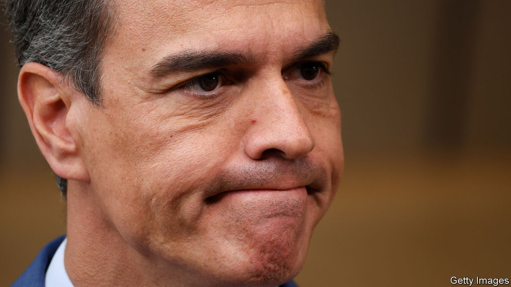
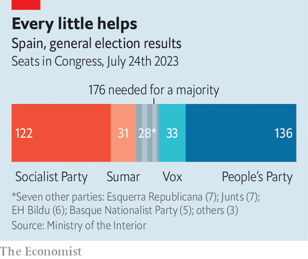

###### When friends just can’t be found

# Pedro Sanchez struggles to form a new government in Spain 

##### Can the country be governed without the support of those that want to break it up? 

 

> Aug 7th 2023 

HARDLY ANYONE predicted a near-, and yet the Socialists of Pedro Sánchez, the prime minister, and the opposition centre-right People’s Party (PP) ended up taking about a third of the vote each on July 23rd. Even with their preferred coalition partners, Vox for the PP and Sumar for the Socialists, both are however short of a majority. So small parties, nearly all of which lost seats, now hold the key to governing Spain again, and the hunt is on for allies.

No significant party beside the PP will vote to create a government that includes, or depends on the support of, , leaving the PP without any obvious routes to reaching a majority. Mr Sánchez and Sumar, his radical-left partner party, are trying to bring five regional parties together to support him as prime minister for another term. Four of these are separatist. Spain, in other words, cannot be governed without the support of those who want to break it up. 

 


The Basque parties are the more straightforward ones to deal with. EH Bildu, a left-wing party that is the heir to the political wing of ETA, a disbanded separatist terrorist group, has already offered its support to Mr Sánchez, saying it would do so to keep the far right out of power. The Basque Nationalist Party, though committed rhetorically to independence, are a pragmatic bunch that have done well, running the region for most of the post-Franco era and winning favourable treatment for its residents. Both these parties helped Mr Sánchez after the previous election, when he also formed a minority government.

The two  parties are more problematic. They held an unconstitutional independence referendum in 2017. Madrid temporarily revoked Catalonia’s autonomy, and jailed some of its leaders. Others went into exile. Mr Sánchez has since pardoned nine of those leaders, and reformed the penal code to remove the crime of sedition. But the separatists think that progress on their demands has now stalled, and are trying to take advantage of their new bargaining power to restore it.

Esquerra Republicana, which currently runs the region, is the more pragmatic of the two parties. It supported Mr Sánchez’s appointment last time. Before taking a summer break, Pere Aragonès, the regional president who hails from the party, held a press conference in which he hinted at what more he might want in exchange for Esquerra’s continuing support for the prime minister.

One major subject of concern is financing. Catalonia owes around €71bn ($78bn) to the central government. And on the same day María Jesús Montero, the national finance minister, hinted at a reform of territorial financing. Some kind of write-off of that debt is in theory possible. But as soon as the idea was floated, other regions began clamouring for the same. 

In an effort to generate goodwill, Yolanda Díaz, the leader of Sumar, has floated another proposal: to allow the use of regional languages alongside Spanish in the Congress of Deputies, the lower house of parliament. They are already allowed in the Senate. Letting them into the more powerful Congress would be a recognition of Spain’s diversity. It would also annoy Spaniards of a nationalist bent. But that might be a small price to pay if it worked.

The separatists’ fundamental goals, though, remain out of reach. They are an amnesty for everyone involved in the referendum (many are still awaiting trial), and a new referendum. Both aims are shared by Esquerra and Junts, the other Catalan separatist party. But Junts is the more intractable. It is still led by Carles Puigdemont, who called the referendum in 2017 and now lives in exile in Belgium, where he serves as a member of the European Parliament. 

Junts did not support Mr Sánchez when he formed his previous government. And before the elections, Mr Puigdemont said flatly that “Sánchez will not be prime minister with the votes of Junts.” Now he seems to be weighing his options (and enjoying sending cryptic and barbed tweets). Kremlinologists of the party are analysing Junts’ other leaders, who range from purist to pragmatist, wondering who has his ear, and hence whether a deal may be possible. Another referendum is not on the cards (Spain’s constitutional court would again forbid it). So the question is whether some combination of money, language, amnesty and inducements yet unnamed might get a coalition formed. But a government cobbled together in this way would be extremely unstable. ■

