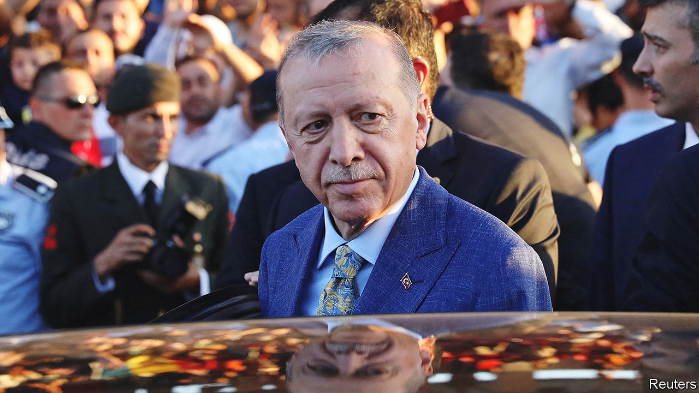

###### Slow turn

# President Erdogan wants to make nice with the West, on his terms 

##### There are limits 

 

> Aug 8th 2023 

LESS THAN three months ago, Turkey’s president, Recep Tayyip Erdogan, was busily accusing America of conspiring to topple his government, talking up his “special relationship” with Russia, and threatening to prevent Sweden from entering NATO. Today, after an unexpectedly easy victory in his country’s presidential elections in May, he is making eyes at the West. Mr Erdogan has  Sweden’s accession to NATO, which he has been blocking for nearly a year, has stepped up his support for Ukraine by openly backing that country’s own dreams of membership of the alliance, and has called on the European Union to resume accession talks with Turkey. He has also courted Western investors by shelving his  of lowering interest rates in the face of rising inflation. 

The recent moves have already begun to pay dividends for Turkey. America seems poised to sell it $20bn-worth of F-16 warplanes and upgrade kits, a deal previously held up by Congress. Joe Biden, the American president, may soon welcome Mr Erdogan, whom he has repeatedly snubbed, to the White House. He and other NATO leaders are also looking to the Turkish strongman to convince Vladimir Putin to reopen the Black Sea to Ukrainian grain exports; a deal negotiated by Turkey to let food exports out has been halted by Mr Putin since July 17th. Mr Erdogan may have a chance to do so later this month, when the Russian dictator is expected in Turkey. Even the EU has made noises about “re-engaging” with Turkey. 

Up to a point

But Mr Erdogan’s overtures, which are more tactical than strategic, and born mostly of economic necessity, do not amount to a reset. Europe’s diplomats play down any chances of a genuine rapprochement as long as Mr Erdogan continues to bully and lock up his critics, to allow corruption to thrive, and to suborn state institutions. Turkey’s leader sees no need to tackle or even to acknowledge any of the above difficulties. “Turkey has no problems with democracy, rights and freedoms,” he said at a recent NATO summit held in Lithuania. 

Turkey’s relations with America are indeed improving, but this is because, as with the EU, they had almost reached rock bottom. Turkish officials chafe at continuing American support for Kurdish insurgents in Syria, whom Turkey considers terrorists. American ones berate Turkey for having enabled Islamic State to set up a caliphate on its doorstep, and for buying weapons from Russia. Sentiment towards Turkey is no warmer in Brussels. Mr Erdogan has attempted to trade his backing for Sweden for progress in Turkey’s stalled accession talks with the EU. But nothing of the sort is about to take place. The best Turkey can hope for with Mr Erdogan at the helm, analysts and European diplomats say, is an upgrade to its existing customs union with the EU, and even agreeing on that may take years. At the very least, European leaders ought to involve Turkey in discussions on foreign policy, suggests Selim Yenel, a former Turkish ambassador to the bloc. So far, they have declined to do so. “They don’t want to offer Erdogan any gifts,” he says. “But they will have to live with him for the next five years.”

Turkey’s return to economic orthodoxy has also been half-baked. The end of an exceptionally loose period of monetary policy that saw inflation approach triple digits last autumn has been less dramatic than expected. Over the course of two months, the central bank, headed by its new governor Hafize Gaye Erkan, has increased interest rates by a cumulative nine percentage points, far less than market-watchers prescribed. Combined with the slowdown in the bank’s sales of foreign reserves, which had propped up the Turkish lira ahead of the elections, this has triggered another currency rout. The currency has lost almost a quarter of its dollar value since the vote, while inflation, which had slowed in the first half of the year, has shot up again, to 48% year-on-year in July. Mrs Erkan herself sees it climbing to 58% by the end of the year, more than double the bank’s previous forecast. But incremental changes are better than no changes at all. Western investors, who had stayed away from Turkey for years, are trickling back in, albeit cautiously. Foreigners have bought $1.8bn of Turkish stocks since early June.

Mr Erdogan has also raised eyebrows by taking a more hawkish line on Ukraine. Days before the NATO summit in July, he told the country’s president, Volodymyr Zelensky, whom he was hosting in Turkey for the first time since the start of Russia’s invasion, that Ukraine “deserves NATO membership”. He also angered the Russians when he allowed Mr Zelensky to return home with five Ukrainian commanders previously captured by Russian troops in Mariupol and transferred to Turkey as part of a prisoner swap. Mr Erdogan had earlier promised Mr Putin the men would remain in Turkey until the end of the war. 

Before the elections, Mr Erdogan could not afford to antagonise Russia, which gave him a hand by postponing gas payments and by wiring billions in cash to finance Turkey’s first nuclear power plant. Now, however, Turkey’s leader feels less vulnerable to pressure from Russia, says Emre Ersen, an academic at Marmara University. Mr Putin might not like what he has been seeing from the Turkish leader of late, says Mr Ersen, but there is not much he can do to push back. Turkey is a key destination for Russian exports, tourists and oligarchs, as well as a potential mediator in talks with the West. 

But this does not mean a pivot away from Russia, either. After two decades in power, Mr Erdogan has perfected the art of transactionalism. He has turned Turkey into a “swing state in international politics”, says Soner Cagaptay of the Washington Institute. That is why any talk of a return to the West is misplaced. Mr Erdogan’s Turkey no longer perceives itself as part of the Western bloc, but as an autonomous actor, able to do business with whomever it wants. “If its interests align with Russia, it works with Russia,” says Mr Cagaptay, “and if its interests align with the US, it works with the US.” ■

