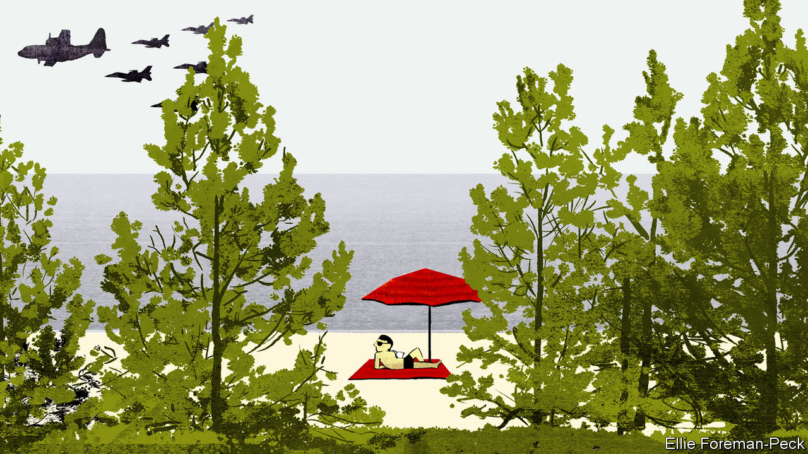

###### Charlemagne

# The Baltic is delighted to be a NATO lake 

##### It is rich, happy and dynamic, particularly on its post-communist eastern shores 

 

> Aug 10th 2023 

Soaking up the midsummer sun at Lazy Beach, a stripe of white sand as delicious as its name, Charlemagne was blissfully unaware of a looming danger. Alarmingly near to this idyll on the Polish shore of the Baltic Sea the armies of four hostile eastern states—Cinereus, Griseus, Murinus and Plumbeus—had stormed into central Germany. Spearheaded by commandos of the notorious Brückner organisation, the invading horde was now thundering north towards the Baltic. Even as pale flesh pinkened, children splashed and a breeze tickled the tall pines in the forest behind the Lazy dunes (in fact it has a crossed L, so the proper pronunciation of Plaża Łazy is PLAH-zha WAH-zi), some 250 NATO warplanes roared into the cerulean heavens to smash the intruders. 

The invasion was, of course, a fantasy, though not of Charlemagne’s making. It was NATO’s own boffins who conjured up this imaginary invasion, setting the scene for a giant war game. Staged across northern Germany in mid-June and involving some 10,000 airmen from 25 countries, Air Defender 23 was the alliance’s biggest-ever air exercise. 

For decades, such an invasion from the east seemed all too plausible. During the cold war the Western alliance was hopelessly outgunned in the Baltic region. NATO planners assumed that neutral Sweden and Finland would sit warily by as a superior Soviet, East German and Polish flotilla ferried communist troops onto Danish and West German beachheads. 

All that changed when the Berlin Wall came down. In 1990 East Germany vanished. Nine years later Poland joined NATO. In 2004 formerly Soviet-occupied Estonia, Latvia and Lithuania followed suit. Finland jumped on board in April and Sweden is clambering up the ladder as fast as it can. Long the dominant power in the Baltic region, Russia now occupies barely a tenth of the sea’s 8,000km (5,000 mile) shore—and a lot of that frontage is made up of soggy estuarine islands. True, its second city, St Petersburg, remains the biggest on the Baltic. But Russia’s other bit of seashore, the enclave of Kaliningrad, a wedge of former German East Prussia squeezed between Poland and Lithuania, is a strategic dead loss, militarily sustainable only through nuclear threat. In reality the Baltic Sea is now  to NATO as much as the Mediterranean was to ancient Rome.

For this Russia can only blame itself. Had it not invaded Ukraine, the formidable forces of Sweden and Finland might never have joined the Western allies. Kaliningrad would have been reachable by road, instead of the narrow air corridor across the Baltic that its residents have had to rely on since their NATO neighbours closed the border crossings. And exercises like the one that disturbed Charlemagne’s summer rest might have become a thing of the past.

Vladimir Putin, Russia’s leader and something of a history buff, could have read a few more books. This is not the first time that Russian aggression in Ukraine and the Black Sea has bounced back to hit it in the Baltic. In the mid-19th century Russian encroachments into the Ottoman Empire caused growing alarm in Britain and France. But when the allies acted to contain Russia, launching what became known as the Crimean war, the first place they struck was not in the south. Their gunboats took advantage of the hostilities to destroy Russian fortifications in the Baltic, putting a stop to more than a century of Russian expansion to the west. 

Why this interest in a cold, blustery inland sea? The fact is that for the past millennium the Baltic has been nearly as crucial and contested a trading link as the Mediterranean. The Hanseatic League, an archipelago of independent German-speaking trading cities spread across the sea’s southern shore, prospered by dealing in timber, twine, grain, metals and wool, among other things. For centuries Denmark was a regional superpower, its claim to  only eclipsed by a rising Sweden in the 17th century. But Sweden’s warrior king, Charles XII, got cocky, marching all the way to Ukraine to undercut the rising might of Russia’s Peter the Great. Charles’s catastrophic defeat at Poltava, south-west of Kharkiv, in 1709 heralded Russia’s emergence as an empire. On the Baltic it captured Estonia and half of Latvia in 1721, the other half and Lithuania in 1795, and Finland in 1809. Germany’s unification in 1871 produced a powerful competitor, since it happened to own most of the sea’s southern shore. But Germany blew its chances in two ghastly world wars. 

The next Med

Not far off the pretty shore of Lazy Beach lie the wrecks of the , the  and an ocean liner, the  . These number among the 158 merchant vessels that Soviet pilots and submariners managed to sink in 1945 as the dying Third Reich evacuated some 1.2m civilians and soldiers from East Prussia to escape the Red Army’s advance. On their final voyages the three ships carried, respectively, 4,500, 7,000 and 10,600 crammed passengers, nine-tenths of whom drowned.

Short of a nuclear war, that kind of thing seems unlikely to happen again any time soon. Excluding Russia, the Baltic just now is not only strong and peaceful but also rich, happy (Denmark and Finland have for years topped global indexes of life satisfaction), and dynamic, particularly on the sea’s post-communist eastern shores. Just watch tourists off their cruise ships gawp at the cute little robot couriers and street cleaners that trundle through the charming, spotless streets of Tallinn, Estonia’s capital. 

Dozing off on Lazy Beach, Charlemagne recalls that scientists say that by the end of the century surface temperatures in the Baltic may rise two or even three degrees centigrade on average. But this is a sweet dream: to complete the lovely setting of forest and sand, a plunge into the new  promises not a sharp ice-bucket challenge but a cooling, gentle embrace. Like the Mediterranean but without the clutter. ■


