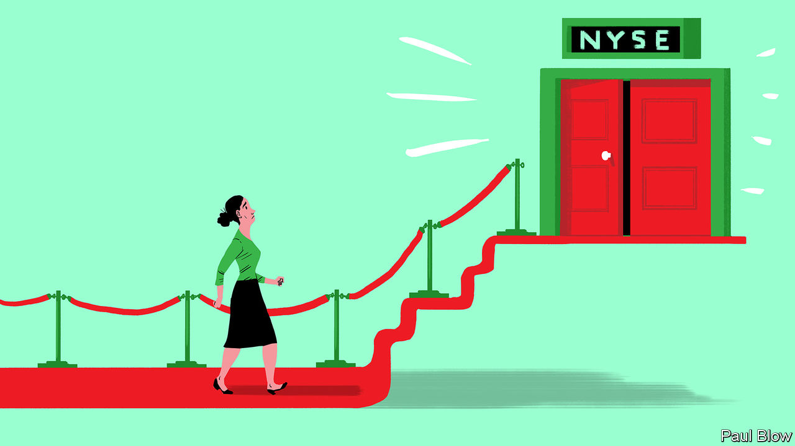
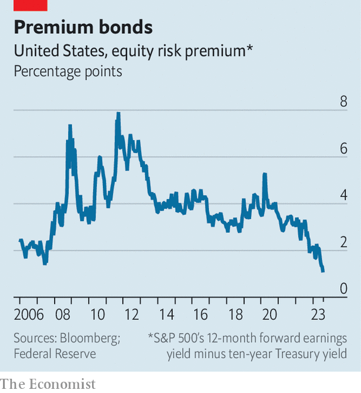

###### The risk-on rate

# American stocks are at their most expensive in decades 

##### Are they worth the cost? 

 

> Aug 10th 2023 

Try a little, and it is never too hard to argue that the stockmarket looks risky and a crash must be coming. But in the long run such arguments are usually best ignored. Since 1900 American shares have posted an average real return of 6.4% a year. Over three decades, that would transform the purchasing power of $1,000 into $6,400. Bonds, the main alternative, do not come close. With an average historical return of 1.7% a year, they would generate a measly $1,700. Cash would do worse still.

The lesson for today’s investors, many of whom were caught out by this year’s bull market, might seem obvious. Forget about a downturn that may or may not materialise. Just buy and hold stocks, and wait for returns that will erase any number of brief dips. Unfortunately, there is a catch. What matters today is not historical returns but prospective ones. And on that measure, shares now look more expensive—and thus lower-yielding—when compared with bonds than they have in decades.

Start with why stocks tend to outperform bonds. A share is a claim on a firm’s earnings stretching into the future, which makes returns inherently uncertain. A bond, meanwhile, is a vow to pay a fixed stream of interest payments and then return the principal. The borrower might go bust; changes to interest rates or inflation might alter the value of the cash flows. But the share is the riskier prospect, meaning it needs to offer a higher return. The gap between the two is the “equity risk premium”—the 4.7 percentage points a year that stocks have historically earned over bonds.

 


What of the next few years? Estimating the return on a bond is easy: it is just its yield to maturity. Gauging stock returns is trickier, but a quick proxy is given by the “earnings yield” (or expected earnings for the coming year, divided by share price). Combine the two for ten-year Treasury bonds and the s&amp;p 500, and you have a crude measure of the equity risk premium that looks forward rather than back. Over the past year, it has plummeted (see chart).

Now consider the equity risk premium’s moving parts: earnings, Treasury yields and share prices. Both expected earnings and Treasury yields are roughly where they were in October, when share prices hit a trough. But since then shares have risen a lot, shrinking their earnings yield and bringing it closer to the “safe” Treasury yield. This might mean three things. Investors might believe earnings are about to start growing fast, perhaps because of an ai-fuelled productivity boom. They might think earnings have become less likely to disappoint, justifying a lower risk premium. Or they might fear that Treasuries—the benchmark against which stocks are measured—are now more risky.

Sustained earnings growth is the dream scenario. The second option, though, is less rosy: that investors have let their revived animal spirits get ahead of them. Ed Cole of Man Group, an asset manager, argues the squeezed equity risk premium is a bet on a “soft landing”, in which central bankers quash inflation without a recession. This has become easier to envisage as price rises have cooled and most countries have so far avoided downturns. Yet surveys of manufacturers still point to recession in that sector, and the full dampening effect of rate rises may not yet have been felt. 

The third possibility is that, rather than cooing over stocks, investors are shunning the alternative. Last year was the worst for bonds in both America (where they lost 31% in real terms) and across developed markets (a 34% loss) in over a century.

After that, says Sharon Bell of Goldman Sachs, a bank, it is unsurprising if some investors are wary of bonds and inclined to splurge on shares, especially if they believe inflation has moved structurally higher—something shares, as claims on nominal earnings, protect against, whereas bonds, deriving value from fixed coupons, do not. At the same time, governments are set to issue ever more debt to cover ageing populations, defence spending and cutting carbon emissions, while central banks have disappeared as buyers. Higher bond yields, and a mechanically lower equity risk premium, will be the result. This would imply a regime change, to one where the equity risk premium has shifted lower for the long term (rather than temporarily, to be corrected by a fall in share prices). 

Whatever the reason for the squeeze, investors have now placed their bets on rising profits. In a recent analysis, Duncan Lamont of Schroders, an investment firm, compared returns on the s&amp;p 500 going back to 1871 with the yield gap against ten-year Treasuries. He found the relationship “has not been helpful in giving a steer on short-term market movements”. Over the longer term, though, there is a clear link. For stocks starting with a low yield gap to do well over ten years, “a near-condition has been real earnings growth”. Animal spirits can only take you so far before earnings must deliver. They would not have to slip far for even a long-term investor to conclude today’s market is too pricey. ■


