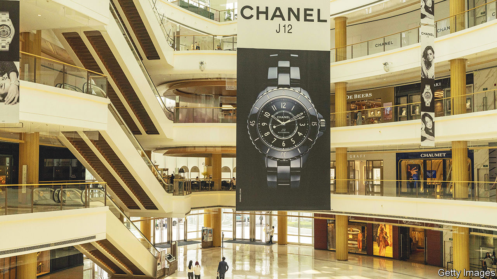
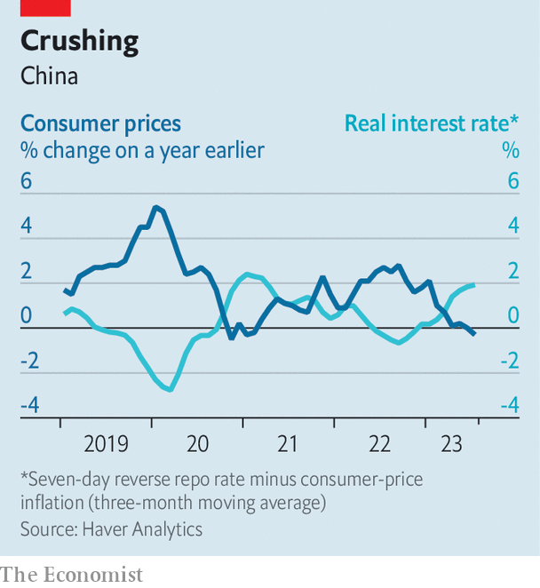

###### A pointed threat

# Deflation and default haunt China’s economy 

##### To stop consumer prices falling, the country must stop property sales flagging 

 

> Aug 10th 2023 

It can sometimes be difficult to wrap one’s head around the world’s second biggest economy. But three headlines in the space of two days—August 8th and 9th—captured the predicament that China now faces. Exports fell by more than 14% in dollar terms. , one of the country’s biggest property developers, missed two coupon payments on its dollar bonds. And annual consumer-price inflation turned negative. In sum: China’s export boom is long over. Its property slump is not. And, therefore, deflation beckons.

Ever since China imposed its first brutally effective  in early 2020, its economy has been out of sync with the rest of the world’s. When the country abandoned its ruinous zero-covid controls at the end of last year, many economists hoped that the exceptionalism would continue, and that China would stage a rapid recovery, even as other big economies courted recession. The expectation also raised a fear. Analysts worried that China’s renewed appetite for commodities and other goods would put upward pressure on global inflation, making the lives of central bankers elsewhere even harder. Neither the hopes for growth nor the fears of inflation have been realised.

Instead, China is now struggling to meet the government’s modest growth target of 5% for 2023 (“modest” because last year provides such a low base for comparison). Far from becoming an inflationary force in the global economy, the country is now flirting with falling prices. 

According to the data released on August 9th, consumer prices dropped by 0.3% in July compared with a year earlier. Viewed in isolation, that is no great cause for alarm. A solitary month of mild deflation is not sufficient to turn China into the next Japan. Consumer inflation has been negative before—in 30 months this century, and as recently as 2021. Moreover, July’s figure says almost as much about pork’s past as it does about China’s economic future. Prices for the country’s favourite meat were unusually high in July last year. They have since fallen by a quarter, contributing to the negative headline number. 

But consumer prices are not the only ones in the trough. The prices charged by producers (at the proverbial “factory gate”) have now declined year-on-year for ten months in a row. Those fetched by China’s exports dropped by more than 10% in July, according to estimates by analysts at ubs, a bank. And the gdp deflator, a broad measure that covers all the goods and services produced in the country, fell by 1.4% in the second quarter compared with a year earlier. That is only its sixth decline this century and its steepest since 2009. 

Many economists foresaw the drop in pork and food prices. They assumed, however, that it would be offset by a faster increase in the cost of services, as China’s economy gathered steam. They also expected that the property market would stabilise, which would prop up demand for other goods, both upstream (in products such as steel and construction equipment) and down (in those such as furniture and household appliances).

After a brief revival in the early months of the year, property sales are faltering again. Those in 30 big cities fell by 28% in July compared with the year before. Declines in rents and the prices of household appliances both contributed to the negative turn in consumer prices in July. Country Garden also blamed “a deterioration in sales”, among other things, for its failure to pay its bondholders on the expected date this month. The company has a 30-day grace period before it falls into default.

 


China’s government is also now up against the clock. In recent weeks a rotating cast of committees, ministries and commissions has unveiled a variety of measures to improve the economy. A 31-point plan to encourage private enterprise announced that the government would remove barriers to entry and strengthen intellectual-property rights. A 20-point plan to expand consumption touted cheaper tickets for scenic spots, among other goodies. A 26-point plan to increase labour mobility promised to make it easier for rural migrants to settle in cities (and easier for foreign businesspeople to get visas).

Yet if the property market does not improve, deflationary pressure will persist. The longer it lasts, the more difficult it will be to reverse. Thus a more forceful fiscal and monetary push is required. ubs calculates that the government’s deficit, broadly defined, shrank in the first half of this year, providing less support to the economy. Meanwhile, the central bank has barely cut interest rates, reducing its short-term policy rate from 2% to 1.9%. That is not enough to keep up with the decline in inflation, which means the real cost of borrowing is rising (see chart). In order to defeat deflation, the budget deficit will have to widen. And the central bank’s efforts will need to go beyond 0.1 point. ■


