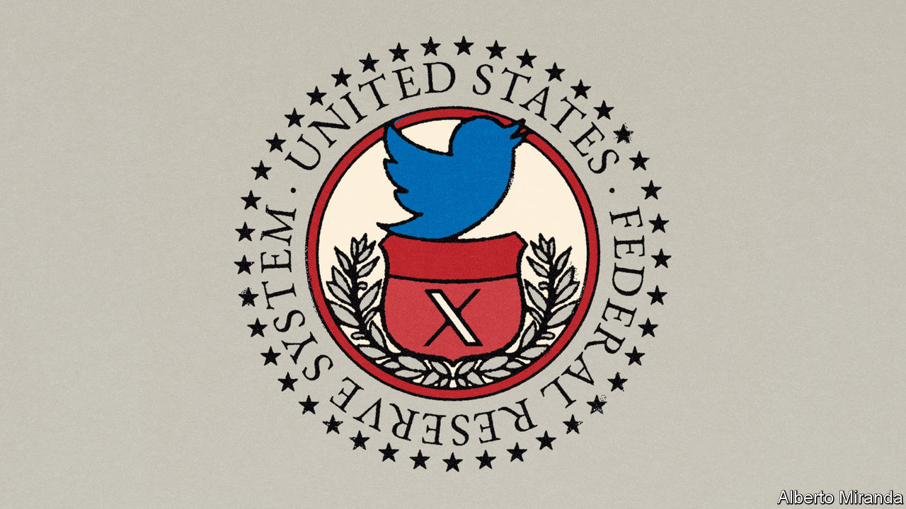

###### Free exchange

# Elon Musk’s plans could hinder Twitternomics 

##### The site now known as X is extremely helpful to researchers 

 

> Aug 7th 2023 

Elon Musk is no fan of the Federal Reserve. At least a dozen times over the past year the owner of X (a firm until recently known as Twitter) has savaged America’s central bank for . Last December, for instance, he tweeted that its hikes might go down as the “most damaging ever”. But Mr Musk’s disdain for the Fed is not mirrored by the Fed’s attitude towards X. On the contrary, the central bank’s researchers rather like the website, treating it as a compelling barometer of the economy.

This puts X in a peculiar position. Its value as a business remains dubious, which is why Mr Musk has been scrambling to remake it, with changes including (but not limited to) the company’s name. But its value to the economy is a different story altogether. The firm can serve as a timely indicator of both fundamental trends and market sentiment.

There is a large, growing literature on how to decode economic signals from social-media sites, ranging from Facebook to Reddit. Yet even in the sea of online information and commentary, Mr Musk’s stands out. Others simply cannot match its volume and frequency. By 2013 Twitter users were already producing more than 5,700 posts in a second. By 2016 Instagram’s larger user base was producing only 1,000. Three papers recently published by the Fed explore the platform’s economic contributions. 

The first is as a predictor of markets. Sentiment gleaned from tweets seems to be rather good at presaging short-term movements in both share prices and bond yields. In one paper a group of economists including Francisco Vazquez-Grande sifted 4.4m finance-related tweets posted between 2007 and April 2023 to create a Twitter Financial Sentiment Index. They used a machine-learning model to measure each tweet’s sentiments: a message about stocks going to the Moon would be positive; Mr Musk’s quips about the Fed would presumably count as negative.

The index, they find, correlates tightly with corporate-bond spreads (the difference between yields on corporate and government bonds, which usually widens as investors turn pessimistic). More than merely shadowing financial movements, posts can even foreshadow them. The overnight index before the stockmarket’s open dovetails with the coming day’s equity returns. A separate paper by Clara Vega and colleagues finds that the website’s sentiment also closely tracks Treasury yields. Indeed, the correlation is stronger with tweets than with sentiment measures gleaned from the Fed’s own official communications.

A second use of tweets is as a gauge of economic conditions. Posts about job losses in particular seem to offer timely information about the labour market. Tomaz Cajner and co-authors construct a separate machine-learning model to digest posts with keywords such as “lost job” or “pink slip”. Their measure of job losses mirrors official data on employment levels from 2015 to 2023. This correlation is potentially powerful because most government statistics appear with a lag, whereas the tweets are available immediately. Twitter, for example, would have provided a ten-day advantage in detecting the collapse in employment at the height of the covid-19 pandemic in 2020.

The Fed papers also see a third use for tweets: as a bellwether of sorts for monetary policy. Ms Vega and colleagues find that the social-media site fares better than changes in bond yields in predicting monetary-policy decisions on the day of their announcement. The Twitter sentiment index, meanwhile, is good at anticipating shocks from tighter policy such as rate increases. Tweets tend to turn sour just ahead of these moves. (That the website wastes no time in turning bitter will come as little surprise to regular users.)

No one is about to ascribe powers of causation to X. The social-media posts instead reflect broader feelings that are already coursing through financial markets. Still, the cornucopia of tweets does provide an additional way of measuring such sentiment, which, if proved valid over time, would be highly valuable.

Beyond the Fed, some analysts are also finding other potential applications. Agustín Indaco of Carnegie Mellon University in Qatar calculates that the volume of tweeting alone can account for about three-quarters of cross-country variation in GDP. Rather like satellite images of night lights, tweets may therefore be a way of observing economic health without relying so heavily on tardy official statistics. This metric may work best in poorer countries, where heavy posting on social media would be a proxy for the state of telecommunications and use of smartphones.

Marking the spot

If X is so economically useful, why is it not more lucrative? The various papers do not venture so far as to examine the gulf between Twitter’s struggle for profitability and its evident utility—not just as an economic tool but as a platform for sharing information, opinions, jokes and more. Mr Musk was onto something when he described the firm as a “common digital town square”. The problem in economic terms is that a town square falls into the category of public goods such as parks and clean water. Although public goods can be privately owned, it is notoriously hard to extract profits from them given that, by definition, it is difficult to charge people for all the benefits they confer.

Mr Musk is doing his darnedest to shift the economic equation at X by giving additional privileges to users who pay $8 a month for the site’s blue-check verification. Tweets by users who cough up now receive extra promotion, among other benefits, showing up more often in the feeds of other people on the website. That, however, sets up a trade-off. Paid-for tweets may start crowding out better-informed posts from users who would rather not subscribe to the website. Over time, a website that prioritises payment over credibility will function less well as a town square and, by extension, as an economic indicator. The gain to X’s finances would be a loss to the Fed’s economists. ■


