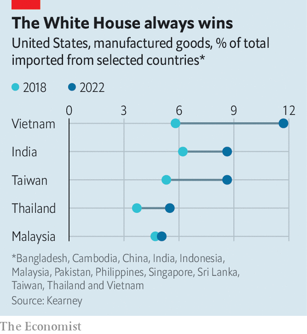
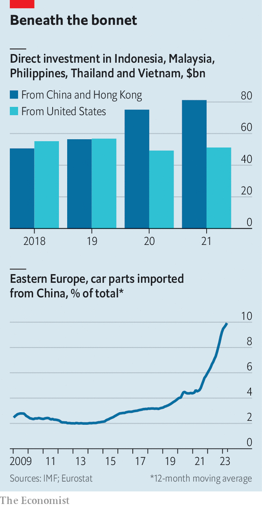

###### Rising tigers, hidden dragon

# How America is failing to break up with China 

##### The countries’ economic ties are more profound than they appear 

 

> Aug 8th 2023 

WHEN IT COMES to tracing the geography of global supply chains, few companies provide a better map than , the world’s largest contract manufacturer. This year the Taiwanese giant has built or expanded factories in India, Mexico, Thailand and Vietnam. The Chinese production sites once loved by Western companies are firmly out of fashion. Souring relations between the governments in Washington and Beijing have made businesses increasingly fretful about geopolitical risks. As a consequence, in the first half of the year, America traded more with Mexico and Canada than it did with China for the first time in almost two decades. The map of global trade is being redrawn.

At first glance, this is almost exactly as desired by America’s policymakers. Under first Donald Trump and then Joe Biden, officials have put in place an array of tariffs, rules and subsidies. The latest arrived on August 9th: an executive order introducing screening for outbound investment, and banning some investment into Chinese quantum computing, artificial-intelligence projects and advanced chips. America wants to weaken China’s grip on sensitive industries and, in a motivation that mostly goes unspoken, prepare for a possible  by its adversary. This attempt to “de-risk” trade with China is the cornerstone of the White House’s foreign policy. Yet despite extensive efforts, and the reshaping of trade seemingly evident in headline statistics, much of the apparent de-risking is not what it appears.

Instead of being slashed, trade links between America and China are enduring—just in more tangled forms. The American government’s preferred trading partners include countries such as India, Mexico, Taiwan and Vietnam, in which it hopes to spur the “friendshoring” of production to replace imports that would have come from China. And trade with these allies is rising fast: just 51% of American imports from “low-cost” Asian countries came from China last year, down from 66% when the Trump administration’s first tariffs were introduced five years ago, according to Kearney, a consultancy. The problem is that trade between America’s allies and China is also rising, suggesting that they are often acting as packaging hubs for what, in effect, remain Chinese goods. This flow of products means that, although America may not be buying as much directly from China as before, the two countries’ economies still rely on each other.

 


For evidence, look at the countries that benefit from reduced direct Chinese trade with America. Research by Caroline Freund of the University of California, San Diego and co-authors investigates this dynamic. It finds that countries which had the strongest trade relationships with China in a given industry have been the greatest beneficiaries of the redirection of trade, suggesting deep Chinese supply chains still matter enormously to America. This is even truer in categories that include the advanced manufacturing products where American officials are keenest to limit China’s presence. When it comes to these goods, the share of American imports arriving from China declined by 14 percentage points between 2017 and 2022, whereas those from Taiwan and Vietnam—countries that import heavily from China—gained the greatest market share. In short, Chinese activity is still vital to the production of even the most sensitive products.

Exactly how the rerouting works in practice differs across countries and industries. A few products can be sourced only in China. These include some processed rare earths and metals where Chinese companies dominate entire industries, such as the gallium used in chip production and the lithium processed for electric-vehicle batteries. Sometimes exports to America and the rest of the West from their allies are nothing more than Chinese products that have been repackaged to avoid tariffs. Most often, though, inputs are simply mechanical or electrical parts that could be found elsewhere at greater cost by an assiduous importer, but are cheaper and more plentiful in China. 

Pass the parcel

All three types of phoney decoupling can be found in China’s backyard. The latest official data, published in 2018, concerning exports by the Association of South-East Asian Nations (ASEAN), a regional club, show that 7% by value were actually attributable to some form of production in China—a figure that is probably an underestimate, given how difficult it is to disentangle trade. Fresher data suggest that China has only grown in importance since then. The country has increased its share of exports to the bloc in 69 of 97 product categories monitored by ASEAN. Electronic exports, the largest category, which covers everything from batteries and industrial furnaces to hair clippers, have exploded. In the first six months of the year Chinese sales of these goods in Indonesia, Malaysia, Thailand, the Philippines and Vietnam rose to $49bn, up by 80% compared with five years ago. There is a similar pattern in foreign direct investment, where Chinese spending in crucial South-East Asian countries has overtaken America’s.

Factories farther afield are also humming with Chinese activity, perhaps most notably in the car industry. In Mexico the National Association of Autopart Makers, a lobby group, has reported that last year 40% of nearshoring investment came from sites moving to the country from China. A rich supply of intermediate goods is duly following. In the past year Chinese companies exported $300m a month in parts to Mexico, more than twice the amount they managed five years ago. In central and eastern Europe, where the car industry has boomed in recent years, phoney decoupling is even more conspicuous. In 2018 China provided just 3% of automotive parts brought into the Czech Republic, Hungary, Poland, Slovakia, Slovenia and Romania. Since then, Chinese imports have surged, thanks to the rapid adoption of electric vehicles, where the country increasingly dominates production. China now provides 10% of all car parts imported into central and eastern Europe, more than any other country outside the eu.

Tighter trade links between America’s allies and China are the paradoxical result of America’s desire for weaker ones. Firms panicked by worsening relations across the Pacific are pursuing “China plus one” strategies, keeping some production in the world’s second-largest economy, while moving the rest to countries, such as Vietnam, that are friendlier to Uncle Sam. Yet American demand for final products from allies also boosts demand for Chinese intermediate inputs, and produces incentives for Chinese firms to operate and export from alternative places. Although Apple, the world’s largest company by market capitalisation, has moved production outside China in recent years, this comes with a caveat: much of the production still relies on Chinese companies. The tech giant lists 25 producers in Vietnam on its official suppliers list. Nine are from mainland China.

 


How worried should American policymakers be? In the worst-case outcome—a war in which supplies of goods between China and America are almost completely severed—dealing only indirectly with China or with Chinese firms on the soil of third countries is probably an improvement on Chinese production. Moreover, companies are adapting to security rules so as to reduce costs for consumers. But this also carries risks: a belief that decoupling is under way may obscure just how critical Chinese production remains to American supply chains.

The fact that so much production in Asia, Mexico and parts of Europe ultimately relies on imports and investment from China helps explain why so many governments, particularly in Asia, are at best fair-weather friends to America, at least when it comes to shifting supply chains. If forced to choose between the two countries once and for all, exporters would suffer mightily. A recent study by researchers at the IMF models a scenario in which countries must pick between America and China, with their decision on which of the two superpowers to side with determined by recent voting patterns at the UN. Such a scenario, the researchers calculate, would reduce GDP by as much as 4.7% for the worst-affected countries. Those in South-East Asia would be struck particularly hard.

Given that most countries are desperate for the investment and employment that trade brings, America has been unable to convince its allies to reduce China’s role in their supply chains. Many are content to play both sides—receiving Chinese investment and intermediate goods, and exporting finished products to America and the rest of the West. Ironically, then, the process driving America and China apart in trade and investment may actually be forging stronger financial and commercial connections between China and America’s allies. Needless to say, that is not what President Biden had in mind. ■


