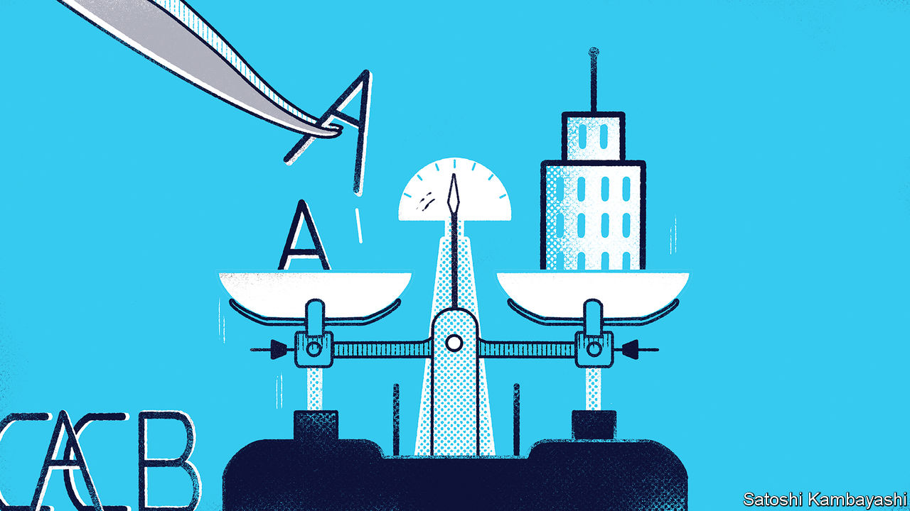

###### Buttonwood

# In defence of credit-rating agencies 

##### The much-maligned institutions have performed well of late 

 

> Aug 10th 2023 

Fifteen years ago, in August 2008, the world’s credit-rating agencies were in the midst of the worst period in their history. The global financial crisis was about to reach its zenith. It was already clear that the allegiances of rating agencies—beholden to both investors in and issuers of debt—had been stretched beyond a healthy limit. The survival of their business model looked uncertain.

In a turn-up for the books, rating agencies have more than survived. Borrowers’ demands to have their homework marked have surged. During the market boom of 2021, Moody’s Investors Service, one of the “big three” agencies, made almost $4bn in revenues, compared with $1.8bn at its peak in 2007. The “issuer pays” business model, in which borrowers are on the hook for having their own bonds rated, creating a conflict of interest for the agencies, has limped on, too, despite endless demands for change. Yet even though they have gone largely unreformed, rating agencies have been on a good run in recent years.

Ironically, rating agencies often spring into the limelight when they are least important. That is what happened on August 1st when Fitch, another of the big three, reduced the American government’s rating from aaa to aa+. After all, agencies do not offer superior expertise when it comes to the analysis of rich countries’ fiscal health. The economic data that they observe is widely watched by everyone else. In 2015 American money-market funds were liberated from having to use credit ratings as their only metric for deciding whether to invest in securities. Funds can now determine, for instance, that a security represents a “minimal credit risk”. This means that downgrades to the ratings of Treasuries matter even less than before.

Companies that provide ratings nevertheless hold two important roles. First, they aggregate, sort and publish information about borrowers, which investors can analyse and use to compare them. Second, they act as a certification stamp on assets. Bank regulators use credit ratings to determine the capital requirements for lenders; funds use them to decide what they should and should not hold. 

Rating agencies have a difficult job: not attracting negative attention is about as good an outcome as they can reasonably expect. During the deep financial distress early in the covid-19 pandemic, they quietly managed just that, as the Committee on Capital Markets Regulation, a panel of researchers from academia, banking and business, concluded when later assessing their performance. In 2020, 198 companies rated by s&amp;p Global Ratings defaulted, the most since the global financial crisis. Whereas 11 investment-grade firms failed to repay their debts in 2009, all of the defaults in the first year of the pandemic happened among companies already labelled as riskier speculative grades. 

The firms did take flak during the demise of Silicon Valley Bank (svb) in March. Both Moody’s and s&amp;p had given svb investment-grade ratings. But the bank’s collapse, which was facilitated by social media, instant messaging and digital-finance apps, was unusually rapid. And the ratings that were awarded to the bank—of a3 and bbb respectively—were far from the highest notches available. Indeed, a downgrade warning from Moody’s the week before svb’s collapse was one of the triggers that revealed the parlous state of the bank’s funding. Rating agencies can be criticised for having been asleep at the wheel, or for prompting the crisis, but hardly both.

Research also demonstrates a continued role for agencies in rating emerging-market government debt. One paper by the Bank for International Settlements, a club of central banks, shows that rating changes still have a big impact on credit-default-swap markets in the emerging world, suggesting that investors retain respect for agencies’ judgments. Another, published by the World Bank, calculates that the effect of credit ratings may even have risen since the global financial crisis. A one-notch improvement in a developing economy’s credit rating in comparison with similar countries raised capital inflows by around 0.6% of gdp in 2009-17, about a third more than in the preceding decade.

Rating agencies are a lightening rod for criticism. Firms that attempt to be the arbiters of risk are bound to get stuff wrong—or worse, play a causal role—during unexpected blow-ups. Even though problems exposed during the financial crisis remain unfixed, rating agencies are still crucial to the working of capital markets. Recently, they have even been doing a pretty good job.■


