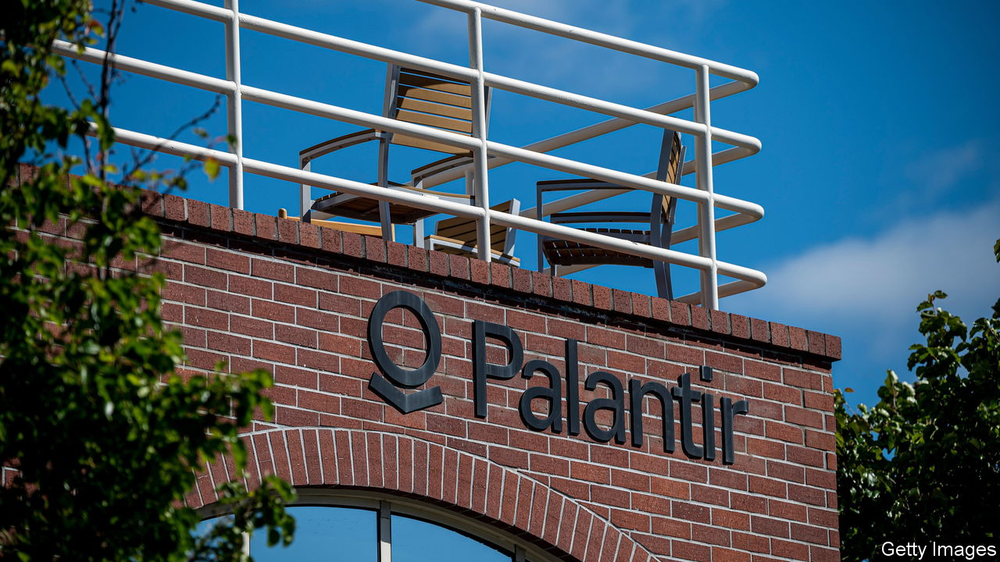

###### Resurrection

# Meme stocks are back from the dead 

##### The stockmarket is booming, but not as much as Reddit favourites 

 

> Aug 10th 2023 

Last year was tough for all investors, but ones that hang out on Reddit suffered more than most. The Roundhill Meme exchange-traded fund, which tracks meme stocks, fell from $70 a share to $25. Fellow travellers in the covid-19 bubble, including non-fungible tokens (which use blockchains to sell digital artefacts) and spacs (blank-cheque initial public offerings), also collapsed, leaving apes (retail investors) with few options but to hodl (hold on for dear life) or cut their losses. 

Proclamations of the death of meme investing may, however, have been hasty. Meme stocks are now shooting past the rest of the market, which has itself surged. The meme index is up by nearly 60% this year, outperforming the s&amp;p 500 by 40 or so percentage points. Returns on individual holdings are more bonkers still, even if some stocks have risen from a low base. Shares in SoFi, a fintech firm, have doubled; the market capitalisation of Palantir, a software-maker, has nearly tripled; stocks in Carvana, a car retailer, are up by 800%. Apes are going all in, some with their entire 401k retirement plans. There is no clearer evidence of a bull market.

 


Some of the rallies, at a stretch, even make sense. Redditors view good news as a burst of rocket fuel for share prices. Carvana, which was teetering on the edge of bankruptcy, has averted a crisis by putting up more collateral in exchange for a debt cut. Palantir is riding the ai wave. A judge in Delaware recently rejected plans to further dilute shareholders in amc, a cinema chain and one of the early meme stocks. 

Other rallies are a little more inexplicable. Soon-to-be worthless shares in Bed Bath &amp; Beyond, a defunct retailer, have more than doubled in the past three months. Tupperware, a struggling home-goods firm, saw its shares jump from 60 cents to more than $4 in late July. Yellow, a bankrupt trucking company, has seen a similar rise in the past few weeks. 

Is this all down to meme investors? Apes did pivot to buying bankrupt companies after Bed Bath &amp; Beyond’s delisting, with some 25m shares changing hands on the average day in July. But they are not wholly to blame. Little to no chatter pops up on Reddit in relation to Tupperware or Yellow. Short-sellers may be the true culprits in these instances: they must buy shares sold short to close their positions. 

In recent days the bull market has cooled a little. Small shifts in major indices produce enormous swings in meme stocks. On August 7th Yellow’s shares dropped by a quarter; Bed Bath &amp; Beyond’s by 7%. Investors who bought earlier this year will still be sitting on big profits. Yet they will need to be careful. hodling could risk some legendary losses. ■


