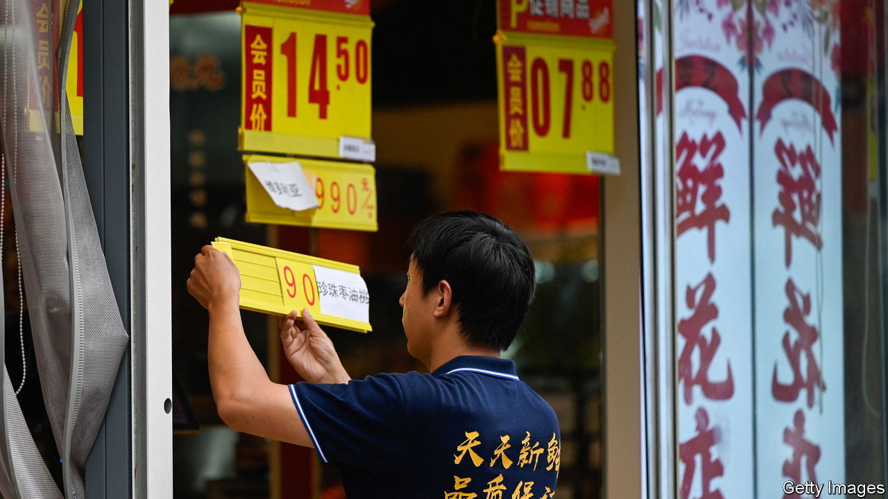

###### Strait-forward

# Can China escape deflation? 

##### Three false dogmas are inhibiting the authorities’ response 

 

> Aug 9th 2023 

FOR THE past two years, policymakers in most of the world’s biggest economies have faced an excruciating stagflationary dilemma. They have wrestled simultaneously with high inflation, which demands steep interest rates, and fears of a recession, which would normally call for policy easing.

 


The exception is China. It is now struggling with both slowing growth and dangerously low inflation: stagnation, not stagflation. New figures show that consumer prices fell by 0.3% in July, compared with a year earlier. Officials were quick to blame volatile food prices. But the deflationary pressure is more widespread. The prices charged by exporters and other producers are tumbling. A property developer’s missed bond payment on August 6th was a stark reminder of China’s ongoing housing slump. And the economy’s “nominal” growth rate (which does not strip out the effects of inflation) has dropped below its real, inflation-adjusted rate. This implies that many prices across the economy are falling.

This combination of slow growth and deflationary peril is troubling. But it is not a dilemma. The textbook response to both problems is stimulus, which should revive spending, lift growth and dispel deflation. Scylla and Charybdis are on the same side of the strait. 

China’s government is seeking to put things right by cutting red tape and setting consumer-friendly regulations, but it has neglected two obvious policy instruments: interest rates and central-government spending. The central bank has cut rates by only 0.1 percentage points. Given falling inflation, the real cost of borrowing is growing. And although the finance ministry wants local governments to issue bonds, it is loth to do more itself. The burden is falling on the most stressed part of China’s fiscal machinery—its local governments and their financing vehicles. 

Several unhelpful beliefs may be inhibiting the central government. First is the view that stimulus is futile. Some economists argue that firms and households will not borrow because they are already saddled with debt and fear for China’s economic future. Yet that only strengthens the case for more forceful fiscal easing, which would stabilise employment, improve the incomes of private borrowers, and thereby relieve feelings of economic insecurity. Moreover, it seems strange to argue that monetary easing cannot work before it has really been tried.

Some of China’s officials also seem to have fallen for the fallacy that you have to reflate a tyre through the puncture hole. Aware that consumer confidence is low, they have zeroed in on such things as extending amusement parks’ hours and making it easier to trade in old appliances. In fact, the best way to bolster confidence and spending is to create jobs and lift wages. And the best way to do that is macro easing, not micro fiddling. 

China’s government may also believe that economic stimulus is at odds with longer-term economic reform. Xi Jinping, its leader, is understandably eager to promote “high-quality” growth—innovative, well-paid, green and resilient—rather than “low-quality” growth, such as spending on redundant infrastructure, cheap manufacturing or speculative homebuilding. China’s policymakers know that past stimulus sprees have left behind unoccupied flats and lightly used roads. 

Yet reform and stimulus need not conflict. Further public investment in green infrastructure—or flood prevention—would both boost demand and help China adapt to a changing environment. Further easing of China’s  restrictions, which were tweaked on August 3rd but still deny some urban public services to migrants from the countryside, would let labour move more freely, and increase consumption. If policymakers do not do more to dispel deflation, China’s growth, of high or low quality, will be needlessly slow. ■

