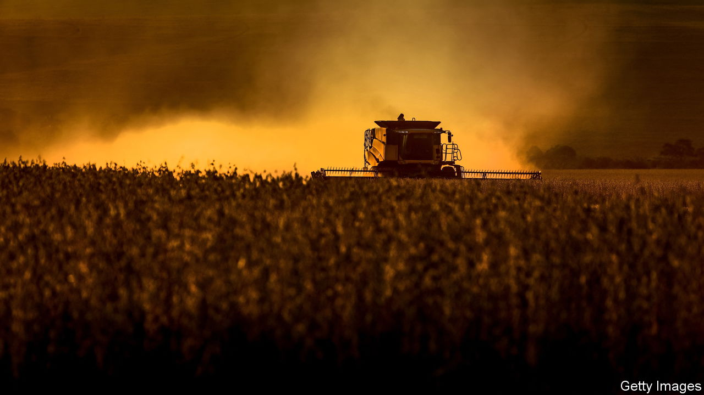
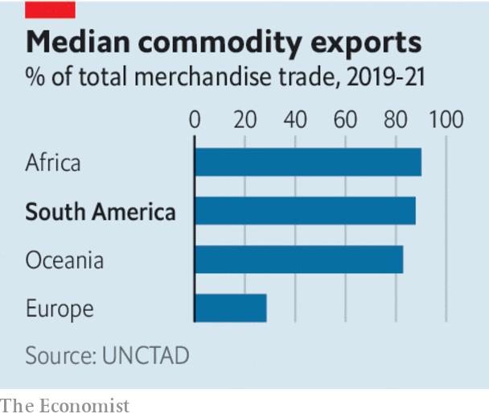

###### Natural resources

# How Latin America could be a commodities superpower 

##### It must not squander the opportunity of the next commodity boom 

 

> Aug 10th 2023 

OVER FIVE centuries Latin America and its 2bn hectares of land have been a vital source of food, fuel and metals for the world. First looted by colonisers for gold, silver, cotton and sugar, it later supplied rubber and oil to Europe and the United States. Now Latin America faces a chance to become the 21st century’s . This time, it must use that chance to boost development at home. 

The transition to clean energy will spark decades of demand for the metals needed to multiply solar and wind parks, power lines and electric cars. Latin America holds more than a fifth of the global reserves for five critical metals. It already dominates the mining of copper, pervasive across green technologies, and holds nearly 60% of the world’s known resources of lithium, used in all main e-vehicle battery types. It is also rich in silver, tin and nickel. And it will benefit even if the green transition sputters, thanks to recent discoveries of oil that could see it quench 5-10% of the global demand by 2030. 

 


As the world goes greener it will also become more populous. By 2050 it may have nearly 10bn mouths to feed, up from 8bn now. That will fuel demand for the carbs, proteins and delicacies that Latin America produces aplenty. It already supplies more than 30% of the world’s corn, beef, poultry and sugar, and 60% of the world’s soyabeans. Eight out of ten cups of the world’s Arabica coffee are made from the region’s beans. By 2032 its net food exports may exceed $100bn, the largest in the world by far. 

The region’s draw as a trading partner will be accentuated by superpower rivalries. As the West scrambles to diversify away from China, it wants more deals with Latin America, a largely neutral and peaceful region. As monied rivals also eye its riches, a new great game is under way: just last month Vale, a Brazilian mining company, sold 13% of its green-metal arm to Saudi-owned entities for $3bn; China earmarked $1.4bn to develop lithium production in Bolivia; and Europe pledged to invest €45bn in Latin American green projects. 

The problem is that Latin America’s affair with commodities has rarely been happy. Past struggles over the spoils have catalysed coups, inequality and populism. Hugo Chávez, a Venezuelan despot, squandered his country’s oil boom, spending lavishly while underinvesting in the industry and stuffing it with cronies. Oil windfalls in Colombia and Ecuador led to premature deindustrialisation. As export receipts have surged, so have domestic currencies, strangling other export industries and tying the region’s fate to a volatile market. Latin America has endured countless booms and busts. Local economies are lopsided: on average, 80% of its countries’ exports comes from the export of raw materials.

To do better this time round, Latin American countries must get several things right. First they need to make sure the boom does indeed take place. At present, politics is holding it back. As left-wingers and populists have gained power, many countries in the region have passed or threatened laws that would raise taxes, nationalise reserves or shut out foreign investment. It is right and proper that governments want to maximise their rents, especially given how often they have been robbed in the past. But if they seek to take too much, or keep changing their minds, their reserves will not soon be tapped.

Sharing the bounty with communities that live near mines is also crucial. Locals complain that extraction endangers their livelihoods. This year protests stopped work for months at a Peruvian copper mine accounting for 2% of the world’s supply. Those communities are frequently ignored by national governments; mining firms have too often been involved in scandals or ruined the local environment. Unless both do more to alleviate grievances, progress will remain precarious. Money, often fought over by local bosses, cannot solve it all. 

And governments should spend their money wisely. When prices are high they should stash some of the windfall in rainy-day funds that they can tap into to prop up state budgets when times get tough. Instead of splashing cash in a bid to build cutting-edge battery factories from scratch, governments should invest in the basics that enable new industries to emerge: education, health, infrastructure and research. The World Bank estimates that Brazil’s infrastructure-financing gap until 2030 is almost $800bn, 3.7% of GDP each year. Latin America has a historic chance to grow out of its resource trap. It should seize it. ■

