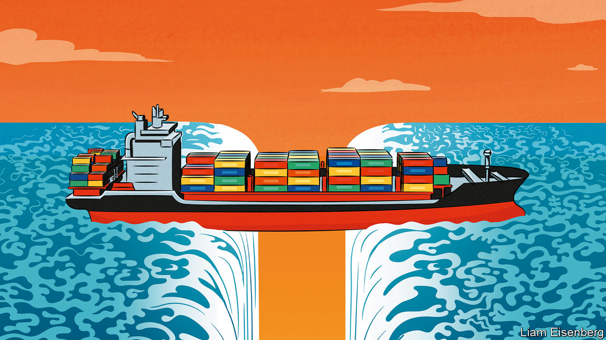

###### Costly and dangerous

# Joe Biden’s China strategy is not working 

##### Supply chains are becoming more tangled and opaque 

 

> Aug 10th 2023 

On August 9th President Joe Biden unveiled his latest weapon in America’s economic war with China. New rules will police investments made abroad by the private sector, and those into the most sensitive technologies in China will be banned. The use of such curbs by the world’s strongest champion of capitalism is the latest sign of the profound shift in America’s economic policy as it contends with the rise of an increasingly assertive and threatening rival. 

For decades America cheered on the globalisation of trade and capital, which brought vast benefits in terms of enhanced efficiency and lower costs for consumers. But in a dangerous world, efficiency alone is no longer enough. In America, and across the West, China’s rise is bringing other aims to the fore. Understandably, officials want to protect national security, by limiting China’s access to cutting-edge technology that could enhance its military might, and to build alternative supply chains in areas where China maintains a vice-like grip. 

The result is a sprawl of tariffs, investment reviews and export controls aimed at China, first under the previous president, Donald Trump, and now Mr Biden. Janet Yellen, America’s treasury secretary, has travelled to Delhi and Hanoi to tout the benefits of “friendshoring”, signalling to company bosses that shifting away from China would be wise. Although such “de-risking” measures would lower efficiency, the thinking goes, sticking to sensitive products would limit the damage. And the extra cost would be worth it, because America would be safer. 

The consequences of this new thinking are now becoming clear. Unfortunately, it is bringing neither resilience nor security. Supply chains have become more tangled and opaque as they have adapted to the new rules. And, if you look closely, it becomes clear that America’s reliance on Chinese critical inputs remains. More worrying, the policy has had the perverse effect of pushing America’s allies closer to China. 

All this may come as a surprise, because, at first glance, the new policies look like a smashing success. Direct economic links between China and America are shrivelling. In 2018 two-thirds of American imports from a group of “low-cost” Asian countries came from China; last year just over half did. Instead, America has turned towards India, Mexico and South-East Asia.

Investment flows are adjusting, too. In 2016 Chinese firms invested a staggering $48bn in America; six years on, the figure had shrunk to a mere $3.1bn. For the first time in a quarter of a century, China is no longer one of the top three investment destinations for most members of the American Chamber of Commerce in China. For the best part of two decades, China claimed the lion’s share of new foreign-investment projects in Asia. Last year it received less than India or Vietnam. 

Dig deeper, though, and you find that . America may be redirecting its demand from China to other countries. But production in those places now relies more on Chinese inputs than ever. As South-East Asia’s exports to America have risen, for instance, its imports of intermediate inputs from China have exploded. China’s exports of car parts to Mexico, another country that has benefited from American de-risking, have doubled over the past five years. Research published by the imf finds that even in advanced-manufacturing sectors, where America is keenest to shift away from China, the countries that have made most inroads into the American market are those with the closest industrial links to China. Supply chains have become more complex, and trade has become more expensive. But China’s dominance is undiminished. 

What is going on? In the most egregious cases, Chinese goods are simply being repackaged and sent via third countries to America. At the end of 2022, America’s Department of Commerce found that four major solar suppliers based in South-East Asia were doing such minor processing of otherwise Chinese products that they were, in effect, circumventing tariffs on Chinese goods. In other areas, such as rare-earth metals, China continues to provide inputs that are hard to replace. 

More often, though, the mechanism is benign. Free markets are simply adapting to find the cheapest way to supply goods to consumers. And in many cases China, with its vast workforce and efficient logistics, remains the cheapest supplier. America’s new rules have the power to redirect its own trade with China. But they cannot rid the entire supply chain of Chinese influence.

Much of the decoupling, then, is phoney. Worse, from Mr Biden’s perspective, his approach is also deepening the economic links between China and other exporting countries. In so doing, it perversely pits their interests against America’s. Even where governments are worried about the growing assertiveness of China, their commercial relationships with the biggest economy in Asia are deepening. The Regional Comprehensive Economic Partnership, a trade deal signed in November 2020 by many South-East Asian countries and China, creates a sort of single market in precisely the intermediate goods in which trade has boomed in recent years. 

For many poorer countries, receiving Chinese investment and intermediate goods and exporting finished products to America is a source of jobs and prosperity. America’s reluctance to support new trade agreements is one reason why they sometimes see it as an unreliable partner. If asked to choose between China and America, they might not side with Uncle Sam. 

Putting the risk into de-risking

All this carries important lessons for American officials. They say that they want to be precise in how they guard against China using a “small yard and high fence”. But without a clear sense of the trade-offs from their tariffs and restrictions, the risk is that each security scare makes the yard bigger and the fence taller. The fact that the benefits have so far been illusory and the costs greater than expected underscores the need for laser focus. 

Moreover, the more selective the approach, the greater the likelihood that trading partners can be persuaded to reduce their reliance on China in the areas that really matter. Without it, de-risking will make the world not safer, but more dangerous. ■


