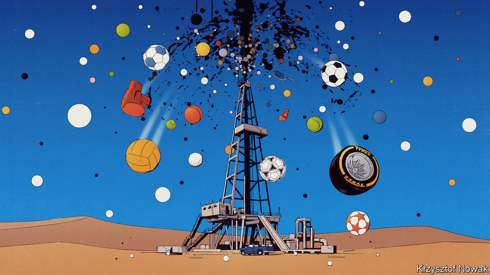

###### The business of sport

# Saudi Arabia’s rush into global sports 

##### Sports is a dynamic, capital-intensive business, not a museum exhibit 

 

> Aug 10th 2023 

Sports fans have seen plenty of surprises this summer. Carlos Alcaraz won Wimbledon, ending years of domination of tennis by the trio of Novak Djokovic, Roger Federer and Rafael Nadal. In golf the victors of the us Open and Britain’s Open were outsiders who were given odds of winning of 1% or less. On August 6th the all-conquering us women’s football team crashed out of the World Cup after Sweden scored a winning penalty. The ball crossed the goal line by only a few millimetres. 

Yet the biggest shock has been off the field, as Saudi Arabia has barged into the . Pumped up on petrodollars and desperate to reinvent itself under Muhammad bin Salman (mbs), its 37-year-old de facto ruler, it has spent $10bn on players, teams and leagues, upending golf and football. That has upset Western fans, activists and politicians, who see it as “sportswashing” human-rights abuses, and complain about the desecration of the hallowed trophies of sport. 

is no cheerleader for mbs, but this sports-venting does not bear scrutiny. The West trades widely with Saudi Arabia, the deals will not make its bad human-rights record worse, and it is not clear that the country could or would monopolise and destroy any global sport. In a turbulent world many fans see their teams as a source of pride and stability. But many forget that sport is also a business that is being disrupted. It needs to be open to new capital and fresh ideas.

Sport has long seen investment splurges, whether by media tycoons or Russian oligarchs. Even by those standards the Saudi effort is big. In football it is paying for some of the world’s top players, including Karim Benzema, to play in a revamped domestic league. It controls Newcastle United, an English club, and may bid for the World Cup in 2030. In golf a Saudi-bankrolled tournament is merging with the PGA Tour, America’s men’s circuit. The kingdom sponsors Formula 1, has deals in wrestling and boxing and is eyeing winter sports and e-sports.

Do not imagine that this is a modern version of Arab royals buying racehorses that catch their eye. Saudi Arabia’s plan is state-backed and more systematic than that. The kingdom views sport as a way to reinvest oil revenues and catalyse reform at home by creating a bigger services industry and boosting tourism. mbs is a volatile strongman, but he is also overseeing some liberalisation, including of women’s rights. The spread of a globalised, consumerist, sporting culture may help Saudi Arabia shift social norms away from austere religious conservatism.

The Saudi spree mirrors a surge in institutional capital flows into sport. Since early 2020 over $100bn of private-equity cash has been deployed. America’s baseball, basketball, hockey and football leagues contain brands with reliable cashflows (partly because these are self-regulating cartels). Europe’s soccer teams, which may be relegated, are riskier but sometimes undervalued given their big fan bases. Other sovereign buyers are active. Qatar, which hosted last year’s World Cup, has Paris St Germain, a French club, and a stake in the Washington Wizards, a basketball team. Bloomberg reckons 17 of Europe’s top 98 soccer clubs are now backed by sovereigns or institutional capital.

Many of these new investors see digital disruption as an opportunity. Revenues are in jeopardy, as viewers abandon traditional television, and in America “cut the cord” on cable packages that bundle sports. For old media firms this is a nightmare: Disney is looking for an investor to take a stake in espn, its huge, declining sports network. For nimble owners of teams and brands, digital disruption holds the promise of reaching audiences directly, with a more immersive, interactive experience.

Fans often fear change will ruin something that they love. However, sport is not just a competition between players, but also for an audience—and rival forms of entertainment do not stand still. Italy’s Serie A football league is a warning of what happens if reform is too slow. Its revenues are falling, its teams are underperforming and they are mostly lossmaking. European football costs over $7bn a year to run, excluding players’ wages, and does not break even. It can benefit from fresh money.

Besides, disruption can lead to improvements that bring in new fans. England’s Premier League broke off from the rest of the game in 1991 and is now one of the world’s most successful tournaments. India’s Premier League, launched in 2008, drew millions to Indian cricket. Formula 1 has found a younger audience in the Netflix show, “Drive to Survive” and direct-to-consumer streaming. Who knows what will come from Apple’s $2.5bn investment in streaming mls, America’s soccer league; or Qatar’s backing of Padel, a rival to tennis, with 25m players.

The case for disruption, then, is clear. However, Saudi Arabia faces two other objections. The first is that it is a state actor that is not motivated by profits and has vast resources. Sport requires a competitive balance, so if an owner buys all the best players their team can in theory win all the time and the game suffers. This risk needs to be watched. However, despite decades of crazy money, no team has managed to dominate football. Saudi Arabia’s spending on players is worth only 6% of European football’s annual operating costs. Its rebel league shook-up golf. 

Big fan

The second objection is Saudi Arabia’s rotten record on human rights, including the murder of Jamal Khashoggi, a journalist. Foes of the West like Russia face sanctions, which include sport. Yet the kingdom is not in this category. America and Europe did $140bn of trade with Saudi Arabia in 2022, including in oil and weapons—both more strategically sensitive than putting. And although some club owners gain influence, controlling sports assets does not seem to blind the Western public or their governments. Even Roman Abramovich, an oligarch who bought Chelsea to court Britain’s elite, has not escaped sanctions. As Qatar found with gay and labour rights in the 2022 World Cup, sponsorship can sometimes bring more scrutiny.

An ever-expanding list of activities are restricted around the world on grounds of national security, well-being or morality: think of semiconductors, social media, and energy and arms. Adding sport to the list is an own goal. ■


