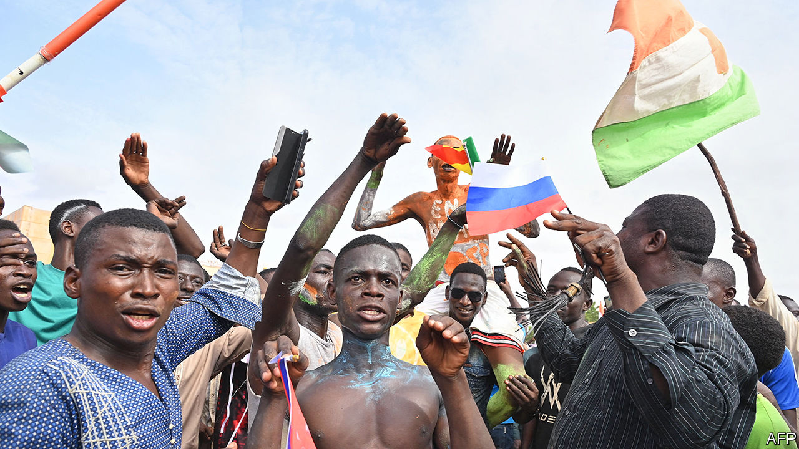
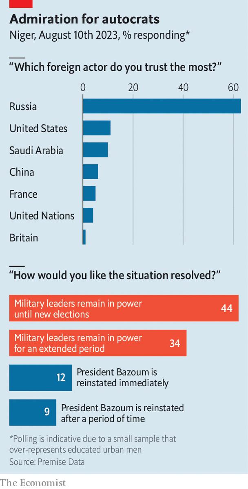

###### Crisis in the Sahel

# After Niger’s coup, the drums of war are growing louder 

##### Hopes for a diplomatic solution are fading 

 

> Aug 7th 2023 

NASSIROU MAHAMADOU, a vegetable-seller perched on a stool in Niamey, the capital of Niger, does not look like a fighter. Yet at the mention of threats by Niger’s neighbours to use force to reinstate Mohamed Bazoum, the elected president who was ousted in a  on July 26th, he swells with anger. “If they come here, we [civilians] are going to war alongside the army.” He is outraged that the Economic Community of West African States (ECOWAS), the regional bloc, is considering sending troops to battle the junta, even as it has done little to fight the jihadists that he says are the bigger threat. “ECOWAS has weapons to attack Niger but not to kill the terrorists,” he says. “It’s a disgrace.” 

The regional bloc had threatened to use force if Mr Bazoum were not reinstated by August 6th. Yet as the clock ticked down to that deadline, the coup leaders showed no sign of giving up power. Instead they filled a stadium with cheering supporters (pictured), who beheaded a rooster painted in the colours of , the former colonial power. As the deadline day ended, the junta closed Niger’s airspace altogether, claiming that two other African countries had been preparing troops for deployment to Niger. It said Niger’s armed forces were “ready to defend the integrity of our territory”. It later ratcheted up tension by accusing France of violating its airspace and freeing terrorists, without providing any evidence. France denied the claims. 

The rising tension highlights two related, and disturbing, trends in the region. The first is the rapid spread of jihadist terrorism over the past decade as groups affiliated with Islamic State and al-Qaeda have pushed into the Sahel, a desperately poor and arid region south of the Sahara. Among the worst-affected places are Burkina Faso, Mali and Niger, where more than 10,000 people were killed in armed conflict last year. The second trend is the retreat of civilian rule, as men in uniform have overthrown elected governments that were losing popular legitimacy because they have failed to end the jihadist terror. Since 2020 there have been coups in Burkina Faso, Chad, Guinea and Mali. In Burkina Faso and Mali the putsches have been followed by a spiral of deteriorating security. 

The leaders of the coup in Niger also claimed to want to restore security. Yet Mr Bazoum’s government had been making progress against the jihadists through talks, demobilisation programmes and help from the roughly 1,500 French troops in Niger. Deaths in conflict in the first six months of this year were lower than in any equivalent period since 2018. Instead, the coup appears to have been motivated by the personal ambition of generals.

Many leaders in the region hoped to halt this contagion of coups, not least because left unchecked it might give ambitious generals in their own armies ideas. Among the most strident is Bola Tinubu, the recently elected president of neighbouring Nigeria who chairs ECOWAS. Because he was briefly detained by a junta in 1994 he detests putschists. Others in the region tend to agree with him. “It’s one coup too many,” said Aissata Tall Sall, Senegal’s minister of foreign affairs.

After the deadline passed, hopes of reinstating Mr Bazoum through diplomacy suffered further blows. Victoria Nuland, a senior American diplomat, met members of the junta in Niger but described talks as “difficult”. She was blocked from meeting either Mr Bazoum or General Abdourahamane Tchiani, who overthrew him. On August 8th a mediation team from ECOWAS, the UN and the African Union was refused entry to the country.

 


The snub came after defence chiefs of ECOWAS said they had finalised plans for sending in a force. Benin, Guinea-Bissau, Ivory Coast, Nigeria and Senegal all indicated they would contribute (see map). Yet the junta in Niger has allies of its own. The military rulers of Burkina Faso and Mali declared that they would consider any intervention in Niger to be a declaration of war on their own countries. Members of Niger’s junta have also travelled to Mali. There, according to Wassim Nasr, a journalist and researcher, they requested assistance from Wagner, a Russian mercenary group that has operated in Mali since 2021.

ECOWAS, having drawn a line in the sand, may find it difficult to accept anything less than a full reinstatement of Mr Bazoum. Instead the junta named 21 ministers in a cabinet led by Ali Lamine Zeine, an economist, shortly before an ECOWAS summit was due to be held on August 10th to decide on the bloc’s next steps. Even if ECOWAS is willing to accept this government, it would probably still insist on Mr Bazoum’s liberation. Yet General Tchiani may see holding him as his best protection against another coup, or counter-coup, argues Nina Wilén of Lund University.

Still, an ECOWAS invasion is not inevitable. War is “the option of last resort”, a high-level government official involved in deliberations in Abuja, the capital of Nigeria, told  after the deadline had expired. The junta has “reached out to the Nigerian authorities through back channels”, the official said. Moreover, he said Nigeria’s government was concerned by domestic opposition to a military intervention “especially in northern Nigeria with imams preaching against it”. 

After a closed-door meeting of the Nigerian Senate, the body’s president, Godswill Akpabio, advised ECOWAS “to strengthen their political and diplomatic options”. Several reports suggest that a majority of senators at the meeting were against sending in troops. Under the constitution, Nigeria cannot deploy forces abroad without Senate approval unless there is an “imminent threat or danger” to national security. 

ECOWAS has also struggled to win the support of other regional powers that share borders with Niger. Abdelmadjid Tebboune, Algeria’s president, said he was “categorically against any military intervention”, which would be considered a “direct threat to Algeria”. Chad also opposes the use of force. 

Gauging the mood

A key consideration for ECOWAS must surely be whether foreign troops would be welcomed or opposed by Nigeriens themselves. On August 8th Rhissa Ag Boula, a former rebel and then minister under Mr Bazoum, announced the creation of a “resistance council” to reinstate the president. It says it supports an ECOWAS military intervention. “We are going to mobilise all over the country to denounce [the junta],” Mr Ag Boula told 

 


Whether it will gain support is unclear. Canvassing by Premise Data, a polling firm, for  in the first survey conducted since the coup found that 79% of respondents support the actions of the junta, and that 78% think it should stay in power “for an extended period” or “until new elections are held” (see chart). A slim majority of 57% said they were not in favour of an intervention by regional or international organisations. Of those supporting foreign intervention, an alarming 53% said they preferred it to be by Russia, presumably because they think it would support the putschists, as Wagner has done in Mali. Just 13% chose America, 11% the African Union and a paltry 6% preferred ECOWAS. These findings are not necessarily representative of opinion across the country because the poll was conducted quickly, with a small sample, made up mainly of men in the capital. Even so, it provides an indication of the mood.

There are other big hurdles facing an ECOWAS force. One is cost. “Nigeria is too broke to conduct this operation, so needs funding for it,” says Cheta Nwanze of SBM Intelligence, a research firm in Lagos. France has said it supports efforts by ECOWAS to reinstate Mr Bazoum but has not said if its armed forces would back an ECOWAS intervention or whether its treasury would help fund the operation. 

Moreover, an ECOWAS mission would be far more complex and risky than any the bloc has mounted in decades. In 2017 a Senegalese-led force moved against the longtime president of the Gambia, Yahya Jammeh, after he refused to accept the result of an election he had lost. He folded as soon as troops pressed in. Yet Niger is more than 100 times larger than the Gambia and it has a Western-trained army that seemingly supports the junta, which is holding its legitimate president hostage.


A closer parallel might be Sierra Leone, where in 1997 a group of soldiers ousted the elected president during a civil war. Some eight months later, after the putschists allied with gang-raping rebels, ECOWAS forces rolled in and reinstated the president. Although the mission was successful, albeit against a ragtag army, the Nigerian-led force was accused of human-rights abuses and of bombing civilian targets.

Mr Tinubu may hope that large parts of Niger’s army will refuse to fight if ECOWAS troops cross the border. Yet if they do resist, the region’s troops may find themselves stuck in a three-way fight between the junta’s forces and the jihadists. Even if an intervention succeeded in restoring Mr Bazoum, he could be perceived as a puppet of foreign forces. “I pray to God that Bazoum comes out of this alive,” says a former adviser in the presidency. Yet even he counsels against ECOWAS sending in troops. “It will destroy human life for nothing and sink our country into war.” ■

