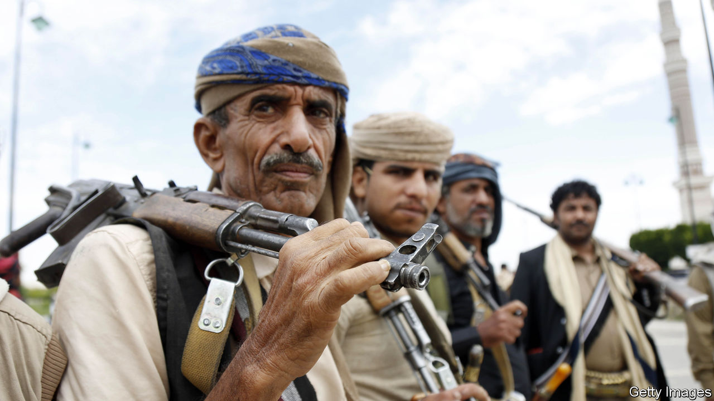

###### One state, or two states, or no state

# Can Yemen hold together? 

##### A country ravaged by civil war seeks an elusive peace 

 

> Aug 9th 2023 

Fragmented states in the Middle East are no rarity—think of Iraq, Libya, Palestine and Syria—but Yemen is the most disunited of all. Rent by civil war for the past eight years, it is a patchwork of competing factions. Last year a ceasefire between Saudi Arabia, which supports a toothless but internationally recognised government, and the Houthi rebels, who control a large swathe of territory including the capital, Sana’a, promised to stabilise the country and, on paper, to hold it together. Instead, the fragile ceasefire has enabled the Houthis to tighten their grip on the area under their control and has weakened the forces arrayed against them. After fighting those of Saudi Arabia and the United Arab Emirates (UAE) to a draw, the Houthis look poised to win the peace.


At least nine different factions have been vying for power. The Presidential Leadership Council (PLC) that Saudi Arabia created last year claims to be Yemen’s legitimate government. The Saudis, who pay for it, recently promised another $1.2bn to keep it afloat. The PLC claims to control the entire country but probably has the smallest footprint of all Yemen’s power-seeking factions. It is restricted to a mere wing of the presidential palace in Yemen’s second city, Aden, near Yemen’s southern tip (see map). Most of the PLC’s members live in the Ritz-Carlton Hotel in Riyadh, the Saudi capital, where Crown Prince Muhammad bin Salman (MbS), the kingdom’s de facto ruler, has been known to keep troublesome politicians and family members in a sort of gilded cage. The PLC’s eight representatives are often at loggerheads with each other. 

After the Houthis captured Sana’a in 2014, Saudi Arabia and the UAE rallied a medley of alliances within Yemen to fight back. But of late these two heavyweights of the Arabian peninsula have fallen out, causing their coalition in Yemen to unravel. The UAE backs secession for the south in the guise of the Southern Transitional Council (STC) led by Aiderus al-Zubaidi, a former general, though he is a member of the Saudi-backed PLC. 

Gulf rivalries encourage Yemeni wrangling. The southerners under Mr Zubaidi fly a separate flag over a swathe of what used to be a separate country, once known as the People’s Democratic Republic of Yemen before it unified with the north in 1990. The UAE under its assertive leader, Muhammad bin Zayed al-Nahyan, probably has its eye on the ports and oil wells of southern Yemen. Though it has drawn down its forces since 2019, it still supports Mr Zubaidi militarily and has bases of its own on his turf.

The Saudis now seek to frustrate the UAE’s ambitions by stoking the local aspirations of Yemen’s old principalities and tribes against Mr Zubaidi’s would-be breakaway state. They also hope to carve a north-south land passage through to the Indian Ocean. In recent weeks the Saudis have backed the formation of a “national council” in the Hadhramaut and a “tribes’ alliance” in Shabwa, more than 500km east of Mr Zubaidi’s seat in Aden. Tensions have already spilt into violence. Militias loyal to the Hadhramaut council in Seiyun have clashed with protesters supporting Mr Zubaidi. Both sides have tussled for control of Mukalla, another southern port.

Other chunks of Yemen also threaten to break away. Pockets of al-Qaeda still lurk in the remote hinterland of the Hadhramaut. The governorates of Marib and Taiz have close ties to Islah, a faction close to the Muslim Brotherhood, an Islamist movement backed by the gas-rich Gulf state of Qatar. Fearful of losing out to richer Gulf states, Yemen’s eastern neighbour Oman may wish to bring the abutting Yemeni province of Mahra under its wing.

This fragmentation is manna from heaven for the Houthis. Twenty years ago they were a rugged band of rebellious northern tribes who followed a branch of Shia Islam and often had to hide in mountains and caves from the authorities in Sana’a. Now they dominate the country. Their leadership is united, bonded by a religious glue. With arms and training from Iran and its Lebanese Shia proxy, Hizbullah, they have kept hold of Sana’a and the northern coast down to the port of Hodeida, despite years of Saudi-backed Yemeni counter-attacks. They responded to aerial bombardments by the Saudis with missile and drone attacks deep inside Saudi Arabia and even the UAE. In March 2022 they forced MbS to call a ceasefire.

The Saudis have since tried to win the Houthis back onside. They lifted their siege of Hodeida, let flights to Sana’a resume and sent a delegation to negotiate with the Houthis without consulting the PLC. They let a Houthi commander fly with his followers to Saudi Arabia for the annual , or pilgrimage, in Mecca. And while starving Yemen’s secessionist south of funds, they have proposed paying the salaries of the Houthi administration. Some of MBS’s advisers have even suggested that, following the kingdom’s rapprochement with Iran last March, the Saudis may forge a full-blown alliance with the Houthis. 

The ceasefire, however, has only emboldened the Houthis against the Saudis. They are celebrating a victory of the poorest Arab state over the richest—and are demanding reparations. In sermons their leader, Abdelmalik al-Houthi, portrays himself as the rightful ruler of the , or Muslim world, thanks to his descent from the Prophet Muhammad. Some Houthis even dream of conquering Mecca and Medina, Islam’s holiest places, claiming them as historic parts of Yemen. When a Saudi delegation arrived in Sana’a in April, they were derided as aggressors, not peacemakers. “The Saudis have given in to most of the Houthis’ ridiculous demands and got nothing in return,” says Abdelghani al-Iryani, a Yemeni former mediator.

Give them an inch...

Since the ceasefire the Houthis have reinforced their ideology in their own territory, for instance by banning the charging of interest, and have tried to spread their reach elsewhere. No sooner had the Saudis lifted their siege of Hodeida than the Houthis attacked Aden and declared a boycott of any goods imported from the south. Late last year they attacked the south’s oil installations. More recently they have mobilised their forces around the city of Taiz, a redoubt held by the internationally recognised government that was once Yemen’s industrial base.

Many Yemenis now fear the official government may fall. While the Saudis promise handouts to the Houthis, they have sharply cut funds to their Yemeni allies. “They’re paying Ronaldo almost as much as they pay 33m Yemenis,” complains Bara Shiban, a Yemen-watcher in London, referring to a Portuguese footballer recently bought by a Saudi club. Houthi attacks have also deprived the south of oil and customs revenues, further eroding the government’s economic base. A riyal there is worth about a third of its value in the Houthi-controlled north. Ali al-Bukhaiti, a former Houthi spokesman exiled in Britain, reckons that Yemen may yet re-emerge as a single state, whatever its inhabitants desire. “At the end of the day, the Houthis will gobble them all up.” ■

