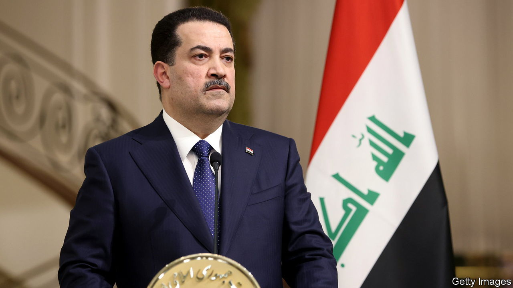

###### A record bank heist

# Interpol is after Iraq’s bank robbers 

##### The exposure of crookery surrounding Iraq’s tax revenues has rattled rulers, past and present 

 

> Aug 10th 2023 

Spurred by a  in ’s sister publication, , of the theft of $2.5bn of state funds, the Iraqi authorities have called on America, Britain and Interpol to help arrest and extradite suspects who have sought refuge abroad. Four senior men in Iraq’s previous government under are wanted. An investigation had been launched by his government last year, but then the case was largely left to languish, despite promises of action by , his successor as prime minister. 

Responsibility for further action seems to have been shunted onto Western and Middle Eastern governments. The accused quartet—a former finance minister, an intelligence chief, a senior adviser and a private secretary to Mr Kadhimi—have been living in Dubai, London and Washington.

The Iraqi courts have seized the Iraqi properties of Ehsan Abdeljabbar, another previous finance minister, who launched the investigation; he is abroad, too. A businessman also at the scandal’s centre, Nur Zuheir, was freed on bail in November; he too travels abroad. Mr Abdeljabbar and Mr Zuheir strongly deny any wrongdoing.

Mr Kadhimi’s allies say this is a witch-hunt by Mr Sudani to deflect attention from powerful Iraqis friendly to the present regime who are also under suspicion. They say that Shia Islamist militia leaders who back Mr Sudani worked with Mr Zuheir to raise funds and that the anti-corruption watchdog commissioned by Mr Sudani has a link to a Shia militia.

Corruption has been a staple of Iraqi politics since the Americans overthrew Saddam Hussein in 2003, but the massive tax scam reported in shows Iraqis for the first time in detail how state coffers have been raided. Politicians across the ethnic and sectarian spectrum have united to squirrel away oil and tax revenues worth hundreds of billions of dollars.

Attempts to improve transparency by digitalising government finances and hiring international auditors have been repeatedly scuppered. While Mr Sudani says the investigation is robustly going ahead, he knows that previous prime ministers have been ejected by Shia Islamist factions who depend on dirty money. This is good news for Mr Zuheir. “Nur will never be put on trial,” says an observer the case. “So many top people are involved, they’ll never give him a platform to talk.” ■

