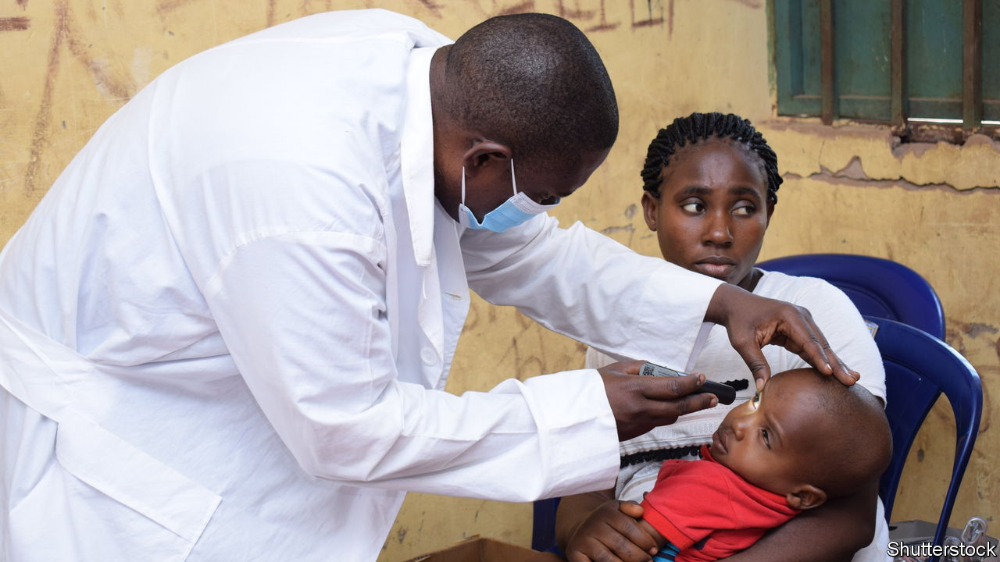
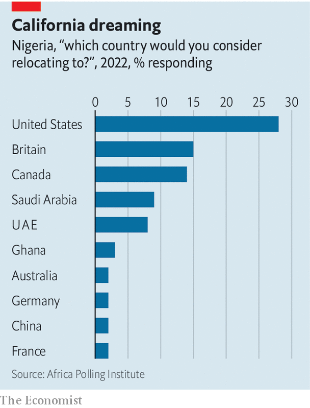

###### Call for the doctor, call Nigeria

# Why Nigeria’s hospitals are losing their staff 

##### The country’s many problems are driving its own professionals abroad 

 

> Aug 10th 2023 

A current buzzword in Nigeria is , a Yoruba verb meaning to run, flee or escape. So many Nigerians, most notably doctors and nurses, are seeking jobs abroad that politicians are bemoaning the “ syndrome”—and have been debating ways to stem the outward flow. No one yet has an answer. 

Meanwhile hospitals are losing qualified staff at an alarming rate, as droves of doctors and nurses head for America, Britain, Canada, the Gulf states and elsewhere in search of better pay and working conditions. In the past eight years, by one count, at least 5,600 doctors have left for Britain, leaving only 24,000 registered doctors to cater for a burgeoning population of around 220m. The Association of Resident Doctors fears that 85% of those left behind are planning to emigrate, too.

 


MPs complain that countries such as America, Canada and Saudi Arabia, which often stage recruitment drives for doctors in Nigerian cities, are in effect exploiting the country’s highly subsidised medical-education system at the expense of Nigeria’s own suffering people. The government has been half-heartedly scrambling for clever ways to persuade medical professionals to stay. A parliamentary bill proposed that new doctors would be legally bound to stay in Nigeria for at least five years after qualifying. In the face of the doctors’ threat to go on strike if this were enacted, the government backed down.

Many thousands of other talented Nigerians are trying to leave. Britain offers a “global talent” visa valid initially for five years and doles out thousands of student visas. The recipients often fail to return home. Many of those less fortunate strike out across the Sahara desert, putting their lives in the hands of smugglers and traffickers to take them on perilous voyages across the Mediterranean to Europe. Some drown, or end up in thrall to Arab slavers in Libya or in vile detention camps across north Africa.

On the plus side, those who succeed abroad provide a huge inflow of remittances. Last year, they sent back an estimated $20bn, on top of $148bn in the previous seven years: far more than arrived in foreign direct investment.

In the short run, the desire to leave is too ardent for governments to stop. All told, 73% of Nigerians in 2021 wanted to go, according to the Nigeria Social Cohesion Survey, which was up by 41 percentage points on the previous one, in 2019. With corruption and physical insecurity rampant, annual inflation at 23%, and 63% of adult Nigerians deemed “multidimensionally poor”, it is no surprise that the syndrome is stronger than ever.■

