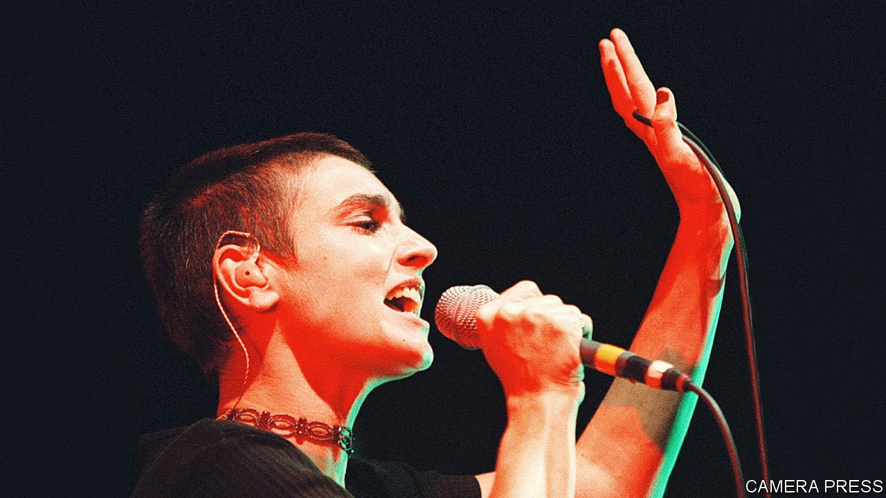

###### The place where she was

# Sinéad O’Connor hated the very idea of being a pop star 

##### Ireland’s most provocative singer and protester died on July 26th, aged 56 

 

> Aug 9th 2023 

Six years ago “Dr Phil”, America’s fatherly TV therapist, asked Sinéad O’Connor to show him a picture of the life she hoped for in future. She held out a sketch of a spiky-haired woman in trousers and a stars-and-stripes top, singing into a microphone. He asked her to sign it, and she did: Magda Davitt. To his nonplussed look, she explained hastily that Sinéad O’Connor had gone. She didn’t want to be that person any more. 

Sinéad frequently went missing. In her place came Scamp, herself as a child, because she was a rascal and tiny and a terrible thief. Then Mother Bernadette Mary, priest of the Irish Orthodox Catholic church, with a big wooden cross swinging round her neck. And Magda, who didn’t last very long. Then, when she converted to Islam in 2018, Shuhada’ Sadaqat. She put that name on documents alongside her original. As Shuhada’ she wore a hijab both when performing and when she was sitting in her cottage up an Irish mountain, on her crimson sofa, chain-smoking Mayfair cigarettes. She had always been a multi-piece jigsaw. Once she got the time, for she never seemed to have it, she needed to lay the pieces out on the floor and see if she could make any sense of them. 

To begin, she was resigned to girlhood, but wanted to look like a boy. When her first album, “The Lion and the Cobra” came out in 1987, a squarer-than-square exec told her she should wear short skirts with boots, necklaces and bracelets, and grow her hair long. Immediately she went to a barbershop and had it all shaved off. The barber cried, but she looked in the mirror and saw, without her hair, herself. Ever after she was either close-cropped, or completely shaved. With this went the leather jackets and the Doc Marten boots, the toe-caps slashed to show the steel underneath. For a time she came out as a lesbian, then retracted. She loved men and sex with men, married four of them and had children with three. She doted on them. Motherhood exalted her. 

As a performer she played several parts. One was a punk. The cover of “The Lion and the Cobra” showed her with arms raised, grimacing. But she was only singing. The anger in her—especially in “Troy” where she promised to return, Phoenix from the flame, “being what I am”—rang through the beautiful voice. But she was only a mild sort of punk, really. The next album, “I Do Not Want What I Haven’t Got”, was calmer. Her music bosses preferred her to look demure and sad, and she could do that too; no one could wring more pathos out of the old Irish songs, “Danny Boy” or “Foggy Dew”. And yet, another paradox, she felt almost nothing for Ireland. The whole place was a church in which people, women especially, did not dare raise their voices. The best day of her life was in 1983 when she left. Divorce and homosexuality were still illegal then. The unmarked graves of the Magdalen mothers had still to be uncovered. As a bad-lot teenager, she had spent time in such a place herself. She knew girls who had become suicidal when their babies were taken away. But one of the nuns bought her a guitar, which became her life. 

She found world fame in London. It rested essentially on one song, her cover in 1990 of Prince’s “Nothing Compares 2U”, which she sang on video with a face as pale as death. The song topped almost every chart, and she was a star. But she never wanted to be. Pop stars had to be good girls. She was a handful, a troublemaker. They lived in a sort of prison; she needed to be free. She was just a troubled soul who needed to scream into mikes now and then. Her models were Bob Dylan and Bob Marley, protest singers who made people hear the truths that no one talked about. They didn’t want glitter and money and awards. Nor did she. 

Fame, however, could be sabotaged. She began by refusing in 1991 to accept four Grammy nominations. This was a protest against many things: child abuse, sexism in the music industry and American jingoism, for playing the national anthem before her concerts. The next year, at the end of performing Bob Marley’s “War” on “Saturday Night Live”, she held up a picture of the pope on the word “evil”, and tore it into pieces. “Fight the real enemy!” she shouted. Meaning paedophile priests, and the church’s silence. At once she was labelled a crazy bitch. NBC banned her for life, and her career in America ended. But it was a brilliant stroke. Having a Number 1 had derailed her, and now she had reset her career. It became no easier, but it was on her own terms.

Abuse was something she knew plenty about. Her mother, an alcoholic, hadn’t wanted a daughter. So she had made her lie on the floor, arms and legs apart, and stamped on her to try to burst her womb. She made her say “I am nothing, I am nothing”, over and over. Sinéad’s job was to clean the house. If so much as a lampshade was crooked, the shit was beaten out of her, usually with a hockey stick. She recorded the tortures in her songs; they were her only therapy. And yet, in another paradox, she loved her mother, whose very smell was evil. She missed her, and ached to hug her. It was not unlike the way she both treasured aspects of Catholicism, and hated the church. As a child she had worried that the Holy Ghost, a bird of light, was kept cooped up in a tabernacle by priests who took no joy in their religion. It ought to be out flying. 

Amid all these bits of herself, the consistent thread was song. That too went missing from time to time, especially after 2015, when a radical hysterectomy made her lose her mind. Typically she publicised her breakdown, in a desperate video from a Travelodge in New Jersey. After six years of various treatments she re-emerged, only to be knocked down by the suicide of her son Shane, the lamp of her soul, in 2022.

Song might have rescued her even then, as it did when she was a teenager. She had plans for recordings and tours. Music was her deep inner place; she never made sense to anyone, even to herself, unless she was singing. As a bad child, she sang to get into heaven. When music played then, she saw an entity, not human, dark-blue and green and made of space, that took her hands to dance. And she heard it speak: “Some call me music, some the great absolver...If you don’t know who to be, you can be me.” ■

