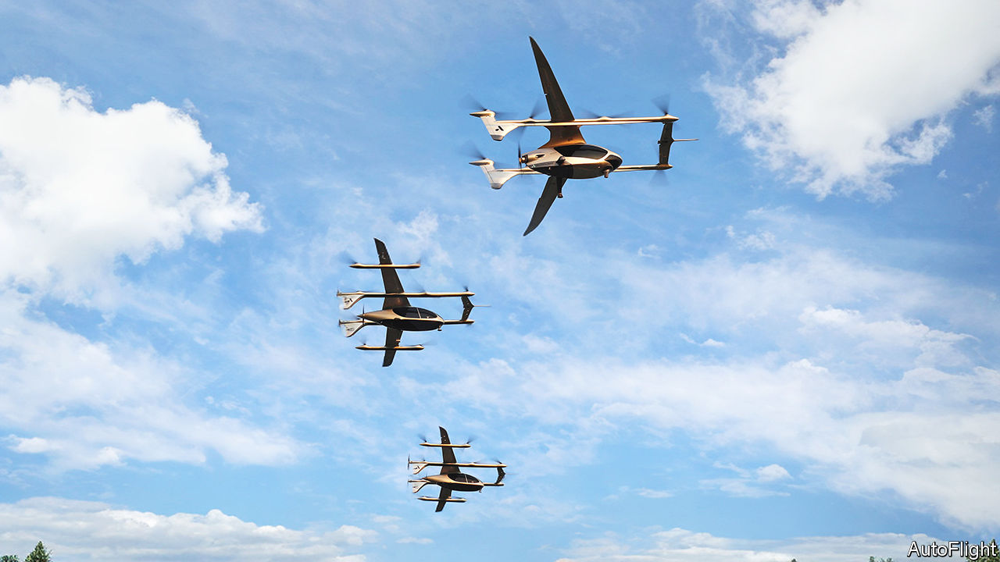

###### Aviation

# An airborne taxi rank 

##### Flying taxis 

 

> Aug 10th 2023 

In the years ahead this will become a familiar sight. In a first of its kind, three electric vertical take-off and landing (eVTOL) aircraft, often called flying taxis, hover in formation near Shanghai, China. The aircraft, being developed by AutoFlight, use upwards-facing propellers to take off and land vertically, and “pusher” propellers for forward flight. Along with eVTOLs from other firms, these aircraft should be approved to operate commercially in the next year or so. At first that is likely to be with pilots in many countries, but eventually they will fly autonomously—as they are here.■


