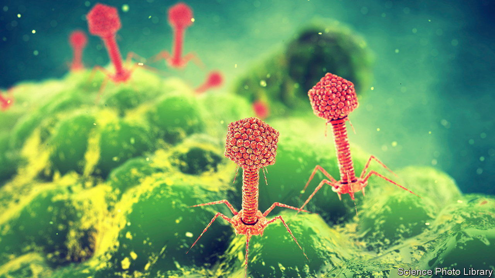

###### Parasites at work

# Tiny hitchhikers on viruses could promote resistance to antibiotics 

##### Knowing why could help keep infections at bay 

 

> Aug 9th 2023 

FROM caesarean sections to chemotherapy, antibiotics make much of modern medicine possible by keeping bacterial infections at bay. That is why the growing bacterial resistance to those drugs is so worrying. The United Nations estimates that by 2050 infections with drug-proof bacteria could claim up to 10m lives a year, more than double the current toll.

A problem with tackling such resistance is that scientists have an incomplete sense of how it arises. One way is essentially random: a chance mutation in a particular bacterium may make a certain drug less lethal. If that bacterium survives a dose of treatment, its descendants will inherit that same resistance. But the speed at which bacterial drug resistance spreads means that cannot be the whole story. “I always felt there were additional mechanisms of evolution. And probably more powerful ones,” says John Chen at the National University of Singapore.

In a paper in , Dr Chen and his colleagues identify one such mechanism. It centres not on the bacteria themselves, nor the viruses that are known to infect them, but on yet more rudimentary genetic parasites that exploit these viruses in turn.

The fact that bacteria can transfer genes horizontally, to other unrelated bugs, as well as vertically to their offspring, is well known. Some are exchanged via small loops of DNA called plasmids. Others are transmitted by bacteriophages, specialised viruses that infect bacteria. When a phage latches on to a bacterium, its DNA forces the bacterium to make more copies of the virus until it bursts. Sometimes, small fragments of bacterial DNA can be erroneously included with the new viruses. If they infect another bacterium, the hitchhiking DNA can end up integrated into the new host’s genome. But such “transductions” cannot fully explain the speed with which bacteria evolve resistance either. It happens rarely, and transfers only small chunks of DNA when it does.

In 2018 Dr Chen identified another mechanism, known as lateral transduction. This happens when phages, rather than killing their hosts immediately, integrate their genomes into those of their prey. When the phages replicate, they read their own genes from the bacteria’s genome, but sometimes grab copies of long neighbouring stretches of bacterial DNA too, which they carry to infect new hosts. 

Dr Chen reckons that phages could in this way end up stealing up to a quarter of their host’s genome. He estimates that lateral transduction is thousands of times faster than other mechanisms, making it a candidate as the chief driver of microbial drug resistance. In practice, this means a bacterium with no previous exposure to antibiotics could acquire the genes necessary for resistance in a matter of minutes.

But the story does not end there. Dr Chen examined , a bacterium that is usually harmless but which can occasionally cause serious illnesses. Particular chunks of its genome, called “pathogenicity islands” (or SaPIs), seem to behave like genetic parasites; bits of DNA that replicate selfishly without regard for the well-being of their host. In one sense, that makes them an even more primitive form of replicator than a virus. 

Trick or treat

When a bacterial cell playing host to a SaPI is infected by a phage, the SaPIs can command the cell to produce a protein called small transferase. This is similar to the protein that the attacking phage uses as a signal to begin packing its DNA into newly produced phages. That biochemical trick can cause new phages to be packaged not with viral DNA at all, but with long chunks of bacterial genome. “It completely replaces the phage genome,” says Dr Chen.

The resulting phages are still capable of infecting new bacteria. But when they do, they transfer bacterial genes, not viral ones—which may turn out to be useful. And while lateral transduction can happen only when a phage weaves its DNA into that of its host, SaPIs can hijack phages without that happening. “I think this has huge implications for how we understand the evolution of bacterial genomes,” says Breck Duerkop at the University of Colorado, who was not involved in the research.

Exactly why such a mechanism exists remains unclear. If SaPIs really are selfish replicators, then hijacking viruses gives them a way to spread and perpetuate themselves. Dr Chen raises the possibility that fortifying their hosts with new, useful genes may also protect the parasites in the long run. “If your host gets outcompeted, you also die,” he says. Both phages and SaPIs, therefore, might be more likely to succeed if they can keep their host bacteria armed with the latest genetic technology.

All that will be of interest to evolutionary geneticists, no doubt. But it will be useful information for public-health researchers, too. One question is just how important each mechanism is. And, as SaPIs affect only , another will be working out whether other bacteria have genetic equivalents. And finally, the antibacterial properties of phages themselves mean that they are increasingly being considered as alternatives to antibiotics. Understanding how they could be hijacked by even tinier parasites would be wise. ■


