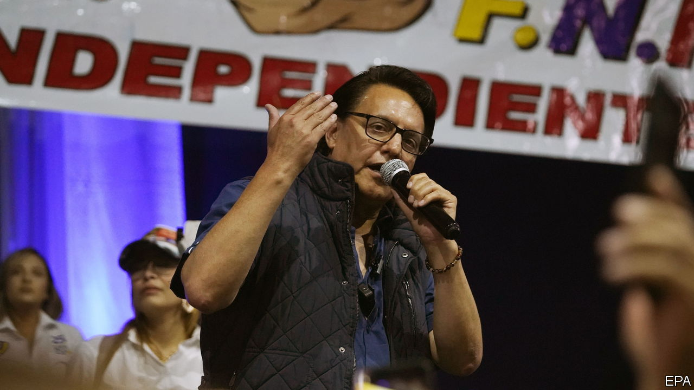

###### Political violence

# An Ecuadorian presidential candidate is assassinated 

##### Political violence is growing in Ecuador and beyond 

 

> Aug 10th 2023 

In the 1980s and 1990s Latin America was part of the global wave of democratisation. In the past few years it has been part of the global retreat. Populists from Mexico to Brazil have tested the strength of institutions. Nicaragua has entrenched its dictatorship. El Salvador has one in the making in Nayib Bukele. The other Northern Triangle countries of Guatemala and Honduras have been increasingly influenced by corrupt and criminal actors.

The latest place to be hit is Ecuador. A leading candidate for presidential elections in little more than a week was assassinated on the campaign trail. Fernando Villavincencio, 59, was shot dead on August 9th while leaving an event at a school in downtown Quito, the capital. Nine other people were injured, including a candidate for congress.

Mr Villavincencio was a significant figure. The former journalist made his name for exposing corruption scandals, especially under the government of Rafael Correa between 2007 and 2017. He continued to do so after turning to politics, first as a congressman then as a presidential candidate. He had been campaigning on combating state corruption, and said he would renegotiate deals with foreign oil and mining companies to secure a bigger share. He was vocal on the need to tackle rising crime in the country and determined to combat Colombian and Mexican drug gangs.

Officials at home and abroad, including President Guillermo Lasso, were quick to condemn the killing, and blame criminal groups for his death. “Ecuadorian democracy has been seriously wounded,” said Fundamedios, a local journalism advocacy outfit. Mr Correa described Ecuador as a failed state. Police have arrested six people on the outskirts of Quito, the capital. One suspect was shot and died shortly after during the crossfire. 

Mr Lasso declared a 60-day state of emergency but vowed the vote would go ahead. The killing is the latest event to rock the country that stood out as a success story in the early 2000s as it used oil rents to improve life. Political turmoil has grown. Two attempts to impeach Mr Lasso led him to resign and dissolve congress in May, triggering early elections. The country’s crime rate has soared as drug traffickers and gangs have worked together, with the murder rate outstripping that of Mexico and Colombia in 2022. Violence has spilled over into the political realm. Last month Agustín Intriago, the popular mayor of the port city of Manta, was murdered.

Ecuador’s experience is not far from the norm in the region. Political violence that had largely subsided in the 1990s, even as criminal violence grew, is once again on the rise. In January right-wing supporters of former Brazilian President Jair Bolsonaro attempted to seize the congress and supreme court buildings and presidential palace after he lost the election. Mexico’s midterm elections in 2021 were the most violent yet: more than 80 politicians were killed, including 35 candidates, mainly by criminal groups.■

