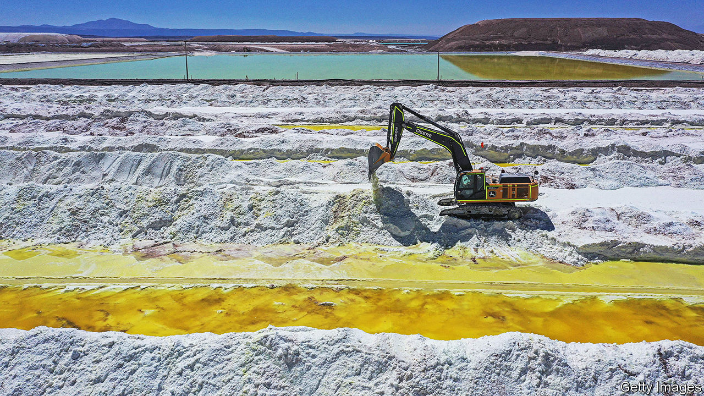
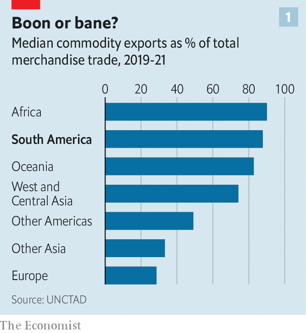
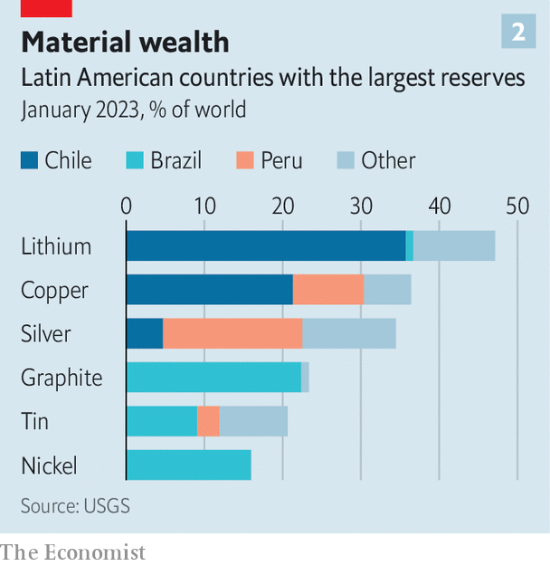
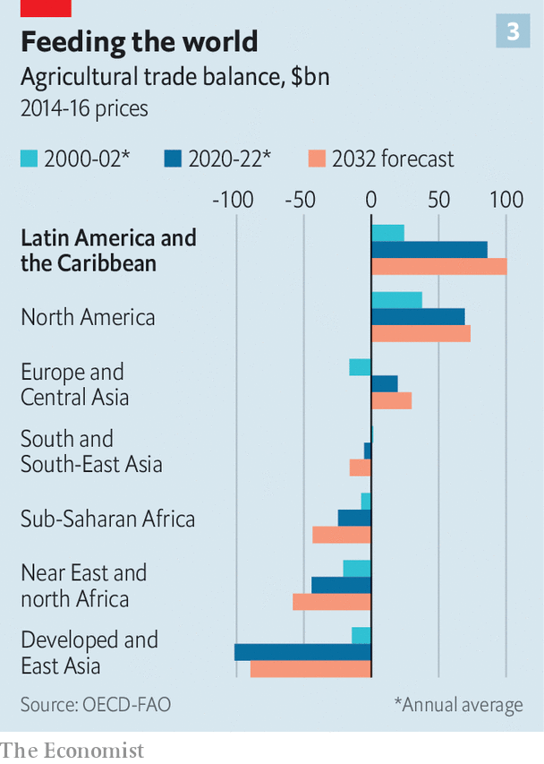
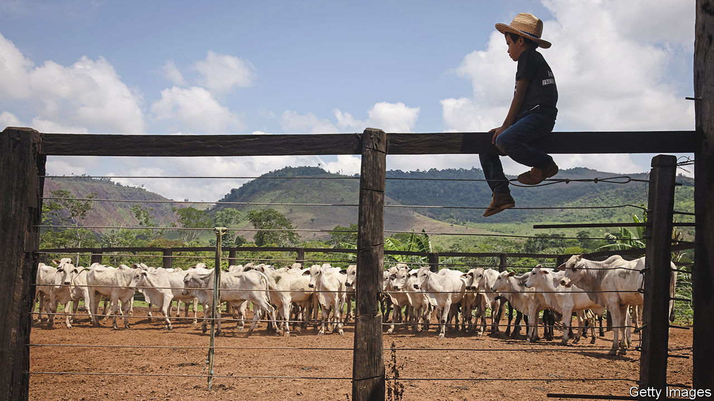

###### Raw potential

# Latin America could become this century’s commodity superpower 

##### A growing, greening world will be ravenous for Latin America’s commodities. Will it deliver? 

 

> Aug 8th 2023 

THE GROUND approaching the salt flats in Chile’s Atacama desert is pockmarked with white crystals. Underneath sit , the ore for the soft, light metal used to make high-capacity batteries. Pumps run by SQM, a Chilean company that is the world’s leading producer of the stuff, hum as they pull up mineral-rich brine. In evaporation ponds, the liquid forms a patchwork of emerald and blue on the blindingly bright crust. 

The operation is the start of a  that ends in the lithium batteries that power electric vehicles (EVs). The global EV fleet will grow at least ten-fold by 2030, to 250m, according to the International Energy Agency, a forecaster. Since 2018 SQM’s annual lithium output has tripled to 180,000 tonnes, a quarter of the global total, and it will probably rise to 210,000 tonnes by 2025. 

Latin America is no stranger to supplying the world with raw materials, but it could be on the verge of a boom. Three forces are pushing the region to become this century’s commodity superpower. The green transition is increasing demand for metals and minerals that Latin America has in large supply, as well as the renewable energy to process them. The region already supplies more than a third of the world’s copper, used in wiring and wind turbines, and half of its silver, a component of solar panels. Its fertile land produces enough grain, animals, coffee and sugar to help feed a growing global population. And lastly, geopolitical tensions between the United States and China are causing countries to look fondly upon investing in a relatively neutral region. 

But Latin America’s experience with raw materials is as chequered as it is long. Argentina owes its name to the Latin for the silver shipped from its ports after it was extracted by conquistadors in Bolivia and Peru; Brazil’s descends from the brazilwood tree, exploited by Europeans in the 16th century. The countries’ vast riches subsequently helped spark coups, populist takeovers, crime and corruption. Meanwhile the region’s economies remain lopsided, its GDP per person is worth a quarter of that of the United States, and inequality is high. Can Latin America manage to reap the rewards of this new boom?

Material prospects 

Fully 21 of 33 countries in Latin America get more than half their export revenue from commodities; rising to over 60% for all 12 countries in South America (see chart 1). They mainly flog minerals and food rather than energy, which dominates only in Venezuela and Colombia. Being overly dependent on commodities is often a problem, but now it could be more of an opportunity.

 


Demand fed by the green transition is likely to be more durable than the oil, coal and steel boom of the 2000s. That was fuelled by China’s industralisation, which slowed in the mid 2010s when there were fewer new factories to build. By contrast, the energy transition is global and requires investment over decades. Low-carbon technologies are much hungrier for minerals than their dirtier equivalents. An electric car contains three to four times more copper than a petrol-fuelled one. Installing one megawatt of capacity in an offshore-wind farm requires six times more scarce metal than in a gas-fired plant. CRU, a data firm based in London, reckons there could be an unmet need of 7m-8m tonnes per year of copper by 2035.

 


In the race to fill such gaps, Latin America stands out. The region holds vast deposits of critical minerals and metals (see chart 2). Despite mining copper for decades, Chile and Peru together retain 30% of the world’s exploitable reserves of the metal. Latin America is home to almost 60% of known lithium. Bolivia has tin, used as a solder in electrical components. Brazil has graphite, another battery metal. Further discoveries there are likely since only 30% of the country’s subsoil has been studied, says Alexandre Silveira, Brazil’s mining minister. 

The metals are often easier to extract in Latin America than elsewhere. It is cheaper to get lithium by evaporation than to drill it from rocks, as is done in Australia and China. Brazil’s magnetic rare earths lie close to the surface. Latin America needs far better roads and ports, but its infrastructure is not as bad as in many mining regions in Africa and parts of Asia. 

Mining and processing minerals are energy-intensive. But many countries in Latin America can tap cheap, green electricity for it. Renewables make up 45% of Brazil’s energy use, one of the highest rates in the world, and the infrastructure to transmit this clean energy is growing. Chile aims to produce the cheapest green hydrogen by 2030, thanks to its 6,500km (4,000 miles) of coastline, sunny north and windy south. 

Even in hydrocarbons, in which Latin America has not traditionally been a global player, it can benefit. A record 60bn barrels of oil were found across the region in the 2010s; another 10bn have since been discovered. Together Argentina, Brazil, Guyana and Mexico could produce the equivalent of 11m barrels per day by 2030, according to Rystad Energy, a consultancy—nearly as much as Saudi Arabia today. The oil will be worth extracting even as demand ebbs: all of these fields are profitable at $45 a barrel or less, while crude trades at $83 today.

 


The rising demand for Latin America’s food is also likely to be long-lived. By 2050 the global population is forecast to grow by 1.5bn to 9.7bn and its middle class to double to 6bn people. Latin America is the world’s largest net food exporter (see chart 3) thanks to huge tracts of farmland and a relatively small population. The region provides 60% of the world’s traded soyabeans, which China imports to feed its 450m pigs. It also supplies more than 30% of the global supply of maize, beef, poultry and sugar. Net exports are expected to rise by 17% in the next decade to hit $100bn.

Grand expansion plans are visible at the port of Santos, in the Brazilian state of São Paulo. Among rusty buildings, COFCO International, the trading arm of China’s state foodmaker, is building a second terminal that will boost its export capacity from 3m tonnes to 14m by 2026. Brazil accounts for 40% of COFCO International’s global investment. 

 


The third pillar favouring Latin America is geopolitics. As the rivalry between the United States and China intensifies, countries are diversifying where they import from and invest in. Latin America is relatively neutral, peaceful, open to investment, and close to manufacturing sites in North America. The United States’ Inflation Reduction Act mandates that from 2027 80% of the market value of the critical minerals used to make EV batteries must be extracted or processed in the United States or one of the countries with which it has a free-trade agreement, as Chile, Peru and Mexico do. 

All this presents Latin America with a huge opportunity. But the region needs to act in order to turn prospects into reality. 

Cash is one ingredient. Wood Mackenzie, a data firm, estimates that between now and 2040, at least $575bn of investment is needed to meet global demand for copper. By 2030 nearly $40bn is required for lithium. Last year more money was spent in Latin America than in any other place on exploring for eight green metals. Appian Capital, a London-based private-equity investor in mining, is ready to deploy 70% of its capital in Latin America in the next ten to 15 years. 

Yet the region continues to punch below its weight. Even though its pipeline of projects looks decent—amounting, on paper, to some $100bn in capital expenditure on copper alone by 2030—traders complain that mines are always five years away from getting started. Africa has fewer projects on paper but a similar number of “committed” new mines—with all the necessary permits and finance. 

Act now

Other obstacles abound. Chile’s copper ores have been reduced to low-grade deposits, forcing miners to dig deeper to produce the same amount. Climate change is making investors anxious. Earlier this year floods forced copper mines to close in Chile and Peru. 

Mining projects themselves can endanger the environment, prompting activists and regulators to act. Operations at a Peruvian copper mine that produces 2% of global supply were halted in February by protests. Sonia Ramos of Ayllus Sin Fronteras, an NGO in San Pedro de Atacama, is worried about lithium mining affecting water; her community has struggled with supplies since large-scale copper mining started 50 years ago. Between 2017 and 2021 it took an average of 311 days for new mines in Chile to get approval, compared with 139 between 2002 and 2006. Last year its regulator temporarily blocked a $3bn extension at a site run by Anglo American, a mining giant, because it could affect nearby glaciers. The government unblocked it. But increasingly, politicians get in the way. 

Investors need legal certainty because capital invested in new mines or wells is recouped only years into the project. But that is elusive. It is not just the fiery rhetoric of the raft of left-wingers and nationalists in Latin America that is causing jitters. Governments are looking to get more value from their materials by imposing more rules. In May Chile voted to raise the top tax rate on copper miners from 41-44% to nearly 47%, among the highest in the world. SQM paid fully 60% of its profits to the state in 2022. President Gabriel Boric has suggested he wants majority state participation in mining concessions, once the current contracts expire. Mexico’s President Andrés Manuel López Obrador has nationalised his country’s lithium deposits. 

If Latin America manages to take advantage of the boom, it may then struggle to manage the risks involved in a sudden influx of riches. Buoyed by current-account surpluses, domestic currencies appreciate, making non-commodity exports less competitive. Labour and capital flow to extractive industries, depriving others of scarce resources. Both make the domestic economy more dependent on a volatile sector. Following the end of the most recent commodities boom in 2013, regional economies grew at an average annual rate of only around 1% compared with 4.1% in the decade before. Swings in commodity prices loom: the green transition is likely to advance in fits and starts, and geopolitical rifts can stem exports overnight.

Tools exist to mitigate such threats. Central banks can intervene in foreign-exchange markets to keep a lid on the currency. Exporters can hedge against price fluctuations by buying futures and options on derivatives markets. Smart fiscal rules can dictate that a share of proceeds be saved when prices are high. Yet governments in the region are more focused on grabbing a share of the proceeds than on planning for the risks. Many lack the technocratic nous to implement fixes. Fiscal rules are often ignored. Only six countries have non-partisan public-finance watchdogs. Save for Chile’s, Latin America’s 24 sovereign funds lack serious guardrails against raids by governments. During the pandemic, the governments of Colombia, Mexico and Peru all exhausted their national kitties, notes Diego López of Global SWF, a data firm in New York. 

Latin American governments also want to run with the windfall, by developing local processing and manufacturing that uses the materials. Argentina’s first lithium-battery plant is expected to start operations in September. Chile offers a 25% discount on lithium to companies that will use it to develop the local supply chain. That could make sense, but creating new industries is easier said than done. 

Refineries are vulnerable to rises in the costs of materials and energy: in December Brazil’s largest copper processor filed for bankruptcy protection. High-value industries require skills and innovation, but Latin America educates too few engineers. The region invests annually just 0.6% of its GDP in research and development, less than a quarter of the average in the OECD, a club of mostly rich countries. Analysts reckon most batteries will be built in or close to the United States, China and Europe, where EV markets are most developed. (EV demand is low in Latin America.)

History counsels caution. Latin America will have to act with savvy if it wants to exploit the resources and to make the most of the income. Prospects look best for a tried and tested trio of Chile, Peru and Brazil. It will not be easy. But with the right approach, the commodities rush presents a historic opportunity to transform not just the face of the Atacama desert but the region’s fortunes. ■

