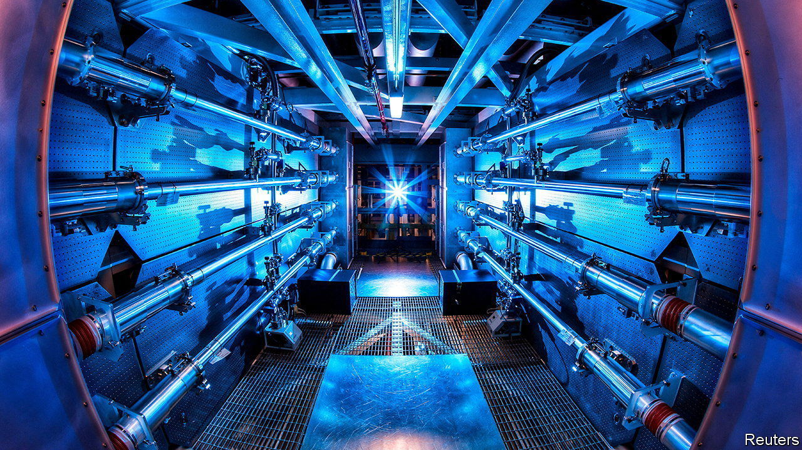

###### The Economist explains

# What is nuclear fusion? 

##### A long-hyped green technology is about to face its reality check 

 

> Aug 7th 2023 

CULHAM, A VILLAGE near Oxford, in England, is home to just 500 people. It is, though, next door to the nearest thing on Earth to a “Silicon Valley” of . What is happening there epitomises the shift of the search for controlled fusion power from governments to private enterprise. For, at the end of this year, the Joint European Torus (JET), a long-standing intergovernmental fusion project located in Culham, will shut up shop. Meanwhile, three firms which hope to use fusion to generate electricity at grid scale are breaking ground there (or are about to do so) for demonstration plants. Does the technology have commercial potential?

Fusion is something which people seem to get excited about for all the wrong reasons. It is, at bottom, just another potential way of generating electricity, yet it sometimes seems to be endowed with near-magical properties. The latest misleading headlines concern the National Ignition Facility (NIF), an experiment at the Lawrence Livermore National Laboratory (one of America’s nuclear-weapons labs), in California. Researchers at the lab have improved marginally on a result announced in December 2022, in which they  of a fuel pellet composed of deuterium and tritium (two isotopes of hydrogen) by hitting that pellet simultaneously from different directions with a laser beam that has been split into 192 sub-beams. 

The resulting fusion of deuterium and tritium nuclei to create helium, neutrons and a whack of energy succeeded, on both occasions, in liberating more such energy than arrived in the beamlets. Cue talk about “near limitless clean energy”. 

Setting aside the fact that the NIF is intended not to provide a route to commercial fusion power but rather to mimic, on a tiny scale, what happens in a hydrogen bomb, the brouhaha still ignores the huge energetic cost, far greater than the energy in the resultant beam, of generating that beam. Electricity generation by laser inertial fusion, as this process is known, is still a long way away.

What is going on at Culham, and also at several sites in America, is far more interesting than that. The firms involved are using half a dozen technologies, only two of which resemble JET’s, to pursue fusion. The JET approach, known as a tokamak, employs a hollow doughnut-shaped torus filled with deuterium and tritium heated magnetically to form a plasma, a state of matter in which nuclei and electrons are separated. One of the commercial versions retains the doughnut, but shrinks it. The other makes it the shape of a cored apple. A third firm uses a gun to fire projectiles that do what NIF’s laser does to fuel pellets, but far more efficiently. And others have yet more esoteric devices in mind.

Unlike nuclear fission, there is no  from a fusion reaction, so the only disposal problem is getting rid of irradiated reactor components at the ends of their useful lives. The firms thus involved hope to generate clean energy at a commercial scale. But the process is no more “near limitless” than solar, wind or hydroelectric power—indeed, it is rather less so. Though deuterium is abundant (it is found in water), it has to be extracted, an energy-intensive process. And tritium has to be manufactured from lithium by irradiating that metal with neutrons.

The truth is that fusion is an interesting approach to power generation which has now arrived at its “put up or shut up” moment. If one or more of the ideas on offer proves both technologically possible and cost effective, then fusion may well find a useful niche—possibly a large one—in the post-fossil-fuel energy economy. If it does not, then it was a brave try. But no harm done. ■

