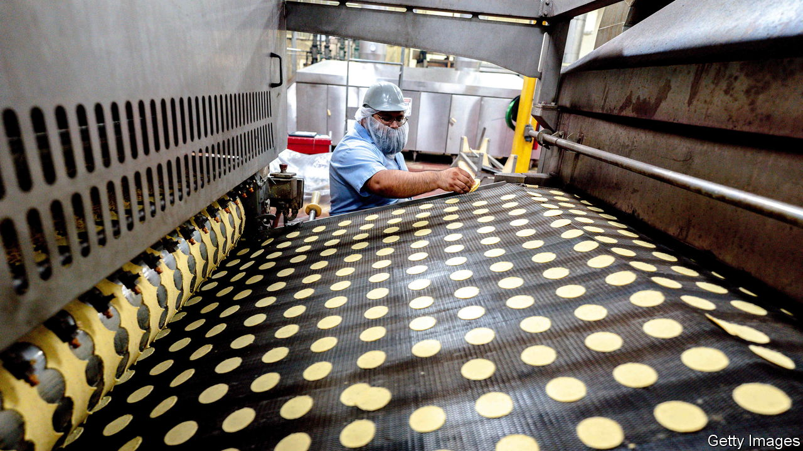

###### The Economist explains

# What makes ultra-processed foods so bad for your health? 

##### They are calorie-rich, nutrient-poor and hard to stop eating 

 

> Aug 7th 2023 

FOOD SHOPPING has become a dangerous pursuit. Nutritional horrors lurk on every shelf. Ready-meals are packed with salt and preservatives, breakfast cereals are sweeter than chocolate bars, and processed meats are packed with nitrite-preservatives, which can form harmful compounds when cooked. A new term is catching on to describe these nutritional bad guys:  (UPFs). In his new book, “Ultra-Processed People”, Chris van Tulleken, a doctor and television presenter, argues that UPFs dominate the food supply in rich countries, and are also creeping into diets in low- and middle-income countries. As they proliferate, so do concerns about their . Just how bad are UPFs, and what do they do to us?

The concept of UPFs was devised by Carlos Monteiro, a Brazilian scientist, in 2009. His team of nutritionists observed that although people in Brazil were buying less sugar and oil, rates of  and type-2 diabetes were rising. That was because they were instead eating more sugar, fats and additives in packaged snacks and pre-made meals. In response, Mr Monteiro proposed a food classification system to take into account the degree of processing involved in the food supply.

Processing can make healthy foods unhealthy: fruit, for instance, goes from healthy to unhealthy as it is desiccated, squeezed or sweetened. Mr Monteiro’s system, called Nova, puts foods into four “buckets”: unprocessed and minimally processed foods; processed culinary ingredients; processed foods; and ultra-processed foods. This allows more fine-grained distinction between different degrees of processing. Thus staples such as rice, oil or flour, which all require minimal processing for consumption, do not belong in the same category as a Twinkie.


UPFs often go through many sophisticated industrial processes. That does not make them all unhealthy by default—a soya-based meat substitute can be part of a balanced meal—but the frequent consumption of UPFs causes a constellation of issues. Most contain a blend of artificial ingredients, plenty of salt and sugar, and few nutrients. Arguably, some UPFs are more akin to industrial products than food.

By dialling up their flavours and palatability, UPFs are engineered to be easier to eat in large amounts than whole foods (try leaving crisps at the bottom of the packet). The extent of the problem was revealed in 2019 by researchers at the National Institutes of Health in America who sequestered volunteers and offered two groups as much food as they wanted. Over a fortnight those on an ultra-processed diet ate some 500 more calories each day, roughly equivalent to a McDonald’s Big Mac, leading them to gain weight; those on the unprocessed diet ate less and slimmed down. 

Eating UPFs has also been linked to poor health more broadly. Another study in 2019 found an association between intake of UPFs and overall risk of cardiovascular and cerebrovascular diseases, which affect the brain, such as strokes. Another recent study showed that eating fewer UPFs was linked with lower risk of a number of cancers. A UPF-heavy diet also seems to affect the gut microbiome, the trillions of bacteria that contribute to health in a range of ways. These sorts of association studies cannot prove causality. Randomised-controlled trials would be ideal, but more ambitious tests may not be ethically possible given the suspected deleterious effect of these kinds of diets. That said, there is plenty of evidence linking many ingredients in UPFs, such as sugar, salt, refined carbohydrates and saturated fats, to negative health outcomes.

Yet UPFs are cheap, tasty and abundant, and for those on a tight budget or on specific diets, such as vegan, there are often few available alternatives. It is possible to eat well by selecting the right UPFs, such as whole-grain cereals, which are often fortified. Government scientists at the American government’s Agricultural Research Service showed it was possible to build a healthy diet with 91% of calories from selected UPFs. But Marion Nestle, a professor of nutrition at New York University, criticised the study, saying the researchers had a conflict of interest through their links to the food industry. Better stay vigilant in those treacherous supermarket aisles. ■

