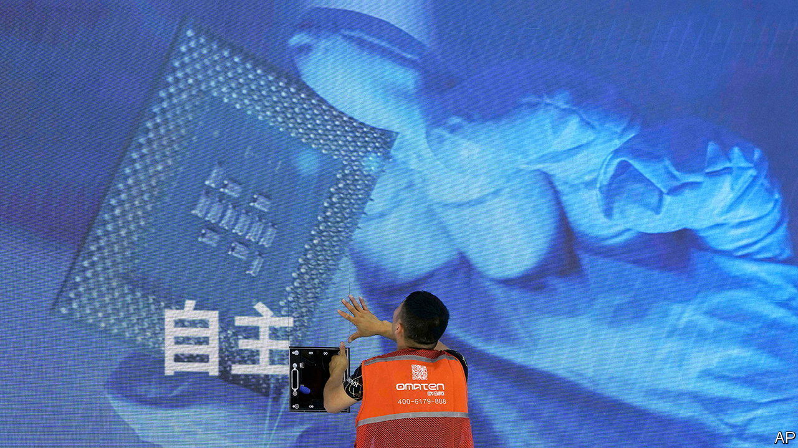
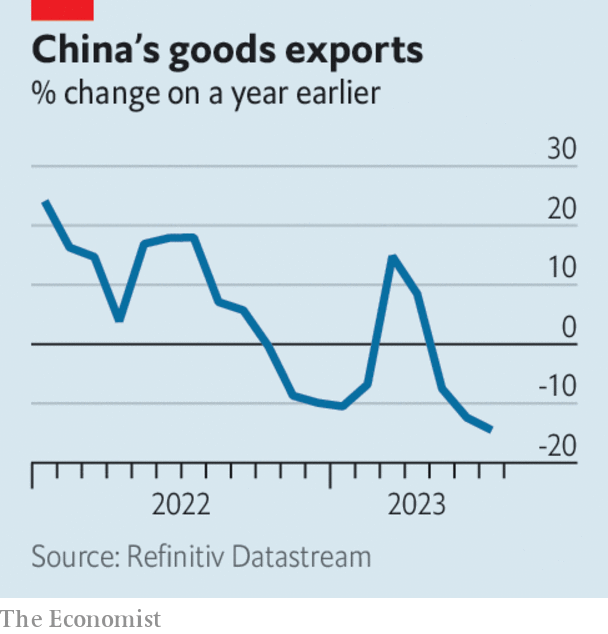

###### The world this week

# Business 

#####  

 

> Aug 10th 2023 

America escalated its  when Joe Biden issued an executive order banning future private-equity and venture-capital investments in certain advanced technologies in China, namely artificial intelligence, quantum computing and . All companies investing in those industries in China will also have to inform the government of their activities. The administration said the decision was taken on grounds of national security, but it risks undermining an effort to ease diplomatic tensions with Beijing. 

 


consumer-price index fell by 0.3% in July, year on year. The index of factory-gate prices slumped by 4.4%. China had been teetering on the brink of deflation for months, as the rebound from lockdowns fizzled out. The value of Chinese exports declined by 14.5% in July at an annual rate, the biggest drop since the start of the pandemic.

The competition between America and Europe to attract investment in  heated up when TSMC, a big Taiwanese semiconductor company, said it would build a factory in Germany. TSMC is spending €3.5bn ($3.8bn) on the project; the German government is stumping up another €5bn. The EU recently approved the Chips Act, a package of subsidies that aims to double the EU’s global share in chipmaking from 10% to “at least” 20% by 2030. 

 Vision Fund made its first investment gain in over a year during the latest quarter, though the Japanese tech conglomerate racked up another heavy net loss. SoftBank said it would begin to invest again, especially in AI, but would do so “timidly, with fear in our hearts”. Meanwhile a slew of tech giants, including Amazon, Apple, Nvidia and Samsung, were reported to be lining up to take stakes in , a chip designer, when SoftBank floats the firm on the stockmarket in September. 

, one of SoftBank’s worst bets in recent years, warned of a “substantial doubt” about its “ability to continue as a going concern”. The provider of shared working spaces said that a surplus of commercial property and economic uncertainty had contributed to its problems. Its stock slumped. WeWork was once valued at $47bn. It is now worth around $275m. 

Blown off course 

Siemens Energy, a big provider of , warned that its losses this year are expected to reach €4.5bn ($5bn) because of ongoing problems with rotor blades and bearings in certain onshore turbines. It also said that offshore projects “already committed to contractually cannot be completed profitably if implemented by the customer”. Vestas, the world’s biggest provider of wind turbines, reported a quarterly loss (though it hopes to turn an annual profit). As demand for wind power has soared, the industry is beset by rising costs, supply-chain problems and backlogs. 

Novo Nordisk released the results from the latest trial of its , Wegovy, which found that patients who took the treatment had a 20% lower chance of suffering a heart attack or stroke. Meanwhile Eli Lilly upped its revenue and profit forecasts amid surging sales of its diabetes and weight-loss medicine. The share prices of both companies hit record highs. 

After a turbulent few years, during which it got caught up in Hong Kong’s political upheavals and was hit hard by the pandemic,  reported a six-month net profit of HK$4.3bn ($550m), its best first-half performance since 2010. The airline expects to reach 70% of its pre-pandemic capacity by the end of the year, compared with 3% a year ago. 

reported another drop in subscribers for its streaming services, but the business’s loss in the latest quarter narrowed to $512m from over $1bn a year ago. The company announced more big price rises, lifting the cost of subscribing to the ad-free version of Disney+ by 27%. 

, one of the big publishing houses in America, was sold to KKR, a private-equity firm, for $1.6bn. The deal comes less than a year after an attempt by Penguin Random House to take over its smaller rival was blocked on antitrust grounds. 

Get back to your desk

Zoom has told employees to  at least two days a week. In May the company’s boss, Eric Yuan, said it was hard to force workers back and that letting “employees work anywhere has sort of become a fashion”. Zoom’s technology enabled the shift to remote working during the pandemic more than anything else. Lauded as a permanent change to working patterns, there is now a move by corporations to curtail the practice. Even America’s federal government is clamping down on working from home. 

 profit dived by 38% in the second quarter, year on year. The Saudi state oil company made a mere $30bn. 

