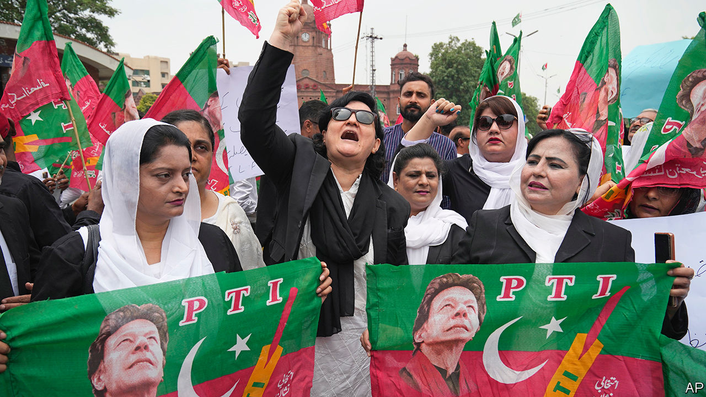
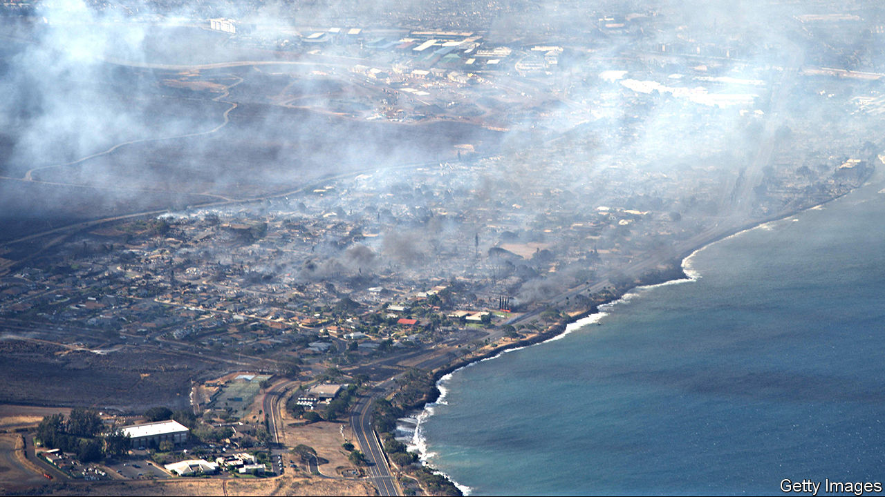

###### The world this week

# Politics 

#####  

 

> Aug 10th 2023 

,  former prime minister and main opposition leader, was sent to prison for three years after being found guilty of “corrupt practices” in relation to gifts he received in office. He has also been barred from politics for five years. Mr Khan says the charges have been trumped up by his enemies. Owing to an army-led crackdown on his supporters over the past three months, protests against his arrests were subdued.

, the leader of  opposition Congress party, returned to parliament after the country’s Supreme Court suspended his conviction for defamation. Mr Gandhi was found guilty in March in what he claims is a politically motivated case. The Supreme Court said that the convicting court had failed to explain why it had given Mr Gandhi the maximum sentence of two years in prison, which had triggered his disqualification from parliament.

A report by UN investigators found that  armed forces had stepped up their “widespread and systematic attacks against civilians”, carried out through indiscriminate bombing campaigns and the torching of villages. The investigators are building a case to hold “individual perpetrators” accountable for war crimes. 

 attacked  in the Black Sea. It launched sea drones at both naval ships and tankers near the port of Novorossiysk, a major export hub and naval base for Russia. The strikes, which have sent oil and wheat prices up, are retaliation for Russia withdrawing from the UN-brokered grain deal in July. Shipping-insurance costs soared.

Russia tried to break the main opposition leader, , by extending his prison term to 19 years. The vocal blogger, who survived a poisoning attempt in 2020 and is serving time in a high-security prison, will be moved into greater isolation at a penal colony reserved for the worst of criminals. “You, not me, are being frightened and deprived of the will to resist,” he told supporters in a message posted online.

Meloni’s credit-rating sinks

Italy’s conservative government, led by Giorgia Meloni, imposed a one-off 40%  for not passing on interest-rate increases to savers. The tax will fall on the income that banks reap from the gap between lending and deposit rates (as bank stocks plunged in reaction the tax was capped at 0.1% of total assets). Other European countries, such as Spain, have introduced similar levies. In Britain the financial regulator has given banks just four weeks to explain why their low savings rates are so low, and promises “robust action” if they don’t offer an ample justification.

At least 41  died when their boat sank off the Italian island of Lampedusa. The vessel had sailed from Tunisia, the latest hot-spot used by traffickers to send migrants on the perilous journey across the Mediterranean to Europe. 

 continued, after a close result in July’s election. The far-right Vox party said it would support a minority government of the centre-right People’s Party (PP) to keep a left-wing coalition out of power. But that did not help the PP make new friends—hours after the announcement, its most likely ally, the moderate Basque Nationalist Party, ruled out its backing of the PP.

 president set October 15th as the date for the country’s parliamentary elections. The Law and Justice (PiS) party is leading the polls, but it is unlikely to clinch the majority it needs to govern alone. Since coming to power in 2015, Poland’s conservative government has clashed with the EU over the rule of law, but proved to be a stalwart NATO ally in Ukraine. A referendum on the EU’s migration policy could also be held on election day.

One of the candidates in  forthcoming presidential election was shot dead at a rally.  had made corruption and crime the focus of his campaign, issues he had investigated as a journalist. He said he had received threats from a gang leader recently. 

The eight South American countries that are home to the  basin created an alliance to work together to crack down on deforestation and other illegal activities at a summit in Brazil. The agreement could amplify the region’s voice on environmental problems. But it lacks firm commitments. The other countries failed to sign up to Brazil’s goal of zero deforestation by 2030.

Diplomatic efforts to reinstate the elected government in  appear to have made no progress. Victoria Nuland, a senior American diplomat, was not given an audience with General Abdourahamane Tchiani, the leader of the coup, or with Mohamed Bazoum, the ousted president. Mediators from the UN and African Union could not enter the country.

The civil war in  that broke out in April has forced more than 4m people from their homes, including almost 900,000 who have fled to neighbouring countries, according to the UN. The ongoing fighting has destroyed large parts of the capital, Khartoum.

 said it has pushed militiamen from the Amhara ethnic group out of Gondar, the region’s second-largest city, and Lalibela, a town known for its churches carved into stone. The towns were seized by fighters from the Fano militia in early August. Government plans to integrate regional forces into the national army have sparked tensions. Tension had been building since April, when the government said all regional forces were to be integrated into the national army.

Voters in the  lifted a two-term constitutional limit on the president and extended each term from five to seven years. Opposition members questioned the result, which will allow Faustin-Archange Touadéra to seek a third term as president.

Data breaches in  prompted calls for more vigilance. The Electoral Commission said that hackers had accessed internal emails and voter data. Separately,  accidentally disclosed the names and locations of its staff. The sensitive information could imperil officers. Northern Ireland’s terrorism-threat level was raised to the highest category this year.

 


Dozens of people were killed as wildfires swept across the  island of Maui, destroying much of Lahaina, a historic tourist town. The flames were fanned by strong winds and drier-than-usual local conditions. 

Voters in Ohio roundly rejected a ballot measure supported by the Republican legislature that would have made it harder to modify the state constitution. The real issue at stake was . Another measure is being put forward for November that would insert a right to abortion in Ohio’s constitution. 

Stating the obvious

 at last acknowledged that  was defeated in the presidential election of 2020. “Of course he lost,” exclaimed Mr Trump’s main challenger for the Republican nomination in the next election. Mr DeSantis senses a new line of attack given Mr Trump’s mounting legal woes. Many other Republicans still refuse to admit that Mr Trump lost. 

