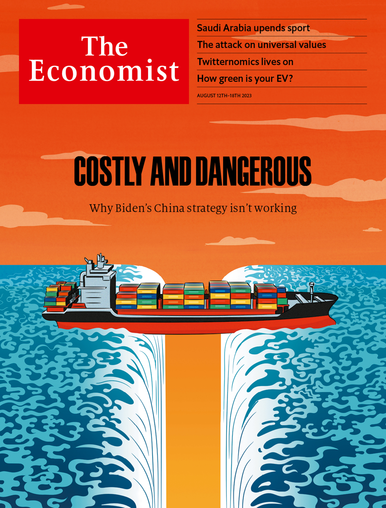
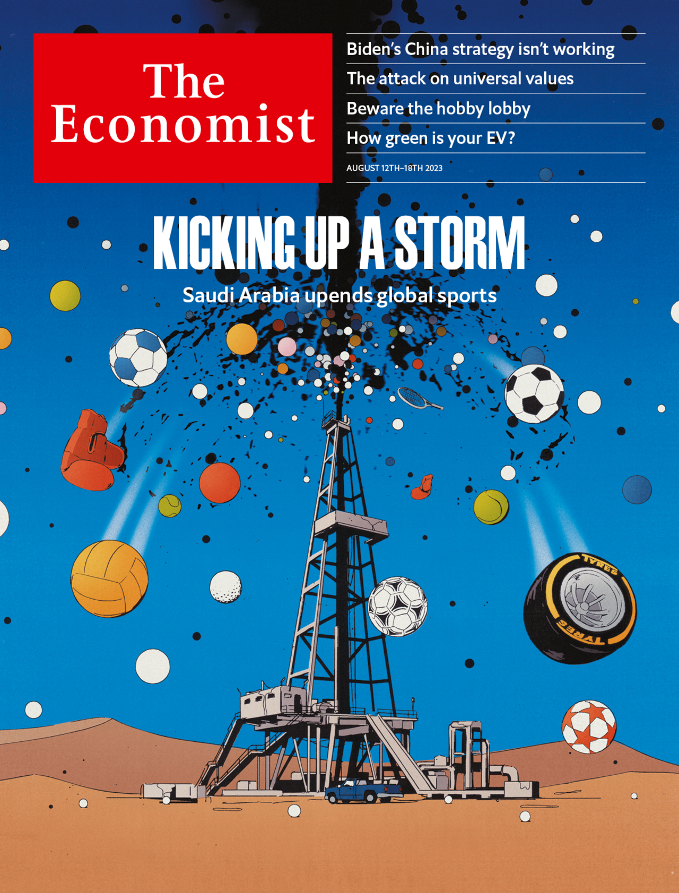

###### The Economist

# This week’s covers 

##### How we saw the world 

> Aug 10th 2023 

Some weeks, including this one, we publish more than one cover. In most of the world, we look at President Joe Biden’s China strategy. On August 9th, Mr Biden unveiled new rules that will police investments made abroad by the private sector. Investing in the most sensitive technologies in China will be banned. But the consequences of such “de-risking” measures are now becoming clear. Unfortunately, they bring neither resilience nor security.

 


: 

: 


Meanwhile in Britain, Europe, the Middle East and Africa we examine Saudi Arabia’s rush into global sports. Pumped up on petrodollars and desperate to reinvent itself under Muhammad bin Salman (mbs), its 37-year-old de facto ruler, it has spent $10bn on players, teams and leagues, upending golf and football. We look at what this, and other spending sprees, mean for the business.

 


: 

: 


