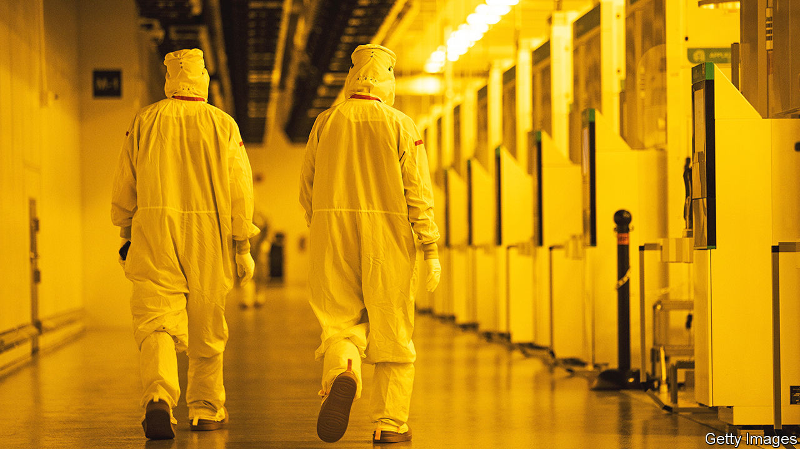

###### Chipping in

# America is building chip factories. Now to find the workers 

##### The country’s chipmaking goals will test its manufacturing potential 

 

> Aug 5th 2023 

JUDGED BY ONE measure, America’s new industrial policy is off to a roaring start. Enticed by subsidies, companies are pouring money into semiconductor plants and electric-vehicle factories. With investment in manufacturing facilities running at a record high, President Joe Biden’s claim that the future will again be “made in America” seems more credible than it once did. 

The next step is less certain. America is building factories, but can it find the workers to operate them? With the jobless rate near a five-decade low, firms are already struggling to find staff. As scores of new factories are built, the gaps will grow.

Semiconductors are the most important test case for America’s manufacturing revival. Over the past couple of decades makers of computer chips have largely left America. The country still has world-class semiconductor researchers and designers, but has been denuded of a workforce that turns silicon wafers into electronic circuits at scale. Hoping to reverse that tide, the  passed last year will see the government dole out $50bn over the next half-decade.

A baseline estimate from the Semiconductor Industry Association, a trade body, is that by 2030 America’s chip sector will face a shortage of 67,000 technicians, computer scientists and engineers, and about 1.4m such workers throughout the wider economy. Set this against the total of roughly 70,000 students who complete undergraduate degrees in engineering in America each year, and the scale of the deficit becomes apparent. Whatever the precise gap, it marks the difference between foundries running at full capacity with labour bills under control, or ending up mired in high costs and low productivity.

One of the sites at the centre of America’s ambitions offers an early glimpse of the problem. The Taiwanese Semiconductor Manufacturing Company (TSMC), the world’s largest maker of chips, plans to invest $40bn in two factories in Phoenix, Arizona, greatly boosting America’s ability to craft large volumes of ultra-small semiconductors. If it is successful, it will suggest that America can reclaim a position at the cutting-edge of chip production.

The first of TSMC‘s factories was due to start production next year. But in July it announced that the launch would be put back to 2025 because it could not find enough workers with the expertise to install equipment at such a high-tech facility. Mark Liu, TSMC’s chairman, said the firm would send technicians from its home base in Taiwan to train its American staff.

“My nightmare is investing in all of this infrastructure and then not being able to build the workforce,” says Shari Liss of SEMI Foundation, a microelectronics lobbying group. The fact that many share her worry is at least a useful spur. A report in January from the Brookings Institution, a think-tank, said America needed a “surge of national, state and local actions” to provide enough workers for the chips sector. The outlines of that are taking shape.

The most immediate hole, as illustrated by TSMC’s troubles, is in the construction industry. The Commerce Department reckons that about 100,000 builders may be needed for the first phase of investments in semiconductor fabrication plants, or fabs. The government cannot conjure such a labour force out of thin air. But it has made its subsidies contingent on companies explaining the steps they will take to recruit and train construction workers.

An official in the Commerce Department says the government wants companies to collaborate on building up a construction workforce. “Workers that are trained for one project will then be beneficial for other fabs that get built,” the official says. In this respect TSMC’s plan to import Taiwanese trainers is less a bug than a feature, helping to transmit knowledge.

Once the fabs are built, they will need technicians to operate them. Such workers, responsible for tasks like inspecting tools and products, have historically required two years of training at a community college or a vocational school. But companies and educators have started experimenting with much shorter courses.

Most eye-catching are quick-start programmes that promise to churn out technicians in just ten days, offered by Maricopa Corporate College in Arizona and Portland Community College in Oregon. The Portland college, supported by Intel, an American chipmaker, offers students stipends of $500 a week, and the one in Arizona guarantees its students interviews with TSMC. Still, no company is about to put candidates with just ten days of training anywhere near the multi-million-dollar machinery inside their fabs.

The more realistic goal is to whet people’s appetites for a career in semiconductors. “Our intent is to reach out to people who may think they lack the skills for this type of job,” says Gabriela Cruz Thompson of Intel. She notes that the firm has been more successful at recruiting women and minorities to the quick-start programmes than to traditional two-year courses. 

There may soon be more in-between options. This autumn Columbus State Community College in Ohio, where Intel is building two fabs, will offer a first-of-its-kind one-year programme. The aim is for students to “finish job-ready” for Intel.

The next rung up the work ladder in fabs are the engineers who run them. Universities near some of the plants under construction, including Arizona State and Ohio State, have expanded their offerings of semiconductor courses as part of degrees in engineering and physical sciences. Leading the charge is Purdue University in Indiana: last year it launched a semiconductor degree programme for both undergraduates and graduates.

The aim of Purdue’s “lab-to-fab” model is to collaborate more closely with companies. As part of a $49m upgrade of its “cleanroom” facility, it gives students access to the sorts of conditions and materials they would encounter in commercial enterprises, along with testing their mettle in the head-to-toe bunny suits they must wear to keep chips free of contamination.

This summer Purdue introduced an eight-week course that included a $10,000 stipend for students, funded by companies that hope to attract would-be workers before they are seduced by Silicon Valley. And in an industrial park at the south-west edge of campus, SkyWater, an American chip foundry, will build a $2bn fab. “Students will be able to wake up in their dorm, turn right and go to their classes, and then turn left and do an internship,” says Mung Chiang, president of Purdue. 

Fab opportunities

Ms Cruz Thompson says that Intel expected 100 or so people to register for quick-start courses. But about 900 did. At Purdue enrolment has also been very strong. In May Handshake, a job platform for recent graduates, reported that applications for full-time jobs at semiconductor companies were up by 79% compared with last year, versus 19% in other sectors. “Students…realise that chips are the new oil,” says Vijay Raghunathan, Purdue’s director of semiconductor education.

Unfortunately, America is limiting its access to one obvious source of talent. Immigrants account for about 40% of highly skilled workers in America’s semiconductor industry. They are funnelled through a couple of visa programmes, with strict caps. Those caps are fixed, meaning that as the industry expands they will become more restrictive. Politicians on the right, including Donald Trump, have floated eliminating the visa openings altogether.

America’s chip firms are already configured for a small but skilled workforce. As they outsourced manufacturing abroad they grew more specialised at home, putting America at the commanding heights of the global industry. Qualcomm, Nvidia and others became world leaders in developing and designing advanced chips. It was a highly profitable division of labour.

Now America is trying to retake a foothold in the industry’s lower tiers, relearning basic skills such as cutting wafers into chips and packaging them in hard plastic casing. The political imperative is to guard against excessive reliance on China. For companies there is also a logic in diversifying supply chains and bringing manufacturing closer to research operations.

The welcome news for those wanting to bring about this shift is that colleges and universities are tilting in their direction. But it remains a gargantuan gamble: not so much on the future as on bringing America back to a manufacturing past that it once made commercial sense to leave behind. ■


