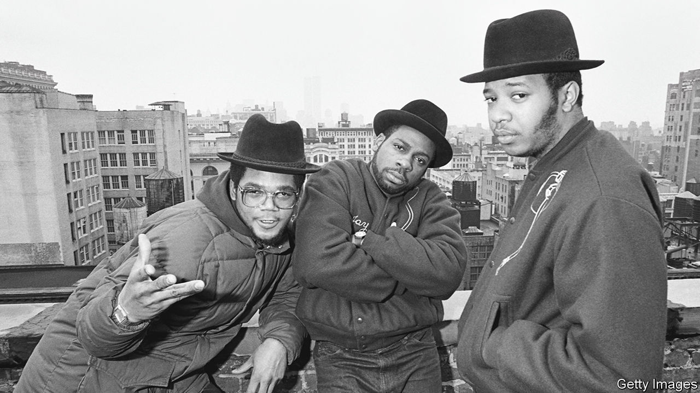

###### Hip-hop hooray!

# Hip-hop’s 50th anniversary shines a light on its New York City birth 

##### From humble beginnings on Bronx streets to billionaires and bling 

 

> Aug 10th 2023 

ON AUGUST 11TH 1973 Cindy Campbell, hoping to raise money to buy school clothes, hosted a “jam” in the rec room of 1520 Sedgwick Avenue, the apartment building where she and her family lived. Admission for girls was 25 cents. For “fellas” it was 50 cents. Her 18-year-old brother, Clive, better known as Kool Herc, dj’d.

His turntables, mixer, enormous speakers and amplifiers pumped out tunes and beats into the wee hours. He repeated instrumental breaks to lengthen the most danceable part of songs. The “break” dancers became known as b-boys and b-girls. A friend, Coke La Rock, hyped up the crowd. It was not called hip-hop yet, but that “jam” is widely recognised as the start of a culture and society-changing type of music that became more than just a genre.

The Bronx was the centre of the new movement. DJs played on the city’s streets and in its parks, siphoning electricity from lamp-posts to pump up the volume. Grandmaster Flash and the Furious Five attracted throngs of fans first at block parties, parks and then at clubs. Before he was even a teenager, Grandmaster Wizzard Theodore invented record “scratching”. Most songs were party anthems until Melle Mel’s “the Message”, hip-hop’s first socially conscious song and one of the best hip-hop singles ever. Its scathing lyrics depicted a bleak Bronx and resonated beyond New York’s five boroughs. “Broken glass everywhere. People pissing on the stairs, you know they just don’t care… Don’t push me ’cause I’m close to the edge”.

Chuck D, Public Enemy’s front man, once said that “Rap is Black America’s TV station. It gives a whole perspective of what exists and what black life is all about.” Darryl McDaniels, the DMC of Run-DMC, the first hip-hop group to go platinum, is still in awe of hip-hop’s pioneers. “When I saw a flyer with Grandmaster Flash’s and Melle Mel’s names on it, it was like Batman and Spider-Man really exists.” He is disappointed that many top rappers today perform without a DJ. “It’s not hip-hop.”

The four elements of hip-hop are the DJ, the MC, b-boys and graffiti. At first the MC (master of ceremonies) amped the crowd, but eventually took centre-stage with rhymes and witty lyrics. The b-boys and b-girls popped and locked during the DJ’s breaks. Modern graffiti, which began in Philadelphia, became an art form in New York City. Eric Felisbret, author of “Graffiti New York”, says that graffiti is often the “stepchild” of hip-hop, probably because it was difficult to commodify. Hip-hop now includes language (bling), film, fashion and politics (Eric Adams, New York’s mayor, calls himself the hip-hop mayor).

 has gone from block parties in the Bronx to become a global phenomenon. “You never thought that hip-hop would take it this far,” as Biggie Smalls astutely observed in his 1994 hit “Juicy”. Auction houses that sell Old Masters paintings now have hip-hop collections on the calendar. “There’s a small supply and high demand for the materials,” says Cassandra Hatton, global head of science and pop culture at Sotheby’s. At a recent anniversary auction, early hip-hop flyers and Polaroid photos were hot commodities. Monica Lynch, a former president of Tommy Records who launched the careers of Queen Latifah and Naughty by Nature, contributed to the auction. 

City Hall has organised block parties in each borough to celebrate the anniversary. LL Cool J, a hip-hop legend, hosted a concert with an impressive line-up, which included Run-DMC, Roxanne Shanté, an early female rapper, and De La Soul. Yankee Stadium will also stage a celebratory concert. “We gotta use the anniversary as an opportunity,” says Mr McDaniels. Hip-hop “still has a lot of work to do”.

Hip-hop artists are of their communities. A Tribe Called Quest reminisced about Linden Boulevard in “Check the Rhime”. Fat Joe rapped of Trinity Avenue. Cam’ron’s rhymes include his childhood address: “I’m from 101 West to Hund-fortieth, the shit is live. 5th floor.” Run-DMC rapped about Christmas in Hollis, their Queens neighbourhood. “Place has a whole lot to do with hip-hop,” says A.D. Carson, a professor of hip-hop at the University of Virginia, “even if the places are digital places or digital space.”

RayZa, a Bronx rapper who is also a guide for Hush Hip-Hop Tours, points out almost breathlessly all the hip-hop landmarks on a recent tour of the South Bronx and Harlem. Forest Houses is where Fat Joe grew up. Disco Fever nightclub, now a furniture shop, is where Grandmaster Flash spun. West 139th Street is where Jay-Z rap-battled with Big L. A mural depicts Big Pun. And the rec room at 1520 Sedgwick Avenue.

To many, including RayZa, it is sacred ground. “Without that room, the culture wouldn’t exist. There’d be no Jay-Z, no LL Cool J, no Roxanne Shanté, no me, no Ice-T, no Ice-Cube, no NWA. Imagine no NWA.” RayZa is certain that thousands of years from now, people will look at the rec room the way we look at the pyramids. “It’s gonna come to a point where they’re gonna charge thousands of dollars to touch it.” ■


