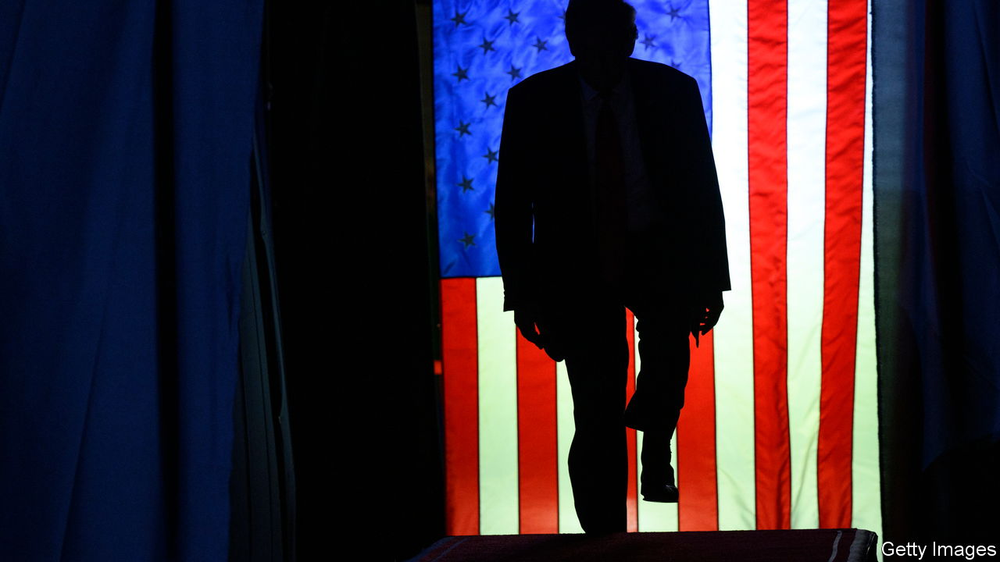

###### Trial balloons

# How strong is Trump’s defence in the election-stealing case? 

##### His lawyers are previewing a fraught strategy—but one tack could work 

 

> Aug 10th 2023 

DONALD TRUMP’S trial for allegedly trying to steal the 2020 election from Joe Biden will not begin for months. But the contest to shape public opinion began on August 1st after Jack Smith, the special counsel, set out four charges. With help from conspirators making false claims of election fraud, Mr Smith alleges, Mr Trump pushed state officials to replace legitimate electors with fraudulent ones, organised fake electors in seven states, sought help from the Department of Justice (DoJ) and pressed Mike Pence, his vice-president, to alter the results on January 6th 2021.

A former president has never before been indicted for trying to steal an election, let alone in the midst of a campaign to take back the White House. Whereas the DoJ is trying to keep the law and the politics separate (tricky as that is), Mr Trump and his lawyers endeavour to merge them at every turn. After being instructed not to influence jurors or witnesses at his arraignment on August 3rd (on pain of being jailed), Mr Trump wrote an all-caps social-media post promising he would be “coming after” anyone who would “go after” him. He also posted complaints about Mr Smith and Mr Biden, and attacked the objectivity of the judge assigned to his case. 

Requests for a venue change and for Judge Tanya Chutkan’s recusal are not likely to be granted. But there may be a political pay-off for Mr Trump: an excuse to paint his trial as rigged from the start. Similar themes emerged this week in a squabble over whether Judge Chutkan should issue a “protective order” during discovery, the pre-trial process when the two sides inform each other of the evidence they plan to present to the jury. Worried that Mr Trump would “improperly press his case in the court of public opinion”, Mr Smith urged the judge to bar the defence from publicising this information. Judge Chutkan will soon rule on this matter.

Only once the trial begins will Mr Smith’s full evidence—and all of Mr Trump’s arguments—come to light. But of the four defences that have been floated, it seems three won’t get Mr Trump very far.

The most prominent, if least convincing, argument points to the First Amendment. One of Mr Trump’s lawyers, John Lauro, claimed on Fox News that everything for which his client is being prosecuted is “core political speech”, as he was simply “petitioning the government” when he was labouring to stay in power. But Mr Lauro acknowledged on NBC News that Mr Trump’s entreaties to Mr Pence to refuse to certify the election amounted to a “technical violation of the constitution”. Later, he said Mr Trump’s suggestions were merely “aspirational”. 

Plenty of laws criminalise conduct-laden speech—from deceiving a customer to “your money or your life”—without violating the First Amendment. As Justice Hugo Black wrote in 1949, freedom of speech does not afford “immunity to speech or writing used as an integral part of conduct in violation of a valid criminal statute”. 

Trial balloons

Mr Lauro also told CBS News that his client was “following the advice of John Eastman”, a “legal scholar”, when he put pressure on Mr Pence. But along with Kenneth Chesebro, architect of the fake-electors plot, Mr Eastman and four other unindicted and officially unnamed advisers are accused of conspiring with Mr Trump to steal the election. That nullifies the advice-of-counsel defence, as it does not apply when the lawyer “is a partner in the venture”, a circuit court has held.

A third errant trial balloon suggests that Mr Trump is immune from prosecution. Although presidents have long been immune from most forms of legal action while in office, the Supreme Court has never held that they retain immunity when they leave the White House. There is no plausible reason for forbearance from prosecuting ex-presidents: immunity exists so that lawsuits do not “unconstitutionally undermine the capacity of the executive branch to perform its constitutionally assigned functions”. 

That still leaves a fourth, more plausible, line of defence: Mr Trump’s state of mind. Mr Lauro has said that in his “heart of hearts” Mr Trump believed he won the 2020 election. Mr Smith cites evidence that he must have known that he lost. Many lawyers and advisers in his inner circle told him so repeatedly.

Even if Mr Trump’s lawyers can persuade a jury he never accepted his loss, does that mean he lacks the requisite intent for criminal wrongdoing? Not necessarily, says Ryan Goodman, a New York University law professor, in a Twitter thread. That irrational belief might have impelled his criminal acts, but the acts themselves are still criminal. Even if he believed he won, Mr Trump could not lawfully press Georgia’s secretary of state to find 11,780 votes by threatening “criminal punishment and threats to the official’s personal safety”. Nor could he “purposefully submit what he knows to be false claims of election fraud to courts” or “pressure the vice-president to outright reject electors”.

However, intent is slippery. If Mr Lauro can persuade one juror that his client’s scheme to reverse the election was protected speech stemming from strongly held beliefs, Mr Trump could walk (since jury verdicts must be unanimous). The ex-president’s legal team faces a dilemma, too. His testimony would be needed to buttress the intent or advice-of-counsel arguments. But given Mr Trump’s penchant for ad-libbing and lying, no defence lawyer would be wise to risk putting him on the stand. That leaves a Catch-22: evidence of Mr Trump’s state of mind could save him—or subject him to still greater legal peril. ■


