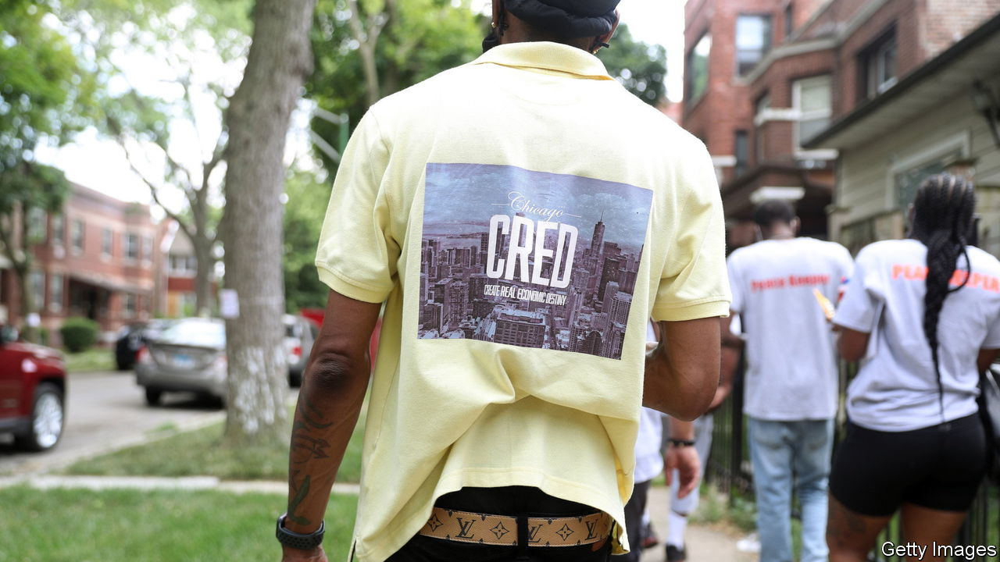
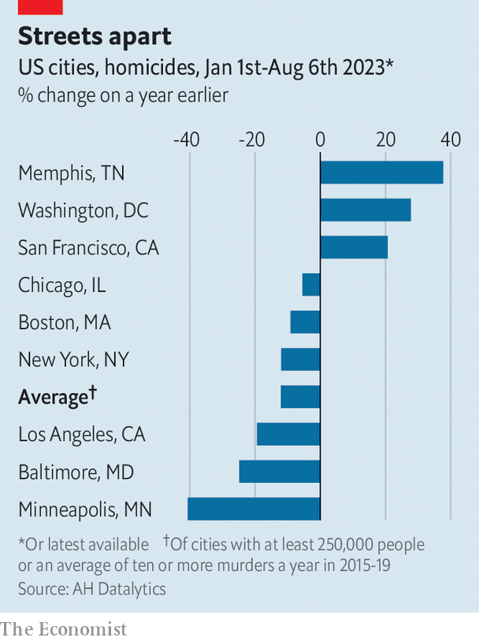

###### Shot down

# Murder rates are falling in a majority of American cities 

##### But it is too soon to say that the post-pandemic wave of violence is over 

 

> Aug 9th 2023 

ON A HOT Wednesday afternoon the office of Chicago CRED, a charity run by Arne Duncan, a former secretary of education, is buzzing. In the car park and inside, dozens of workers dressed in bright vests reading “Peacekeeper” mill around. Each morning they meet at the squat building off 103rd Street in Roseland, a neighbourhood on the far South Side, to share information—who is arguing, what fights or gunshots have already been reported, where gangs might be feuding. The workers then spread out into the neighbourhood in an effort to stop shootings before they happen. By 2.30pm the place is quiet.

According to Terrance Henderson, CRED’s outreach supervisor and a former gang member himself, this work helps explain why violence has dipped in the neighbourhood. “The summer has been going pretty well,” he says. “We had a horrible first quarter,” he adds, when three people were shot outside a Walmart and a local rapper was shot, starting a feud. But “We was able to stabilise that early in the spring.” So far this year, in Roseland and West Pullman, the areas the office covers, the number of murders is down by five compared with the same period last year, or by roughly 20%. Across Chicago, the number of murders counted by the police so far this year is down by about 5% compared with last year. Compared with 2021, when violence peaked, it is down by 20%. 

 


It is not only Chicago (where the crime rate has, to the annoyance of residents, become a national obsession) in which violence appears to be falling. Surveys of the biggest cities suggest that murder rates are down in a large majority of them this year. According to the Council on Criminal Justice, a research group, the homicide rate in 30 of America’s biggest cities was 9% lower in the first half of this year than last. Another survey of 109 cities tracked by AH Datalytics, a New Orleans-based analysis firm, shows a drop of 12% this year (see chart). Some of the biggest falls have been in cities that were especially hard-hit, such as Minneapolis. It is a hint that the wave of violence that rolled across America from the summer of 2020 may have crested.

The most plausible explanation, suggests Daniel Webster, a criminologist at Johns Hopkins University in Baltimore, is that “we are past covid and the economic and social disruptions that it caused.” Explaining why violence rose in 2020 is also tricky. Social services were closed because of the pandemic; the murder of George Floyd by a police officer in Minneapolis led to protests that worsened relations between police and people in the most hard-hit neighbourhoods; lots of cops retired; gun sales soared. All those factors, however, are now returning to something more like normal, notes Mr Webster. There are “all sorts of things that can affect the murder rate”, says Jeff Asher, of AH Datalytics. While individual police forces or groups like CRED try to claim credit, in fact the drivers of the decline “are national”.

Yet local factors may also matter. Jens Ludwig, of the University of Chicago’s crime lab, agrees that the end of the pandemic is the most plausible explanation. But he notes that violence often goes in cycles. “When crime rates go up, both the government and private citizens take more preventive measures.” Police forces remain almost as understaffed today as they were a year or two ago. But NGOs like CRED have expanded enormously, and not only in Chicago. That is “a very plausible part of this story as well”, he says. Private security has also expanded. And there may be more subtle behavioural changes, such as parents more strictly controlling their teenage children to keep them out of fights.

Even with the fall so far this year, in most cities violence generally remains higher than it was in 2019. By August 6th 2019 there had been 300 murders in Chicago; the equivalent figure this year was 378. A few crimes, such as car theft, seem to be continuing to rise prodigiously. And things can change fast. Murders have risen sharply this year in Memphis, where the death of a black 29-year-old, Tyre Nichols, at the hands of police in January led to widespread protests. Spikes in violence often follow police killings. The murder rate has also continued to rise in Washington, DC, where the justice system has been gummed up by the ongoing prosecution of people accused of rioting and invading the Capitol on January 6th 2021.

One worry is that cops remain in short supply, and city governments face a squeeze in the coming years. Much of the cash that has been spent on initiatives like violence interruption is temporary. “What happens when federal pandemic-relief money runs out?” asks Mr Ludwig. 

Still, the decline so far will hearten mayors—and Democrats generally. Rising murder rates have been a big problem for the party, which has a troubled relationship with police unions. In the 2022 midterms, 61% of voters told Pew that violent crime was “very important” in determining how they would vote. Republicans ran adverts pointing to surging murder rates all over the country. Explaining why the country has turned a corner may be tricky. But if the murder rate continues to drop, Joe Biden will happily claim the credit. ■


