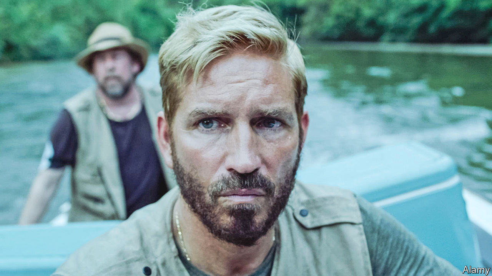

###### Ka-ching

# “Sound of Freedom”: how to make a fortune with a mediocre movie 

##### Turning the culture war into profit 

 

> Aug 10th 2023 

Twenty years ago Barbra Streisand sued a photographer who had taken an aerial shot of her home. Her effort to suppress the photo brought it to the attention of millions. Hence the “Streisand effect”: try to censor something and you risk making it bigger. Today a new name is needed for a related phenomenon: claiming to be repressed to generate hype. “Sound of Freedom”, a new film about Tim Ballard, an anti-sex-trafficking activist, is a case study in how the culture war can be turned into profit.

On July 20th the film, which was released on July 4th, became the first post-pandemic independent movie to make $100m at the box office in America. It is now up to $164m. Though trailing “Barbie” and “Oppenheimer”, it has made more money than the latest offering of “Mission Impossible”, a money-spinning franchise. It cost less than $15m to make and its star, Jim Caviezel, last appeared in a notable movie, “The Passion of the Christ”, in 2004. It has had almost no advertising—of the normal sort.

The film is a reasonably enjoyable action movie. It follows a version of Mr Ballard’s life story, as he is radicalised by his work combating child porn at the Department of Homeland Security, quits and tries to rescue children himself. He infiltrates rebel-held territory in Colombia, single-handedly beats to death a slave-driving child-rapist and rescues his victim, then miraculously flees by stolen speedboat amid a storm of gunfire. 

Left-leaning critics contend, accurately, that the film is not a realistic depiction of sex trafficking. The children are too young; such kidnapping is rare; and most victims are exploited by people they know and trust. Scenes of Mr Ballard reuniting a trafficked Honduran child with his father at the offices of Immigration and Customs Enforcement, filmed at a time when in real life that agency was separating Central American children from their parents, are jarring. Yet the simple depiction of a good Christian American fighting evil foreign white slavers also explains its success.

Mr Caviezel, a conspiracist-minded devout Catholic, has argued that critics are “quaking in their boots” because he is taking on sex-trafficking. Mr Ballard, who has compared himself to Abraham Lincoln, has accused “the godless leftist media” of being so keen to discredit him that they are “running interference for human traffickers”. Rumours on social media that cinemas have tried to stop people from watching it by turning off the air-conditioning inside became so widespread that the CEO of AMC, a big cinema company, had to deny it. 

This, it turns out, is good marketing. Donald Trump has screened the film at one of his golf clubs. Tim Scott, a Republican senator and presidential candidate, called it an “amazing, gut-wrenching, emotional movie”. Fans have eagerly bought tickets for others. 

Mr Ballard recently left Operation Underground Railroad, his charity, amid allegations about his behaviour. Who knows what all this means for the fight against sex trafficking. But what it means for the film’s maker, Angel Studios, is clear: lots and lots of money.■


