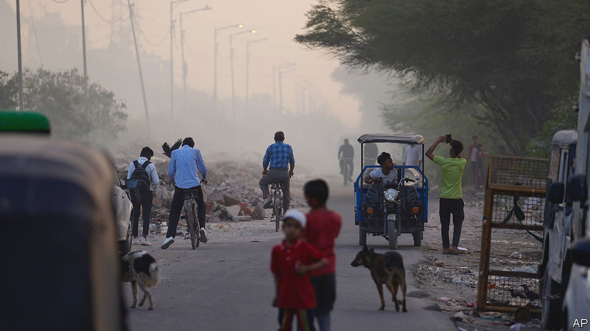
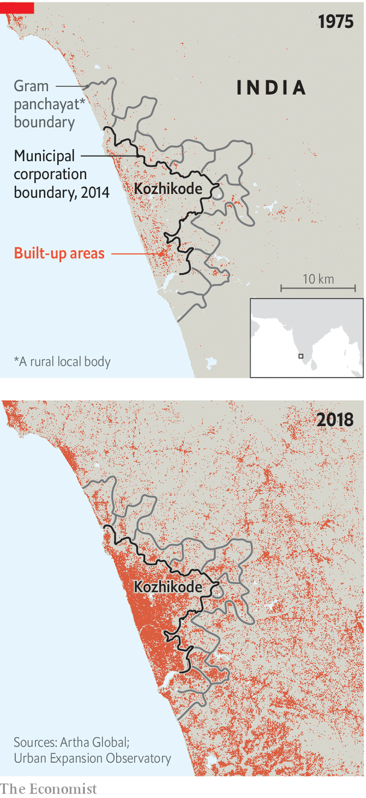

###### Power to the people

# How to fix India’s decrepit cities 

##### Letting them look after themselves would help a lot 

 

> Aug 14th 2023 

Bhubaneswar has lots of greenery, a good bus system, scant signs of rubbish, and inviting public spaces around the ancient temple at its centre. The east Indian city, capital of the state of Odisha, recently acquired broad pavements, orderly parking and modern lighting. Soon it will have 24-hour drinkable tap water—a basic service that even the poshest corners of Delhi and Mumbai lack. Most Indian cities are not like Bhubaneswar. 

They are more often decrepit, overcrowded and unprepared to be the engines of growth that India needs them to be. Most Indian cities—of which 59 have populations of over a million people—lack adequate housing, sanitation, clean water, health care, education, public transport, trees and shade. According to the UN, in 2020 roughly half of India’s urban households lived in slums. This is a huge problem. India’s cities accommodate about 700m people, or half the population, a share that is rapidly increasing as people flood in from rural areas, seeking refuge from poverty in sweltering fields and the added opportunities that cities provide.

India’s urban centres generate 60% of its gdp. By 2036, according to an official estimate, 73% of Indian population growth will take place in urban areas. Workers in big cities command a wage premium of 122% over those in the countryside. Just 5% of Indian city-dwellers are “multidimensionally poor” (ie, very), compared with 19% of people in rural areas. 

Recent governments have promised to address the problem. Most failed, in part because of countervailing demands from poor rural areas, where the other half of Indian voters live. The administration of  and its counterparts in several states are making a better fist of it. The Hindu-nationalist central government has poured money into urban housing, water, electricity, metro systems and other infrastructure schemes. “For the first time cities have become politically salient,” says Srikanth Viswanathan of Janaagraha, an ngo focused on urban governance. 

India’s long-standing neglect of its cities is rooted in Gandhian ideology as well as electoral exigency. Mohandas Gandhi, in some ways India’s founding father, preached that “the soul of India lives in its villages”, a view that gave cities a poor footing in independent India from the start. The constitution sets out powers for the federal government and for states, but hardly mentions cities. Municipal authorities are therefore weak; state governments are mainly responsible for urban policymaking. Only one in eight Indian government employees works at the local level, compared with two in three in China. Where China boosted its urban centres by rewarding local governments for economic development, notes Nirvikar Singh of the University of California in Santa Cruz, no such mechanism exists in India.

Mr Modi’s predecessor, Manmohan Singh of the Congress party, launched a big urban push—which Mr Modi has turbocharged. Since it took office in 2014 his government has ploughed 18trn rupees ($220bn) into civic schemes. A new Urban Infrastructure Development Fund worth 100bn rupees a year was launched in July, aimed at second- and third-tier cities, where a lot of growth will happen. Many state governments are following suit.

Bhubaneswar shows what is possible. Its approach stresses helping the poor and involving citizens in decision-making. “A large section of the population is completely deprived of access to infrastructure, amenities and services,” says G Mathi Vathanan, who oversees urban affairs for Odisha. “Unless we address that, we cannot improve the overall urban landscape.” Odisha has given some 250,000 slum-dwellers title to the land on which they live. Once regularised, slums are given metered water connections, street lighting, rubbish collection and other services. The state has also recognised a “fourth tier” of government, to involve slum-dwellers’ associations in decisions that affect them. The idea is that they are best able to identify local problems and solutions. 

Hundreds of officials from ten other Indian states have attended training programmes in Odisha to study its urban policies. Punjab has adopted the land-titling scheme and is rolling it out to 1.4m slum-dwellers. “The most important thing is to promote innovation across the board and then let cities copy each other,” says Bimal Patel, an architect and urban planner behind many high-profile projects, including India’s new parliament building. 

Yet Bhubaneswar also illustrates what is holding Indian cities back. The core problem remains a lack of autonomy. The chief executive of any Indian city is an unelected bureaucrat answerable to the state government. Mayors are indirectly elected and have short terms and few powers. Owing to delays in civic elections, Mumbai has had no elected local representatives since March 2022. So minimal is their role in running the city, few Mumbaikars will have noticed. Odisha’s focus on a fourth tier of government is all very well; it would be better to create a more serious third tier.

In most cities, governance is widely dispersed among city, state and statutory authorities. Bhubaneswar’s tap-water promise is being fulfilled by a state body. Municipal authorities in Bangalore, India’s IT hub, and other cities do not control its water, sanitation, policing, public transport or urban planning. There is nobody you can throw out of office if the city is broken, says Mr Viswanathan, who lives there. 

 


Bhubaneswar is lucky to belong to a state that has prioritised cities. Elsewhere, cities can get resources from Mr Modi’s urban-development schemes. But they can be used only within municipal boundaries, and most cities have sprawled far beyond them. The city of Kozhikode in southern India exemplifies the problem; its municipal government is unable to provide services throughout most of its extent (see map). Half of the 7,933 urban settlements recognised by the census are governed as rural entities. The central government has tried to tackle this by incentivising states to create more local governments.

A second downside to the top-down approach is that it tends to be piecemeal. Fixing cities “will require us to rethink our urban systems from the bottom up”, writes Feroze Varun Gandhi, a BJP politician, in “The Indian Metropolis”, a new book. That should start with giving cities more autonomy. Yet central and state government officials appear to think this would make cities “really fall apart”, says Mr Patel.

It is not unusual for cities in rising economies to struggle. “There is one quarter” of New York, wrote Charles Dickens in 1843, “which, in respect of filth and wretchedness, may be safely backed against Seven Dials,” then a notorious slum in central London. As recently as a decade ago, Beijing, not Delhi, was a byword for filthy air. 

Now Beijing and New York are desirable places to live. If Mumbai, Delhi and Bangalore are to become so, Mr Modi must try to give them more power. As Odisha’s Mr Mathi Vathanan tells his staff: “Trust the people. They are better than you.” ■

