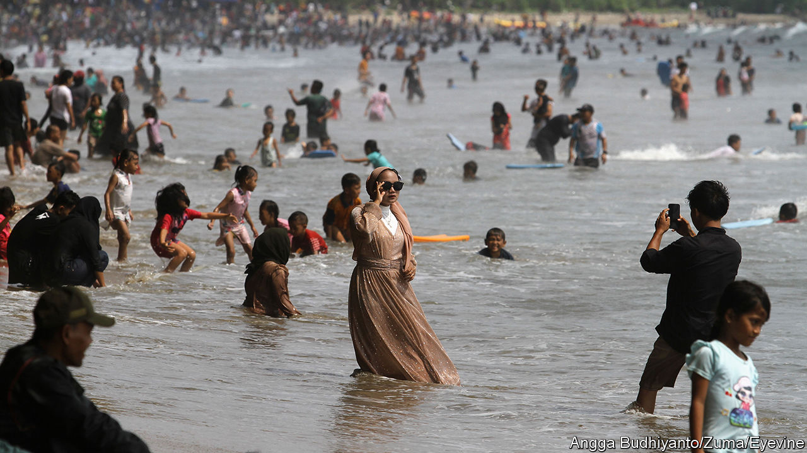

###### South-East Asian syncretism

# Indonesia wants to export moderate Islam 

##### The world’s largest Muslim-majority country enters the Islamic debate 

 

> Aug 16th 2023 

On Christmas Eve 22 years ago, jihadist terrorists planted bombs at churches in cities across Indonesia, killing 18 people. Every Christmas since then, members of the country’s largest Muslim group,  (NU), have gathered outside churches in Indonesia to ensure that Christians can worship in safety. Now the powerful Islamic organisation has a more ambitious goal: to spread its moderate views across the Muslim world.

Despite being the world’s most populous Muslim-majority country, Indonesia has long punched below its weight in the big Islamic debates. The dominant Muslim ideas, spiritual and political, long emanated from the conservative Middle East. This is apparent among Indonesia’s 237m Muslims. Demonstrations of Middle-Eastern-style public piety have become much more common in recent decades. Many more women now wear a Muslim headscarf, or . Yet most Indonesians still hew to the region’s syncretic traditions. In East Java, nu’s heartland, they mingle Islam with local Javanese beliefs called .

The country’s state , known as  encourages such moderation. It forbids atheism but allows religious freedom. Indonesia has six official religions: Islam, Catholicism, Protestantism, Buddhism, Hinduism and Confucianism. Its main Muslim organisations are now pushing for a more inclusive, tolerant Islam that reflects the spirit of .

The views of NU, in particular, have heft. The group claims to have over 100m followers—including several members of President Joko Widodo’s cabinet—and runs 23,000 Islamic boarding schools and over 250 universities. In February over a million of its followers clogged the streets of Sidoarjo, a city in East Java, for the group’s centenary celebrations. Many of the country’s top political figures, including the president (who is known as Jokowi), attended the event. NU used it to formally call for the abandonment of the caliphate, a notional authority that is considered to oversee all Muslims.

The group said Muslims should instead accept the reality of the nation state. It previously called on Muslims to reject the concept of a , or infidel, and accept non-Muslims as fellow citizens. Modest as this reality-check might sound, coming from the world’s largest Muslim civil-society organisation it was significant, suggests James Dorsey, a scholar at RSIS, a think-tank in Singapore.

While chairing the G20 last year, Indonesia held a parallel religious forum, Religion 20. It was co-hosted by nu and the Muslim World League, a Saudi-backed organisation that was long an ideological rival of NU’s but in recent years has become more moderate. NU is preparing to host another forum on religion on the margin of an Association of South-East Asian Nations summit that Indonesia will host later this year. “We cannot practise Islam as it was practised by our forefathers and mothers in the past without any significant changes in our understanding,” says Ulil Abshar Abdalla, a senior nu official. “You cannot impose  [Islamic law] as a positive law that is binding on all people.”

Indonesia’s Muslim leaders could have taken a more hardline course. The Christmas Eve bombings in 2000 marked the start of a campaign by Jemaah Islamiah, a group with links to al-Qaeda, to fight for a South-East Asian Islamic state. In the early 2000s, hundreds were killed in bomb attacks in Bali and at prominent landmarks in Jakarta, including the Australian embassy. The power of radical Islamic groups peaked in 2016 when they went after the then governor of Jakarta, a Chinese-Christian known as Ahok. As a result he was convicted of trumped-up blasphemy charges and imprisoned for two years. 

That marked a turning-point for Jokowi. His administration banned two hardline Islamic groups, Hizbut Tahrir Indonesia and the Islamic Defenders Front, in 2017 and 2020 respectively. The government also started monitoring civil servants for extremist beliefs. The failure of al-Qaeda and Islamic State helped the government’s push, says Mr Ulil. Saudi money, which had been flowing to Indonesian Islamists for years, has dropped off under Muhammad bin Salman, the Saudi Arabian crown prince. In May, Hanan Attaki, the unofficial leader of a conservative subculture popular with young, urban Muslims, known as the Hijrah movement, joined NU.

There are exceptions to this moderate trend. In April Indonesia was banned from hosting football’s under-20s world championships after two provincial governors said Israel’s team should not be allowed to participate. The increase in public piety is also striking. Celebrities now flock to social media and television to describe how they practise Islam. One civil servant says that when he joined his government ministry, over two decades ago, the building’s prayer room was hardly used. These days, it is packed. “But that doesn’t mean we’re now extremists. It just means we’ve become more observant,” he says. ■

