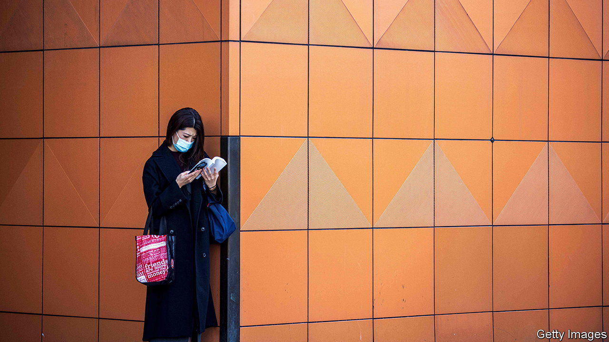

###### Almost twins

# South Korean literature is inspiring Japanese women 

##### Korean feminist writers follow a trail blazed by K-pop stars 

 

> Aug 17th 2023 

When Ogasawara Chiaki, a Japanese woman, read “Kim Ji-young, Born 1982”, a South Korean novel about sexism, she recognised the subject matter. Like the protagonist, Kim Ji-young, Ms Ogasawara was treated as inferior to her brother. When she read of Kim learning of hidden cameras in her workplace toilets, Ms Ogasawara recalled her experience of sexual harassment at work. “It didn’t feel like I was reading about another country.”

She is among the many Japanese readers—especially women—embracing South Korean literature. Translated literature in Japan was until recently mostly Western. Yet 210,000 copies of the Japanese edition of “Kim Ji-young” have been sold since its publication in 2018. Three times as many Korean books were translated into Japanese in 2021 as in 2019. In 2020 the Korean novelist Sohn Won-pyung became the first non-Japanese Asian writer to win the Japanese Booksellers’ Awards, for “Almond,” a coming-of-age story. She repeated the feat in 2022 with “Counterattack at Thirty”, the story of a working-class woman.

This literary trend comes on the back of a boom in South Korean popular culture. Books read by K-pop stars were early hits. “I Decided to Live as Me”, a self-help book read by members of BTS, a Korean boy band, sold 550,000 copies in Japan. The number of Japanese studying Korean has soared. Japanese have discovered that South Korean culture and concerns, including sexism and stressful living, are similar to their own.

Though long , Japan and South Korea are “almost like twins”, says Tsujino Yuki of the Research Centre for Korean Studies at Kyushu University in Japan. Yet Korean literature tends to be more explicit in its social critique than Japanese writing. That is refreshing for Japanese readers used to political apathy.

Saito Mariko, who translated “Kim Ji-young”, reckons such books encourage Japanese women to wear “feminist glasses”. Yano Marika, another Japanese fan, suggests Japanese women “haven’t quite processed” their experience of male chauvinism. Her reading of Korean books such as “My Crazy Feminist Girlfriend”, a novel, and “Reclaim the Language”, an essay on misogyny, helped her do so: “I felt sad and infuriated.”■

