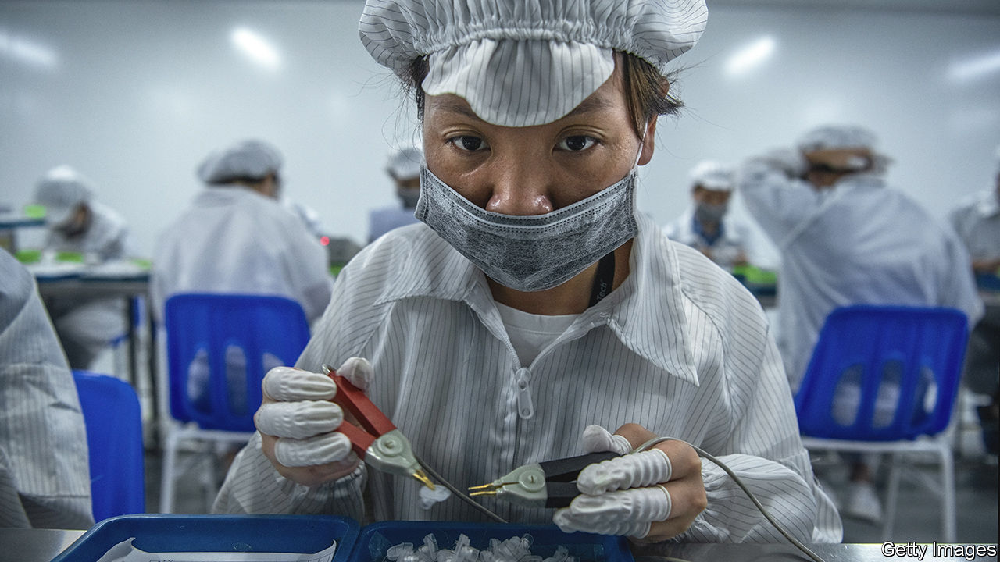
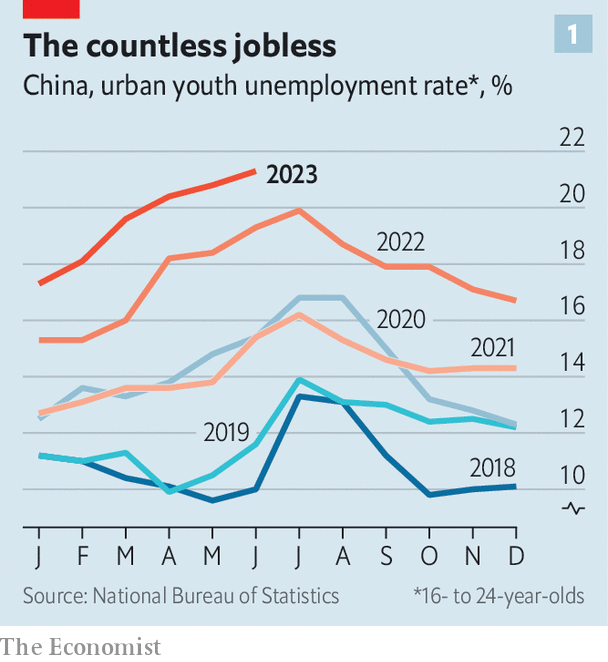
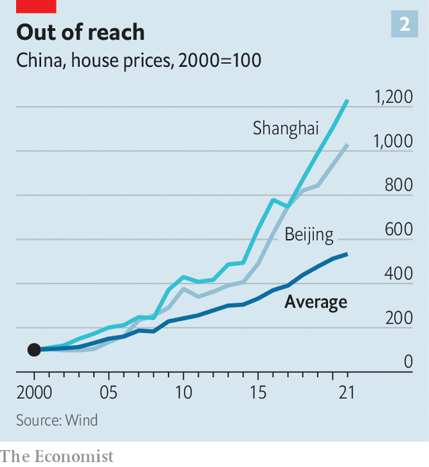
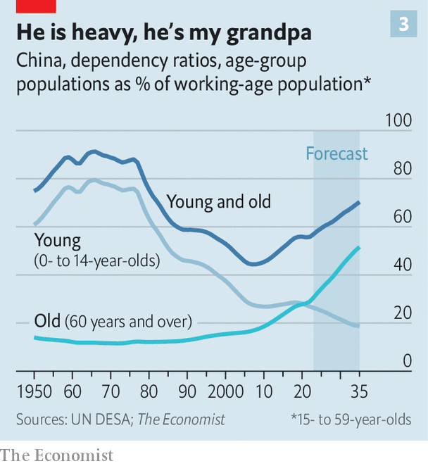
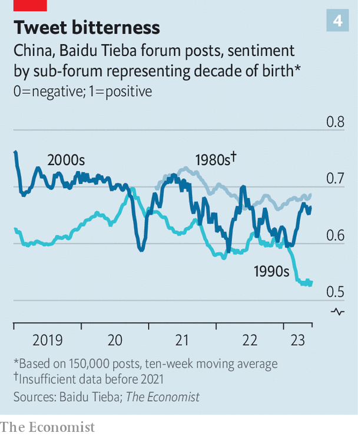
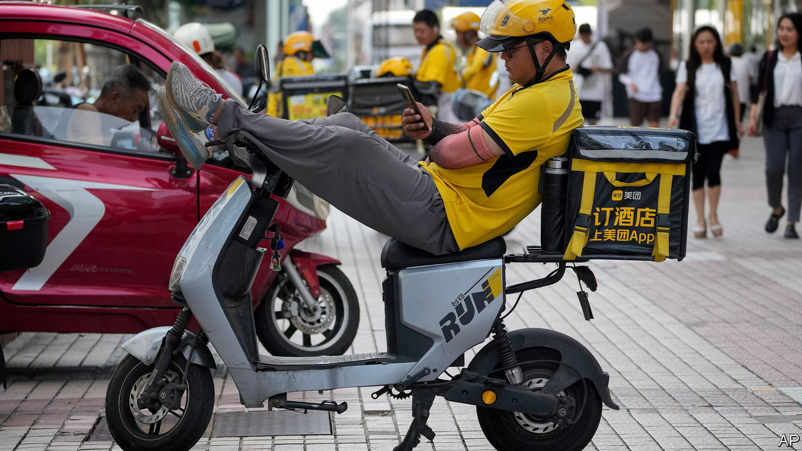

###### Generation Stagnation

# China’s defeated youth 

##### Young Chinese have little hope for the future. Xi Jinping wants them to toughen up 

 

> Aug 17th 2023 

IN THE SOUTHERN city of Huizhou an electronics factory is hiring. The monthly salary on offer is between 4,500 and 6,000 yuan (or $620 and $830), enough to pay for food and essentials, but not much else. The advertisement says new employees are expected to “work hard and endure hardship”. The message might have resonated with Chinese of an older generation, many of whom worked long hours in poor conditions to give their children a brighter future. But many of those children now face similar drudgery—and are unwilling to endure it. “I can’t sit on an assembly line,” says Zhang, a 20-something barista with dyed-red hair at a local tea shop. He scoffs at the idea of making such sacrifices for so little gain. The job at the tea shop pays just 4,000 yuan a month, but he enjoys chatting up customers. 

Before you dismiss Zhang as just another Gen Z moper, consider that he has been working for seven years, including time spent in a factory. He sends half of his wages after rent back home to support his parents. He sees no hope of buying a house or making enough money to get married and have children. Working at the electronics factory in Huizhou would not improve his situation by much; and in other ways it would make him miserable. “Hard work is important,” he says. “But eating bitterness will make you unhappy.”

Across China young people are disillusioned. They have been raised on stories of economic dynamism and social mobility. The Chinese economy more than doubled in size every ten years from 1978, when Communist Party leaders first adopted market reforms, until 2018. City kids could study hard, get into a good university and expect a white-collar job upon graduation. Lucky students from small towns or the countryside might do the same and make their way into the middle class. Less-educated young people had fewer options. But they could travel to cities, where rising wages in factories or on building sites were enough to start a family.

In the decades before Xi Jinping came to power in 2012, China had also been more open. Party leaders Jiang Zemin (1989-2002) and Hu Jintao (2002-12) were hardly liberals. But they left some space for civil society, intellectuals and the media to operate. Private enterprise flourished. Firms were encouraged to go out into the world and learn from the West. More and more Chinese travelled and studied abroad. A dynamic, aspirational, even hedonistic consumer and digital culture emerged.

 


For young people today, though, the outlook is much gloomier. The economy is struggling and they are feeling the worst of it. Unemployment among urban Chinese aged 16 to 24 has been running at over 20% for months, about double the age group’s pre-pandemic level (see chart 1). The official job numbers for this group are so stubbornly awful that China recently  them altogether. Higher education is no longer a reliable ladder to a solid career. Our calculations show that in 2021 over 70% of those unemployed youngsters were graduates. Along with scarce jobs, they face sky-high property prices. Their modest dreams of finding work, buying a house and supporting a family seem increasingly out of reach. 

To get a sense of how young people feel, we have interviewed dozens of them. Their message is strikingly consistent. “We have no hope,” says a 27-year-old in Huizhou. The malaise felt by him and his cohort has led to the emergence of a new nihilistic vocabulary, featuring phrases such as  and  (letting it rot). Using sentiment-analysis tools to extract feelings from text on social media, we found that the mood of young Chinese is growing ever darker.

That should trouble officials in Beijing. Some 360m Chinese (a quarter of the population) are between the ages of 16 and 35. Their gloom has profound implications for the future of China, its economy and the party’s ambitions. But rather than soothe the young, the government tends to scold them. Last year Mr Xi said they must “abandon arrogance and pampering”. Editorials in state media encourage them to “embrace struggle” and sacrifice their youth to the cause of national rejuvenation, as defined by the party. Repression is increasing. “Eat bitterness,” Mr Xi tells youngsters. His admonition, though a worn Chinese cliché, is sure to strike a nerve among people such as the barista in Huizhou.

The grind

It is not as if young Chinese do not work hard. From an early age they face enormous pressure to do well in school and ace China’s notoriously tough university-entrance exam, known as the . Nearly 13m youngsters took it this year. Many of them will have spent years cramming at the expense of other activities. 

Yet there is a growing feeling among young people that no matter how hard they study or work, they will not be rewarded with a better quality of life. They speak of , or “involution”, an academic word used to describe a situation in which extra input no longer yields more output. The idea was captured in “A Love for Dilemma”, a popular TV drama released in 2021. In the show, two characters liken the competition in educational attainment to an unruly audience at a cinema: someone stands up to get a clearer view, which obliges everyone behind them to stand. Then people climb on seats and ladders. But in the end, despite all of their effort, no one is able to see the screen any better.

The data support this sense of . As the number of university graduates has increased, the number of jobs for which they are suited has not risen at anywhere near the same rate. It has not helped that a large number of youngsters who decided to extend their studies during the pandemic are also now joining the job market, creating an even bigger surfeit of graduates. 

One problem is a mismatch between the skills that graduates are acquiring from school and those required by employers. According to one academic study of Zhaopin, a recruitment portal, 39% of job-seekers in first-tier cities had at least two surplus years of education, over and above those required by the jobs they sought. Outside these big cities, the proportion was more like 70%. Tales abound on social media of educated young people taking low-skilled jobs, such as sorting trash. One cigarette-maker hired students with master’s degrees for its production line. 

Young Chinese once dreamed of being lucky enough to get jobs in tech. Jack Ma, the idolised founder of Alibaba, proudly espoused a “996” culture, referring to a work schedule of 9am to 9pm, six days a week, often without extra pay. But in recent years tech workers began to complain of feeling like drones with dim prospects (made dimmer more recently with lay-offs). During an online outpouring of grievances in 2019, Mr Ma responded, perhaps unconvincingly, that “being able to work 996 is a huge blessing.” 

Many young people now seek poorly paid but more stable government jobs that were once scorned by ambitious types. About 2.6m people sat exams for such positions last year, up from 1.4m a decade earlier. Only one in every 70 got one. Even jobs in provincial backwaters have become more attractive. Wu Xiaomei, 23, is from Guizhou, a remote mountainous province in the south-west. She complains that more people have been moving there from nearby provinces where the exams to gain work as a teacher are more competitive. That has made it tougher for locals to get such jobs. Ms Wu ended up teaching in a small-town school in another nearby province with less competition. 

Those born in such places have the most difficult time moving up in the world. They have little chance of getting into a good university in a big city, where the admissions system favours locals. Most are stuck in low-skilled service jobs, such as delivering food in cities. The  system, a household registry, forces most who migrate to cities to live precarious lives, without access to local benefits like medical insurance. Since the mid-2010s, the wage growth of blue-collar workers has slowed significantly, according to a study led by Scott Rozelle of Stanford University.

 


Whether their collars are white or blue, few youngsters earn enough to buy a house in a good location (see chart 2). Between 1998 and 2021 homes in Chinese cities became four times less affordable, judged by the ratio of average house prices to median disposable incomes. In the capital, Beijing, this ratio rose to 25 in 2021, more than twice that of London. While ruing their inability to afford a nice home, the young can also look forward to a growing burden of caring for their parents and grandparents, due to the demographic distortions wrought by nearly 40 years of the one-child policy (see chart 3). 

 


Meanwhile, the relatively open cultural atmosphere of the Hu and Jiang eras has vanished under Mr Xi. He has replaced it with an “empire of tedium”, to borrow a phrase from Geremie Barmé, a noted sinologist. Censorship has become far more heavy-handed. Chatter on the internet has turned into a dreary chorus of nationalist talking points. On Chinese television depictions of “effeminate men” and women’s cleavage have been banned. Video games have been deemed too much fun; authorities have ordered the removal of gore and tried to limit kids’ playing hours. 

At entertainment venues, bands are asked to send authorities videos of their sets before gigs. Directors of plays know that in the audience there are people checking that actors stick to approved scripts. Comedians plead for their audiences not to record them. Earlier this year Li Haoshi, a Beijing-based comic, used an army slogan—“Forge exemplary conduct! Fight to win!”—in a joke about how his dogs eagerly chased a squirrel. That was deemed insulting to the armed forces. Media companies were told not to hire the comic. Police said he was under investigation for causing a bad influence on society. 

Mr Xi has also tightened control over China’s education system. Foreign textbooks were banned in 2020. The same year, schools across the country undertook to remove books that authorities said could “damage societal stability” or promote “deviant” values. Since 2021 students at primary and secondary schools have been assigned turgid texts devoted to Mr Xi’s personal ideology. Universities have been told to become “strongholds of the Communist Party’s leadership”. Several liberal scholars have been dismissed. Officials want Chinese history to be taught in a way that glorifies the party. To do otherwise is deemed “historical nihilism”. In 2021 a government hotline was set up for citizens to report such nihilism if they see it online.

The conservative turn has been especially hard on young women. Feminist activists are under close scrutiny. Authorities kept a tight lid on #MeToo activism. Sexism is rampant. In a survey by Zhaopin, the recruitment portal, 61% of women graduates said they were asked about their marriage and child-bearing status when applying for jobs, compared with just 32% of men. Women were also less likely to secure a job before graduation. A discouraging message about their future comes straight from the top. For the first time in decades the Politburo has no female member. 

Let it rot

Dejected and demoralised, young people still find places to vent online. Baidu Tieba is a Reddit-like forum where discussions take place in various sub-groups organised by subject. We wrote a program to download posts from three sub-groups focusing on people born in the 1980s, 1990s and 2000s. We analysed over 150,000 contributions from 2019 to mid-2023, applying an algorithm to detect the presence of positive, negative or neutral words. Terms like  (let it rot), for example, are tagged as negative. Using this information, the algorithm then classified the posts as positive, negative or neutral in sentiment. The results show an improvement in the collective mood after the government lifted its draconian zero-covid restrictions in December. But, in general, China’s young people have been growing more pessimistic in recent years (see chart 4).

 


Our findings come with caveats. We have focused on a single platform, which may not be representative of other social media in China. Indeed, our results could be subject to selection effects, where users of different dispositions flock to certain sites. Baidu Tieba tends to attract an older crowd. And algorithms have trouble detecting irony and sarcasm. 

Nevertheless, the results are worthy of discussion. Take the differences across generations. Those born in the 1980s are the least glum. Growing up in hardship, they experienced the benefits of reform and opening and took advantage of the opportunities presented by China’s economic boom. Those born in the 1990s, by contrast, are the most downbeat. They grew up during the boom years, in the heyday of globalisation, but are entering the workforce just as the economy stagnates and China turns inward. Some may once have entertained hopes of political liberalisation, which were gradually snuffed out as Mr Xi consolidated power.

Disillusioned youngsters commonly express feelings of exhaustion and resignation. Some talk of “lying flat”, or dropping out of the rat race and abandoning material ambitions that do not seem attainable. The notion of “letting it rot” is even more nihilistic: it describes an attitude of self-indulgence. Those born in the 1990s used this phrase most often in our analysis. For a sense of what it means in practice, consider Qin, whom we met in Huizhou. He is 30 and used to work in a factory. The pay was not enough for him to afford much of a life. Clutching a beer outside an internet bar, he says he now has a part-time job in construction. “I work a few days, then play a few days.”

Young people are pulling back in other ways, too. “Why would I get married? Why would I go on a date?” asks Qin, citing the cost of each. High house prices are a particular concern for young men because home-ownership is often seen as a prerequisite for marriage. Dowries, which more traditional families demand for marrying their daughters, have been increasing. Some ask for sums that would bankrupt prospective grooms and their families. Such economic burdens, along with changing societal views, have resulted in a decline in marriages. Around 6.8m couples got hitched last year, about half the number of a decade ago. 

A surprising number of young couples are not even having sex. In a survey conducted in 2020, 14.6% and 10.1% of partnered men and women born between 1995 and 2003 reported having had no sex in the past year. A trio of scholars at Peking University and Fudan University, evaluating these figures, wrote, “Whether and why sex has lost its appeal for a large fraction of young people needs to be further studied.”

None of this bodes well for China’s dismal fertility rate (the number of children a woman can be expected to have in her lifetime). It fell to a historic low of 1.2 in 2021—far below the replacement rate of 2.1. Besides home prices, analysts point to the rocketing cost of child-rearing as a factor. YuWa Population Research, a think-tank in Beijing, calculated the average cost of raising a first child to the age of 18 at 485,000 yuan ($67,000) in 2019. That equated to nearly seven times China’s gdp per person, one of the highest rates in the world. 

Efforts to remedy the situation have been unsuccessful. In 2016 the government swapped the one-child policy for a two-children-per-couple limit. In 2021 it switched to a three-children policy, now more a goal than a cap. Incentives such as cash handouts, tax breaks and longer maternity leave have not made much difference. Last year, when a young man was told by police that the punishment for violating pandemic-control rules would affect his family for three generations, he responded, “We are the last generation, thank you.” The exchange, caught on video, went viral, his defiant words transformed into another cynical meme (until it was censored). 

Some young people who can afford to are looking to leave China. Last year netizens took to using a Chinese character that sounds like the English word  as a coded way of talking about emigration. Reports of well-heeled Chinese leaving for places such as Singapore are common. The number of Chinese trying to get to the United States via Latin America has . 

Eat this

China’s leaders are not blind to these trends, but they are not wholly sympathetic. Mr Xi cites the gruelling hardships suffered by previous generations of youngsters as a model to emulate, not a nightmare to leave behind. He came of age during the Cultural Revolution, a period of Maoist madness from 1966 to 1976. (Mr Xi’s father was one of many officials deemed insufficiently loyal and tortured; his half-sister took her own life.) Only a teenager at the time, Mr Xi was sent to the countryside, along with millions of other city dwellers, to learn from the peasants. Unable to cope, he ran back to Beijing. But after being returned to the village, he learned the virtues of hard work, according to party lore. Mr Xi was supposedly the first to jump into the cesspool to shovel manure. He believes today’s youngsters should seek their own enlightening hardships. 

Still, he has tried to respond to some of the underlying causes of young people’s despair. Policymakers have repeated the mantra that “housing is for living in, not for speculation”, a slogan that reflects concern for people priced out of owning a home by people who own several. Regulators have urged e-commerce firms like Meituan, a food-delivery company, to improve pay and conditions for gig workers, softening the algorithms that punish them for late deliveries. They also cracked down on private tutoring businesses after Mr Xi warned that the industry had become a “social problem”, exploiting the educational anxieties of China’s parents.

This regulatory storm, as it became known, was part of Mr Xi’s grander pursuit of “common prosperity”, an effort to narrow inequality and “improve the channels of upward mobility” that many disillusioned youngsters believe are blocked. Along the way authorities made examples of some of China’s wealthiest business celebrities by arresting them or, as with Mr Ma of Alibaba, forcing them out of public life. Mr Ma gave up control of his company and now lives in relative obscurity.

But the government’s moves have mostly backfired. The public humiliation of tech entrepreneurs was a punch in the stomach for ambitious youngsters inspired by their example (though young leftists have celebrated the party’s humbling of billionaires). And the regulatory crackdowns on their companies, as well as on property developers, have hobbled some of the most reliable employers of China’s university-educated youth. 

Communist Party propaganda has played down the young generation’s jobless woes. The , a party newspaper, said in July that many youngsters were simply choosing “slow employment”—a phrase that was widely mocked online. A recent report from the China Macroeconomy Forum, a think-tank at Renmin University of China, takes a dimmer view. It concluded the problem of youth unemployment may not abate for a decade, with potentially bigger ramifications for the country’s leadership. “If it is not handled properly, it will cause other social problems beyond the economy, and it could even ignite the fuse of political problems,” the report said.

Disaffected young people are a  in Chinese politics. In 1919 thousands of students took to the streets to protest against China’s harsh treatment by its allies at the end of the first world war and to demand modernising reforms. During the Cultural Revolution, young people again took centre-stage when Mao Zedong unleashed his Red Guards, many of them teenagers. And in 1989 students flocked to Tiananmen Square in Beijing to demand more freedoms. Thousands may have been killed in the crackdown that followed. 

Since then students have played a far more muted role in political life. Three years of harsh covid-19 controls pushed some to breaking point. In November, after deaths from a fire in Xinjiang were blamed on covid restrictions, young people  and on campuses across China to protest. They held up blank sheets of paper in a nod to China’s curbs on free expression. But these protesters probably numbered in the hundreds, not thousands, in a country of 1.4bn. More broadly there appears to be no real sense of revolutionary zeal among today’s youth. 

No-motivation nation

The danger China’s leaders face is not so much a social eruption as social erosion, an unspectacular but unremitting loss of the “vitality, stamina and hope” that Mr Xi claims the young can impart to Chinese socialism. This enervation might manifest itself in a variety of ways. Chinese women may give birth later or not at all, contributing to a decline in population. Forecasts for China’s economy often assume rates of childbirth will enjoy a modest rebound, based on the record of other low-fertility countries. But most of those reference points are European countries with strong welfare systems that permit a better balance between family and career. 

China is relying on increases in “human capital” (like education) to offset its decrease in humans. But the lying-flat phenomenon and high graduate unemployment show that is not enough. The tightening grip of the authorities over civil society, popular culture and entrepreneurs also would seem to discourage the risk-taking that marked earlier generations. 

Some of China’s best-educated youngsters will no doubt emigrate. Others are seeking a different kind of safe harbour. Applications for the civil service are expected to jump again this year. And the share of graduates ranking state-owned enterprises as their first-choice employer has increased for three years in a row, according to the survey by Zhaopin. These businesses offer stability and security over dynamism and ingenuity. If China is to become the more innovative economy Mr Xi demands, it cannot afford to lose too many of its best minds to its least efficient firms.

 


Does Mr Xi understand this? His thoughts on how to achieve national greatness have evolved, along with his message to young people. A few months after coming to power in 2012 he met a group of young entrepreneurs, volunteers and students, telling them to “dare to dream, to bravely chase their dreams and to strive to fulfil them”. Their ambitions will make China great, he said. One beaming participant, who had recently climbed Mount Everest, said it was a good time to be young. 

Now, though, Mr Xi says the “Chinese Dream” of national rejuvenation is to be achieved by focusing on collective goals, rather than by encouraging individual aspirations. He admonishes the young to obey the party and toughen up—to “engrave the blood of their youth on the monuments of history, just as our fathers did.” That is a message that relatively few young people are taking to heart. Told to eat bitterness, they prefer to let it rot. ■

