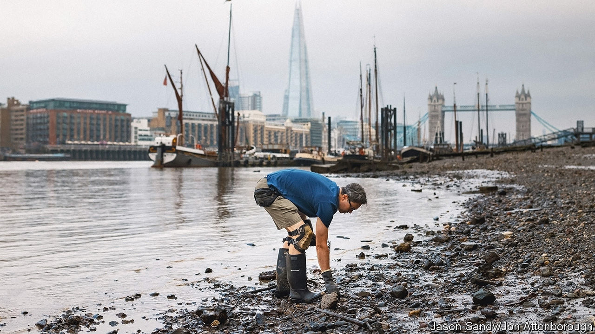

###### Treasure from the Thames

# Britons are ever keener on mudlarking in the River Thames 

##### The foreshore is growing crowded 

 

> Aug 11th 2023 

THE SLUDGE is everywhere. A Roman coin is disguised as a bottle-top; a Tudor shoe is dressed like a wedge of . For Jason Sandy, sorting the trash from treasure is easy work. Scouring the foreshore at low tide, his recent riches have included a knight’s knuckle-duster and a Victorian-era dog tag. 

Growing numbers of Britons are seizing oddments of history that the River Thames spits out. Twice daily, the exposed shore becomes the country’s longest archaeological site. Some 200 mudlarks had permits to comb there four years ago; today around 5,000 do. The Port of London Authority (PLA), a public trust, has stopped issuing permits. Hundreds take their chances without one. 

Mudlarking is not new: Victorian scavengers raked the shore for a living. In the last century it was a niche activity—a tidal “Wild West”, says Lara Maiklem, another mudlark. In the late 1970s the PLA handed its first foreshore permits to 50 larks who were told to keep their finds private. No longer. Many post videos of their finds on social media: Mr Sandy has over 90,000 Instagram followers. Ms Maiklem’s “Mudlarking: Lost and Found on the River Thames” reads like a riveting detective story. A television show, “Digging for Treasure”, follows mudlarks. Old-timers bemoan the publicity. 

One change, says Tim Miller, Chairman of the Society of Thames Mudlarks, is that women now make up roughly half of all larks, versus only 5% two decades ago. The young also get stuck in. Jane Sidell, Inspector of Ancient Monuments at Historic England, celebrates that but worries that some larks are irresponsible: “The foreshore is being ripped away in places.” Archaeologists are also vexed. Ms Maiklem has been criticised for popularising the hobby. 

Theft is a concern. Treasures must be reported, but 80% of mudlarks fail to do so according to a survey by the PLA. “We’re finding shops pop up on Etsy, flogging things from the foreshore,” says Dr Sidell. Some use detectors to find valuables such as Roman coins. Digging also causes damage. “I don’t dig, scrape or use a metal detector,” says Ms Maiklem. “I just wait and see what the river leaves for me.” For now, the Thames delivers ample pickings. Your correspondent chanced on a Victorian clay pipe, its delicate bowl unmarred by 150 years in the churning tide.■


