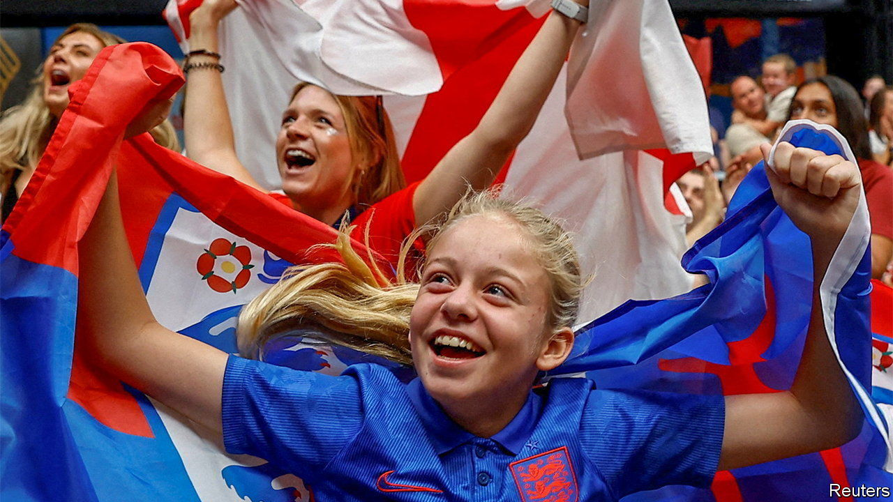
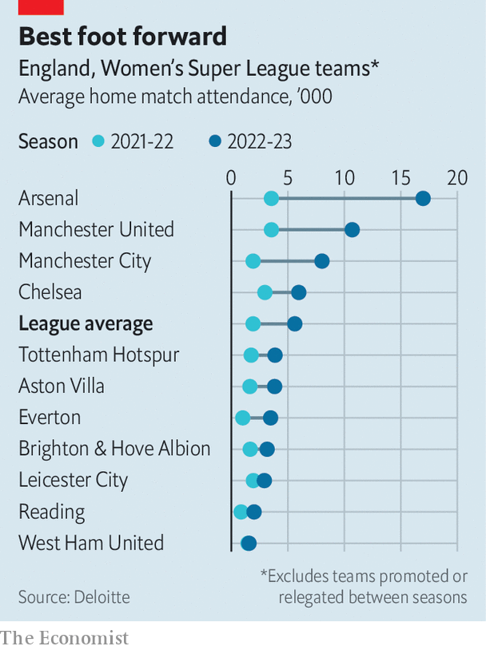

###### Sporting girls

# England’s Lionesses reach the World Cup final 

##### The team has become a game-changer for domestic football 

 

> Aug 15th 2023 

WHEN CAROL THOMAS started playing the game, aged 11, she had no idea the Football Association (fa) did not allow women on its pitches. A ban imposed in 1921 because football was deemed “quite unsuitable for females” remained until 1970. Ms Thomas flourished and became captain of England, but she had to pay for her own travel, including internationally. Her team expected, and got, no media coverage. Gillian Coultard, a former teammate who played in the 1995 World Cup, has described the female footballers of the 1980s and 1990s as the “silent generation”.

A reversal of this neglect of talent is now evident. In 2021, a century after its ban, the FA launched a #LetGirlsPlay campaign for equal access to football in communities and schools by 2024. If this comes anywhere close to being accomplished, much credit will be given to the current national team. In 2022 the Lionesses beat Germany 2-1 in extra time in the final of the Euro tournament. And in a World Cup semi-final on August 16th they beat the hosts, Australia, 3-1. Whether they win or lose the final against Spain, the Lionesses are national heroines. 

 


Their success has had two important consequences. Enthusiasm for the game is soaring, as a sharp rise in attendance figures for the English Women’s Super League shows (see chart). That will bring more investment. Equally crucial, the Lionesses have inspired more girls to play. 

This is evident in the playground. A survey of primary-school teachers has found that the number who see girls play at break every day rose from 22% in July last year to 32% this July. The number of primary schools with girls’ or mixed teams rose from 61% to 71%. Outside school, clubs have multiplied. When Maeve Fitzgerald, a 12-year-old midfielder in south London who is likened locally to Manchester City’s Kevin De Bruyne, wanted to join a club five years ago her parents struggled to find one. Now she is a member of two and plays twice a week. 

More women are becoming coaches, too. Ella Cahoon, 30, who has played since she was eight, volunteered for a club in south-east London after the Lionesses won the Euros. She reckons the biggest challenge, besides ensuring that girls have chances to join teams at every level, is encouraging them to keep at it beyond puberty. The fa says that at primary school 72% of girls play as much football as boys, but that falls to 44% in secondary school. The government has introduced a Kitemark-type scheme for schools that offer equal sporting chances to boys and girls.

Whereas boys from households of all incomes play football, among girls it appears to be more for middle-class families. That may reflect, in part, the cost and time required to get girls to practices and games that are more dispersed, so involve more travel than those for boys. Bernie Butler, whose 12-year-old daughter Charlotte plays for a club in south London, says almost all her daughter’s teammates are white and most are middle-class.

Another old obstacle may be falling away, at least. Ms Cahoon, the coach, remembers boys in the East Midlands jeering at girls’ demands to use the school goalposts. Ms Butler has had a different experience. As a child she played happily with boys in the playground. Now, boys from her club often show up to support girls’ games. She does the same for them. ■


