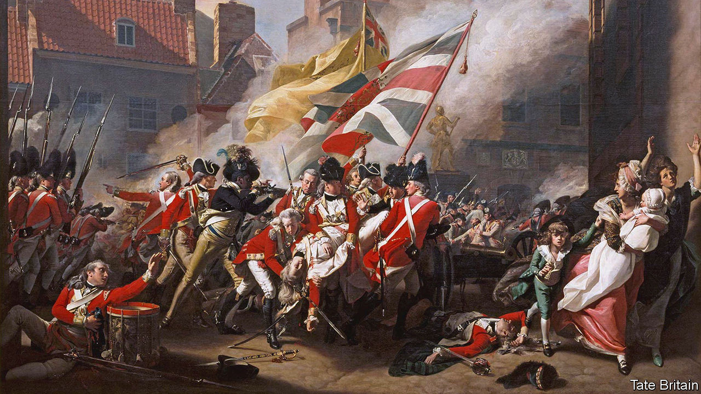

###### Not so black and white

# Reckoning with slavery remains an elite project in Britain 

##### The public shows a studied lack of interest 

 

> Aug 17th 2023 

AT TATE BRITAIN, in London, a crowd gathers in front of a painting. , shows a black soldier avenging the killing of a British officer during the French invasion of Jersey. The painter used this man to “symbolise the fierce loyalty of the empire”, explains the curator. This shows that the artist could rely on the public’s naivety, he suggests, for Britain at the time was “deeply involved in the slave trade”. “If we can be proud of the best moments in history…we must reflect on the worst.” 

Periods of reflection come and go. The killing of George Floyd by police in Minneapolis, in 2020, prompted soul-searching about race around the world, including in Britain. Activists in Bristol toppled a statue of Edward Colston, a slave-owner, and dumped it in the harbour. The largest ripples since have come from institutions looking at their own pasts. In January the Church of England pledged to spend £100m ($127m) to “address past wrongs”, after admitting it had invested in the transatlantic slave trade. In March theapologised after “discovering” it was founded with profits from cotton picked by slaves. Universities, banks, museums and others have done similar things. In February the Trevelyan family, whose ancestors part-owned slave plantations, apologised and said they would pay £100,000 in reparations to Grenada. 

Such acts remain exceptions, however. Britons’ attitudes to their country’s past are shifting a bit, but as a whole they show little interest in re-assessing it. Polling data mostly suggest indifference, including over the nastiest aspects. When asked by pollsters about the empire some Britons, especially older ones, used to express pride. Today people mostly shrug, although a few (16% according to one survey in 2020) call it shameful. Reckoning with the legacy of slavery can sometimes be seen as a duty for an elite who cemented their ancestral homes with profits from African blood. A poll in April found that 44% of Britons thought that the royal family, whose ancestors monopolised the early slave trade through the Royal Africa Company, should pay reparations of some sort. Yet few think the country as a whole, or businesses and other institutions that benefited from slavery, should do so. 

It is rare for the topic of slavery to be tackled nationally. Take the Demerara uprising of 1823, when British colonists brutally suppressed a non-violent uprising of 10,000 slaves in what is today Guyana. One of the resisters, Quamina, was strung up for so long that a colony of wasps built a nest in his abdomen and took to flying in and out of his jaw. The incident sparked outrage in Britain and helped to invigorate the movement for the abolition of slavery in the colonies. Yet today most Britons only know of Demerara as the sugar they spoon into their coffee, not the uprising. Its 200th anniversary, on August 18th, was likely to attract scant public notice. 

Such apathy sets Britain apart from other former imperial powers. In December the Dutch government apologised for that country’s role in slavery and set up a fund to raise awareness of its legacy. Portugal’s president, Marcelo Rebelo de Sousa, said in April that his country should accept responsibility for the slave trade. The French president, Emmanuel Macron, paid tribute to Haitian revolutionary Toussaint L’Ouverture. In contrast the prime minister, Rishi Sunak, is more circumspect. “Trying to unpick our history is…not something that we will focus our energies on,” he told Parliament in April. Instead the history is picked at in places like the Tate Britain café, over coconut doughnuts and pork-and-fennel sausage rolls. 

Younger Britons are somewhat more involved. A survey in 2021 found that 86% of English schools reported teaching pupils aged 11 to 14 about the transatlantic slave trade. But only 13% said they taught the legacies of slavery: a far cry from how German students routinely discuss the impact of the Holocaust. In “Bridgerton”, a historical series popular among the young, black actors are cast as Georgian aristocrats. To some that is empowering. But the whitewashing of slavery adds to a commonly held assumption that it was mainly an American problem.■


