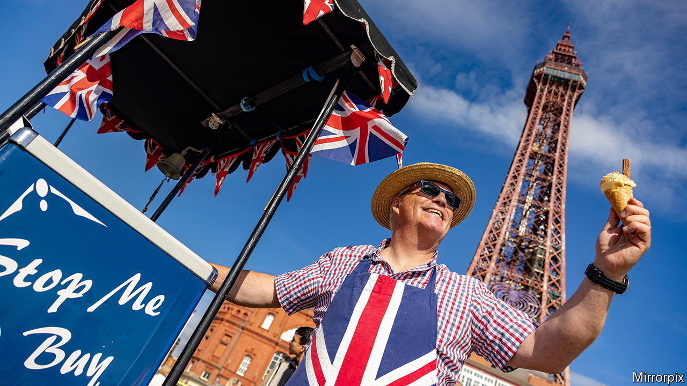

###### Devolution

# Since Brexit, Britain’s union has grown increasingly European 

##### To buttress a shaky nation, British leaders borrow a continental architecture 

 

> Aug 17th 2023 

BLACKPOOL BEARS little resemblance to Brussels. It has no Tintin, no René Magritte, and sticks of rock in place of fine chocolates. But consider one similarity. Just as the de facto capital of the European Union lies symbolically between Paris and Berlin, so Blackpool is roughly midway between Belfast, Cardiff, Edinburgh and London. It was the ideal place, therefore, for an experiment in the government of the United Kingdom. In November the town hosted the inaugural meeting of a body dubbed the “Prime Minister and Heads of Devolved Government Council.” 

It was a low-key affair. Rishi Sunak, the prime minister, and Nicola Sturgeon, then Scotland’s first minister, squeezed into a poky hotel suite. Mark Drakeford, the first minister of Wales, dialled in. Northern Ireland’s leaders were absent, since government there is suspended. An official communiqué hinted at frictions, describing it as a “frank and open forum” in which “views may differ”. 

But it was significant as an effort by the British government to shore up a rickety union, which risked being blown apart by the rancour that followed the Brexit referendum of 2016. Amid political chaos—as Ms Sturgeon plotted a new independence referendum, Mr Drakeford complained of being ignored and Northern Ireland’s border raised existential risks—there has been a quiet process of construction, which has seen the government borrow bits of the EU it had just left. Overcoming Brexit has meant building an increasingly European-looking union.

That is surprising, for Britain is in many ways unlike the EU. It has developed piecemeal, rather than through comprehensive treaties. It is a unitary state, with a powerful central government and a sovereign Parliament that can make and unmake any law. Although the devolved administrations in Scotland, Wales and Northern Ireland have powers in areas such as health and education, they cannot wield vetoes over British government policy, as member states can in the EU. Nor do they have an Article 50-like power to leave the union. England dominates: it has 84% of the population, and so picks the government. (Germany, the biggest EU member, has just 19% of the bloc’s population.)

Start with the Blackpool meeting. When the architects of devolution carved up powers in the 1990s, they gave little thought to how the new administrations might work together. Meetings of leaders were ad hoc and ill-tempered. Boris Johnson’s reforms of January 2022 attempted to put intergovernmental relations on a more orderly, transparent footing, a little like the EU’s Council of Ministers. The new architecture comprises three tiers of ministerial meetings, an impartial secretariat, rules for settling disputes and a chair that rotates between countries.

A second, more dramatic change comes in the form of Britain’s new internal market. Devolution was built on the EU’s single market: capitals could manage their own railways and agriculture because all the kingdom was bound by a common European rulebook, preventing barriers to trade. Brexit ripped this away. Mr Johnson’s answer was a vast law, to reimpose the EU legal concepts of mutual recognition and non-discrimination. A new Office of the Internal Market does the job of the European Commission, monitoring for divergence. Brexiteer ministers talk like Eurocrats. “It is the same Cassis de Dijon principle,” Michael Gove, the minister for intergovernmental relations, told Parliament recently, referring to a historic EU court decision that underpins free circulation.

Britain’s courts are the third element of this trend. The EU’s constitution has been shaped by its judges: cases touching trivial matters have led to vast delineations of power between the member states and the central institutions. In Britain, by contrast, judges have taken a back seat to politicians. But Brexit has triggered difficult disputes over the boundaries of devolution, and forced judges to shape “what had been a rather loose political constitutionalist framework”, notes Colm O’Cinneide of University College, London. In November the Supreme Court ruled that the Scottish Parliament could not organise a unilateral independence referendum.

Supporters of devolution, such as Mr Drakeford, have long looked to the EU as a model that would give capitals more influence. Yet this new architecture was the work of a circle of “muscular unionists”, who saw devolution as a threat to Britain’s integrity. The result is that while many EU forms have been adopted, power is more centralised, says Michael Keating of the University of Aberdeen. The British government retains the last word on the new ministerial committees. 

The new internal market has much less wriggle room than Europe’s. In May, ministers used powers under Mr Johnson’s internal-market act to torpedo a Scottish bottle-recycling scheme. The EU’s funds for infrastructure have been replicated—but whereas the devolved governments once spent them, now they are tightly controlled from London. What is built must still carry a prominent plaque on which the EU flag has been replaced with the British government’s crest. It is as if Whitehall has copied the tools that empower the Brussels institutions, but not those that give its member governments control. 

If Labour wins the next election, more Europeanisation could follow. In a paper prepared for the party’s leader, Sir Keir Starmer, Gordon Brown, a former prime minister, outlines a vision that one Tory critic dubs the EU’s “archipelagic mini-me.” Britain would be recast as a “union of nations” with a “common UK labour market”, a “common currency” and a “shared foreign affairs and defence policy”. A more powerful “Council of the Nations and Regions” would shape economic and climate policy, and the House of Lords would be ditched in favour of a geographically representative “Assembly of the Nations and Regions”. Only a new anthem is missing. “Ode to Joy” would fit. ■


