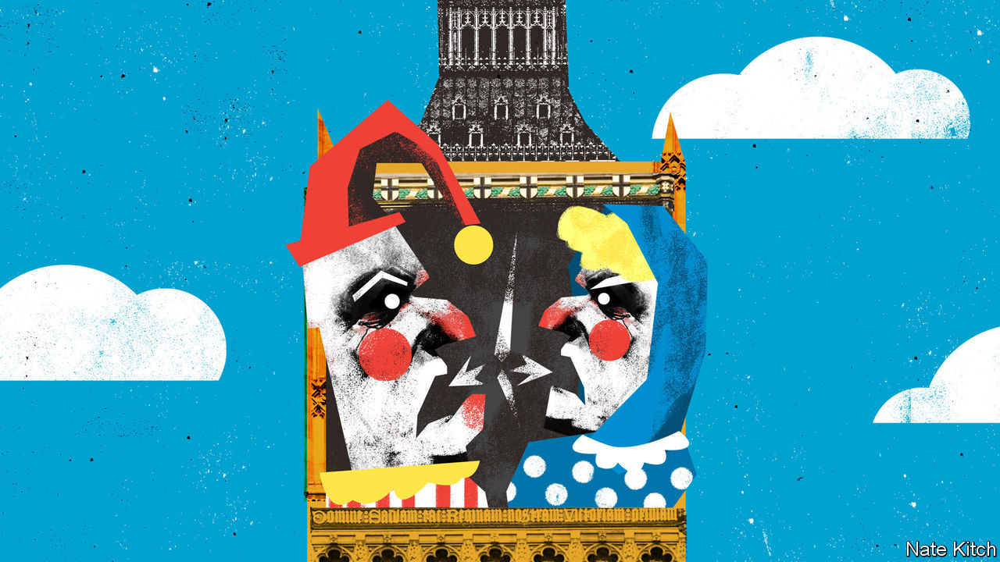

###### Bagehot

# What happens to comedy when British politics becomes a joke? 

##### The satire bust 

 

> Aug 17th 2023 

The satire boom began on August 22nd 1960, when the cast of “Beyond The Fringe” took the stage in a half-empty Royal Lyceum Theatre in Edinburgh. It took 90 minutes for Peter Cook, Dudley Moore, Alan Bennett and Jonathan Miller to demolish “all that is sacred in the British way of life with glorious and expert precision”, wrote one critic. Almost every subsequent British satire from the 1980s’ “Yes, Minister”, which portrayed cynical civil servants, to 2005’s “The Thick Of It”, which portrayed cynical New Labour advisers, owes a debt to four young men fresh out of Oxford and Cambridge over 60 years ago. 

Now a satire bust has begun. “Mock The Week”, which did just that, ended after 21 series in 2022. “The Mash Report”, a spin-off from a satirical website, lasted six series before being canned the same year. “Frankie Boyle’s New World Order” followed suit a few months later. A much-hyped return in 2020 of “Spitting Image”, a 1980s show in which grotesque puppets mocked politicians, was cancelled after it proved both expensive and unpopular. 

In the Edinburgh of 2023, now hosting its annual arts festival, audiences are in the mood for gentler things. Matt Forde, a comedian and impressionist, offers funny but safe material such as an observation that Rishi Sunak resembles a beaming children’s television character even when delivering catastrophic news. Even this act is too much for some: a group of Scottish National Party supporters marched out. The line that broke them was a real quote from the first minister, Humza Yousef, who responded to an allegation that his party had used secret phones for nefarious ends by saying: “It depends on your definition of a burner phone.”

When audiences do want something sharp, they want it to confirm prejudices. Rosie Holt came to fame with spoof videos of Conservative ministers so well-observed, people thought they were genuine. Her reward is nearly 300,000 followers on X (previously, Twitter) and a sold-out show in Edinburgh. The lights on her show glitched because she would only hire a Brexit-supporting technician. The audience chuckled. In the 1960s, Michael Frayn worried that predictable jokes had “less in common with satire than with community hymn-singing”. Stewart Lee, a modern comedian, put it more profanely: “‘Was it funny?’/’No, but I agreed the fuck out of it.’”

Fundamentally, satire is harder than it was. “Beyond the Fringe” had the advantage of novelty. In 1960 censorship was still the norm. The Lord Chamberlain could nix plays for the preservation of “good manners, decorum or the public peace”. Few had mocked Harold Macmillan, the prime minister and an Edwardian throwback, so explicitly. Now satirists have to compete with online jokers who go further and move faster than a writer on a weekly show or a stand-up doing a tour. 

The targets were more obvious, too. In the 1960s, there was one “Establishment”, which was deeply Conservative, patrician and male. The well-connected young men on stage mocked the people they could have become. Now Britain’s Establishment has split. Patrician Tory-types mocked by Cook still exist in politics, the armed forces and right-wing newspapers. But so does a progressive elite, which dominates the rest of the media, charities, universities and the law. Both need taking down a notch.

Some acts still manage to be original and darkly insightful. “It’s a Motherfucking Pleasure” is best described as a woke farce, set in a pr firm, where a blind executive attempts to make disability aspirational. FlawBored, the disability-led troupe featuring two blind performers, delights in making liberal audiences wince. The act ends with the trio applauding the  for recommending their show before having seen it. “We’ve got a lot of able anxiety out there,” says Samuel Brewer, near the end of the performance. “And there’s a lot of cash available from the Arts Council.” When new forms of unthinking deference emerge, they must always be attacked—and not by reactionaries merely annoyed they can no longer use certain slurs. 

Political comedy has to wrestle with identity, and still be funny. Ahir Shah manages it, weaving his family’s story in with that of Rishi Sunak, Britain’s first Hindu prime minister. (“Politically: I’m furious. Racially: thrilled,” says Mr Shah.) In one telling, Mr Sunak requires the usual material. He is a posh boy who went from Winchester College, a fancy public school, to Downing Street. In another, his rise is a miracle almost cut short by British troops who committed a massacre in the town where Mr Sunak’s grandfather lived in 1919, bombing a school near the family home points out Mr Shah. For understanding Britain, which school matters more: Winchester or Khalsa High School Boarding House in Gujranwala?

Giggling into the sea

The satire bust arrived when politics became its own punchline. It is hard to say anything funny about Liz Truss’s 49 days in office. Satire has always been portrayed as futile. In 1961, Cook launched a comedy club in the vein of “those wonderful Berlin cabarets which did so much to stop the rise of Hitler”. Jonathan Coe, an author, argued satire is actively harmful, breeding cynicism about politics and helping lift up those it should bring down. Boris Johnson became a household name via appearances on “Have I Got News For You”, the BBC’s remaining flagship satirical show.

This fatalism is overdone. Satire is useful when politicians contain hidden depths. Mr Johnson did not. But the current crop do. Sir Keir Starmer is seen as a dullard, when he is ruthlessly cynical. Mr Sunak is portrayed as a mere technocrat when he is the most right-wing occupant of Downing Street since Margaret Thatcher and a stunning success of British multiculturalism. Each attracts an oddly deferential tone from commentators, who label them “grown ups”, much as few mocked Macmillan before “Beyond The Fringe”. It is a consensus ripe for ripping apart. British politics is much funnier now it is no longer a circus. ■


