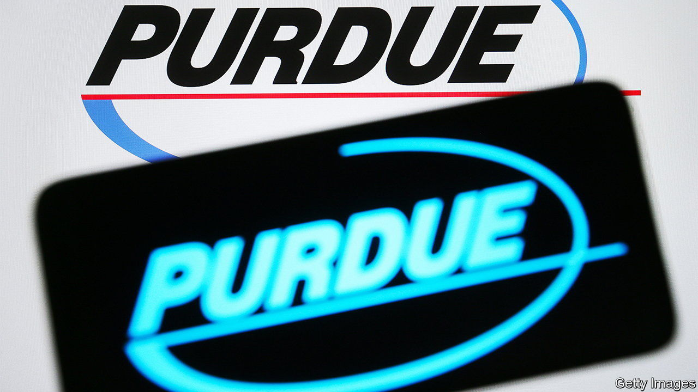

###### Two-step stop

# America’s courts weigh in on how firms resolve liability claims 

##### The Supreme Court is reviewing Purdue Pharma’s bankruptcy plan 

 

> Aug 17th 2023 

The long-running legal battle over America’s opioid epidemic was reignited when, on August 10th, the country’s Supreme Court said it would review an earlier settlement secured by Purdue Pharma, a main character in the saga. Back in 2021 a federal judge had approved a bankruptcy plan for Purdue—the maker of OxyContin, a highly addictive painkiller—under which the business was to be restructured as a public-benefit company with all future profits going towards settling claims from victims and funding addiction-treatment programs. Members of the Sackler family, which owns the drugmaker, were to contribute $4.5bn (later increased to $6bn) towards the settlement.

At issue is a controversial legal arrangement called a “third-party release”, which shields entities associated with bankrupt companies from liability even if they have not filed for bankruptcy themselves. In Purdue’s case, the Sacklers were granted immunity from any future opioid-related claims, an unsatisfying outcome for those who blame the family for their role in fuelling the opioid crisis.

American firms have been turning to bankruptcy courts to resolve product-liability claims since the 1980s, but in recent years have done so in increasingly creative ways. In 2021, faced with thousands of lawsuits alleging that its talcum powder caused cancer, Johnson &amp; Johnson (J&amp;J), a pharmaceutical giant, deployed the “Texas two-step”—a legal manoeuvre that shifts a company’s liabilities to a separate entity and then declares that entity bankrupt. J&amp;J established a Texan subsidiary, called LTL Management, assigned more than 40,000 talcum-powder claims to it, then filed it for bankruptcy. Last year Aearo Technologies, a subsidiary of 3M, a Minnesota-based conglomerate, was hit with some 260,000 lawsuits related to allegedly defective earplugs. By declaring its subsidiary bankrupt, 3M was also able to limit its exposure. Both companies deny the allegations against them.

Lawyers for the companies argue that the bankruptcy courts are more efficient than the tort system for both defendants and plaintiffs. It is easy to see the appeal for businesses. Declaring bankruptcy pauses all litigation, prevents the filing of any new lawsuits and brings all claims under one roof, while the third-party release arrangement absolves the parent company of future related liabilities. Some claimants also prefer the speedier resolution promised by bankruptcy courts to the slower and more uncertain payoffs on offer in the tort system.

Critics point out that bankruptcy is intended for companies that are genuinely insolvent, not merely burdened with lawsuits. In 2022 J&amp;J generated $95bn in sales, handed out $12bn in dividends, had cash holdings of $25bn—and set aside just $9bn to resolve the talcum-powder claims. 3M is similarly unlikely to be sunk by the lawsuits against it. Jared Ellias of Harvard Law School argues that, by dumping their liabilities into a subsidiary, companies facing mass litigation are asking for the benefits of bankruptcy without truly submitting to the courts. For victims seeking a hearing, as well as compensation, the mechanical nature of bankruptcy proceedings minimises discussions of a company’s wrongdoing, which tort battles do not. 

Courts are increasingly sceptical of the companies’ arguments. In June a judge in Indiana rejected the bankruptcy filing of 3M’s subsidiary Aearo, noting that the company was using bankruptcy as a “litigation-management tactic”. A month later a New Jersey bankruptcy court quashed LTL’s insolvency plea, pointing to the deep pockets of its parent, J&amp;J. The Supreme Court’s scrutiny of Purdue’s third-party releases may be the most consequential of all. According to Pamela Foohey, a professor at Cardozo School of Law, Purdue “really pushed the envelope” in how it used bankruptcy. If the justices agree and limit the use of third-party releases, corporations may find that bankrupting smaller subsidiaries to fight sprawling lawsuits is no longer the saving grace it once was. ■


