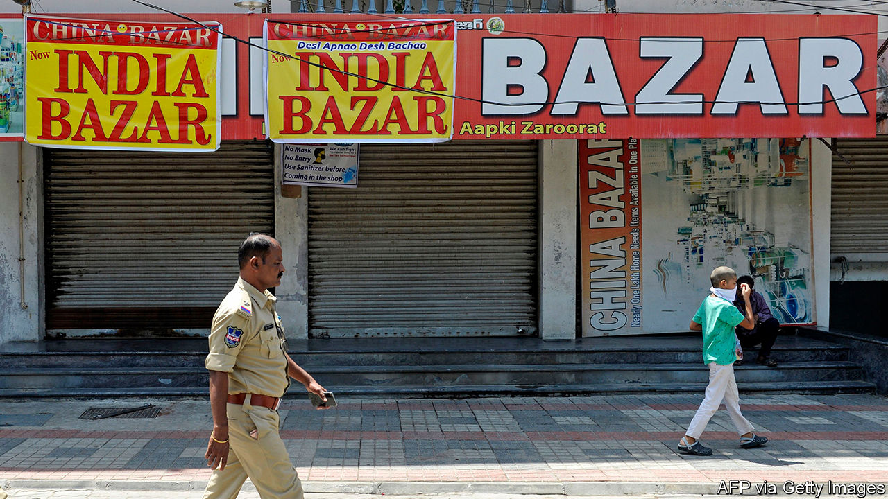
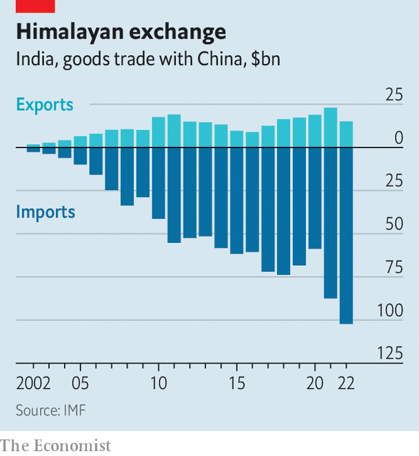

###### The great untangling

# Can India Inc extricate itself from China? 

##### Narendra Modi is testing a wide array of economic weapons 

 

> Aug 14th 2023 

CHINA AND India are not on the friendliest of terms. In 2020 their soldiers clashed along their disputed border in the deadliest confrontation between the two since 1967—then clashed again in 2021 and 2022. That has made trade between the Asian giants a tense affair. Tense but, especially for India, still indispensable. Indian consumers rely on cheap Chinese goods, and Indian companies rely on cheap Chinese inputs, particularly in industries of the future. Whereas India sells China the products of the old economy—crustaceans, cotton, granite, diamonds, petrol—China sends India memory chips, integrated circuits and pharmaceutical ingredients. As a result, trade is becoming ever more lopsided. Of the $117bn in goods that flowed between the two countries in 2022, 87% came from China (see chart). 

 


India’s prime minister, Narendra Modi, wants to reduce this Sino-dependence. One reason is strategic—relying on a mercurial adversary for critical imports carries risks. Another is commercial—Mr Modi is trying to replicate China’s nationalistic, export-oriented growth model, which means seizing some business from China. In recent months his government’s efforts to decouple parts of the Indian economy from its larger neighbour’s have intensified. On August 3rd India announced new licensing restrictions for imported laptops and personal computers—devices that come primarily from China. A week later it was reported that similar measures were being considered for cameras and printers.

Officially, India is open to Chinese business, as long as this conforms with Indian laws. In practice, India’s government uses a number of tools to make Chinese firms’ life in India difficult or impossible. The bluntest of these are outright prohibitions on Chinese products, often on grounds related to national security. In the aftermath of the border hostilities in 2020, for example, the government banned 118 Chinese apps, including TikTok (a short-video sensation), WeChat (a super-app), Shein (a fast-fashion retailer) and just about any other service that captured data on Indian users. Hundreds more apps were banned for similar reasons throughout 2022 and this year. Makers of telecoms gear, such as Huawei and ZTE, have received the same treatment, out of fear that their hardware could let Chinese spooks eavesdrop on Indian citizens.

Tariffs are another popular tactic. In 2018, in an effort to reverse the demise of Indian mobile-phone assembly at the hands of Chinese rivals, the government imposed a 20% levy on imported devices. In 2020 it tripled tariffs on toy imports, most of which come from China, to 60%; then, at the start of this year, raised them to 70%. India’s toy imports have declined by around three-quarters since 2019.

Sometimes the Indian government eschews official actions in favour of more subtle ones. A common tactic is to introduce bureaucratic friction. India’s red tape makes it easy for officials to find fault with businesses that are out of favour. Non-compliance with the tax rules, so impenetrable that it is almost impossible to abide by them all, are a favourite accusation. Two smartphone makers, Xiaomi and BBK Electronics (which owns three popular brands, Oppo/OnePlus, Realme and Vivo), are under investigation for allegedly shortchanging the Indian taxman a combined $1.1bn. On August 2nd news outlets cited anonymous government officials saying that the Indian arm of BYD, a Chinese carmaker, was under investigation over allegations that it paid $9m less than it owed in tariffs for parts imported from abroad.

A convoluted licensing regime gives Indian authorities more ways to stymie Chinese business. In April 2020 India declared that investments from countries sharing a border with it must receive special approvals. No neighbour was named, but the target was clearly China. Since then India has approved less than a quarter of the 435 applications for foreign direct investment from the country. According to , a local outlet, only three received the thumbs-up in India’s last fiscal year, which ended in March. In July reports surfaced that a joint venture between BYD and Megha Engineering, an Indian firm, to build electric vehicles and batteries failed to win approval for security reasons. 

Luxshare, a big Chinese manufacturer of devices for, among others, Apple, has yet to open a factory in Tamil Nadu, despite signing an agreement with the state in 2021. The reason for the delay is believed to be an unspoken blanket ban from the central government in Delhi on new facilities owned by Chinese companies. In early August the often slow-moving Indian parliament whisked through a new law easing the approval process for new lithium mines after a potentially large deposit of the metal, used in batteries, was unearthed earlier this year. Miners are welcome to submit applications, but Chinese bidders are expected to be viewed unfavourably.

In parallel, India is using policy to dislodge China as a leader in various markets. India’s $33bn programme of “production-linked incentives” (cash payments tied to sales, investment and output) has identified 14 areas of interest, many of which are dominated by Chinese companies. 

Home-grown cure

One example is pharmaceutical ingredients, which Indian drugmakers have for years mostly procured from China. In February the Indian government started giving handouts worth $2bn over six years to companies that agree to manufacture 41 of these substances domestically. Big pharmaceutical firms such as Aurobindo, Biocon, Dr Reddy’s and Strides are taking part. Another example is electronics. Contract manufacturers of Apple’s iPhones, such as Foxconn and Pegatron of Taiwan and Tata, an Indian conglomerate, are allowed to purchase Chinese-made components for assembly in India provided they make efforts to nurture local suppliers, too.

Some Chinese firms, tired of jumping through all these hoops, are calling it quits. In July 2022, after two years of efforts that included a promise to invest $1bn in India, Great Wall Motors closed its Indian carmaking operation, unable to secure local approvals. Others are trying to adapt. Xiaomi has said it will localise all its production and expand exports from India, which today go only to neighbouring countries, to Western markets. Shein will re-enter the Indian market through a joint venture with Reliance, India’s most valuable listed company, renowned for its ability to navigate Indian bureaucracy and politics. ZTE is said to be attempting to arrange a licensing deal with a domestic manufacturer to make its networking equipment. So far it has found no takers. Given India’s growing suspicions of China, that may take a while. ■


