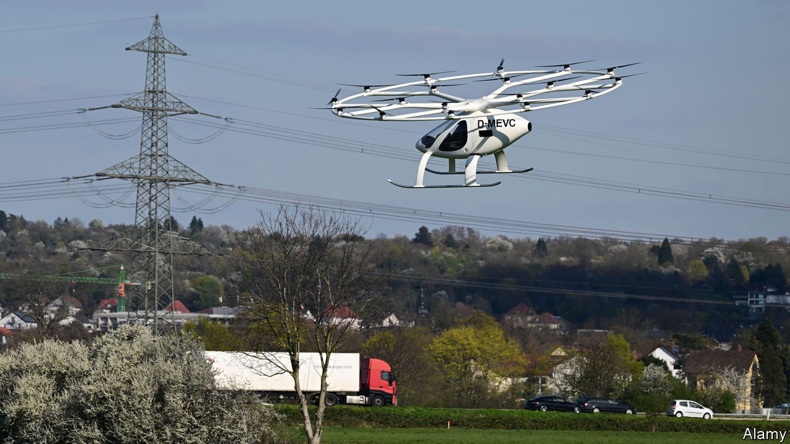

###### Ready for lift-off

# Flying taxis could soon be a booming business 

##### Electric aircraft are well-suited to short journeys 

 

> Aug 17th 2023 

Paris has long been at the heart of the history of flight. It is where the Montgolfier brothers ascended in the first hot-air balloon in 1783, and where Charles Lindbergh completed the first solo transatlantic aeroplane journey in 1927. Next year, if all goes to plan, Paris will be the site of another industry first when Volocopter, a German maker of electric aircraft, launches a flying-taxi service during the Olympic Games. At the Paris Airshow in June the company, and some of its rivals, paraded a new generation of battery-powered flying machines designed for urban transport.

The electrification of aviation has often been written off as a pipe dream, with batteries presumed too heavy a substitute for hydrocarbon fuel in an airborne vehicle. For longer journeys, such as Charles Lindbergh’s across the Atlantic, that may well be true. Yet upstarts like Volocopter are betting that electrification can unlock a boom in demand for clean and quick aerial journeys over shorter distances.

The main form of flying taxi under development, called an electric vertical take-off and landing (eVTOL) aircraft, looks somewhat like a super-sized drone, carrying between one and four passengers, plus a pilot. Powered by batteries, they are both quiet enough to quell complaints in crowded cities, and fast: capable of up to 300kph, enough to comfortably outpace a car, especially one stuck in traffic. Indeed, optimists hope the absence of traffic in the sky will also make eVTOLs well-suited to autonomous operation. They could prove handy for transporting goods, too.

That vision has inspired giddy predictions. Morgan Stanley, an investment bank, reckons global spending on eVTOLs could hit $1trn by 2040. Volocopter is not the only player staking out the terrain. According to the Vertical Flight Society, a non-profit, more than 400 contenders have developed eVTOL designs. Joby, a Silicon Valley startup, has already raised $2bn from investors. Archer, another, hopes to have “hundreds or thousands” of its craft flying by the 2028 Los Angeles Olympics.

Despite the enthusiasm, challenges remain. One is technical certification, which is turning out to be a lengthy process as aviation regulators grapple with an entirely new form of aircraft. Some manufacturers, such as Volocopter and EHang, a Chinese firm, are close to having machines in service. In April Volocopter opened an assembly plant in Germany. But others are further off. Late last year Joby was forced to push back its launch by a year to 2025 thanks to, among other things, regulatory delays. Many have even longer to go.

The bigger question is whether the business of flying taxis will be viable. eVTOLs currently range in price from $1m to $4m. Although their cost may come down as the industry develops, they are likely to remain expensive pieces of machinery. Brian Yutko of Wisk, a maker backed by Boeing, says that flying-taxi rides will be “accessible to the masses”. Joby promises that its fares will be comparable to catching a taxi. Yet some studies suggest the cost could end up as high as $7 per km, many times a regular taxi fare. Even without a pilot, flying taxis may remain a convenience affordable only to a lucky few.

An alternative opportunity for electrification lies with small fixed-wing planes designed to transport a few dozen passengers over distances of a few hundred kilometres—for instance, between nearby cities. Heart Aerospace, a Swedish firm, plans to have a 30-seater plane with an all-electric range of 200km in the air by 2028. In September last year Eviation, an Israeli company, successfully tested a nine-seater electric plane with a range of 400km.

According to McKinsey, a consultancy, air travel accounts for just 8% of journeys between 150km and 800km in America. In Europe it is only 4%. Most such journeys are taken by car, even in Europe, where buses and trains are more readily available. That creates a big opportunity for environmentally friendly short-haul flights, especially given that 90% of America’s population and 50% of Europe’s live within a 30-minute drive of a regional airport. Expect plenty more experiments with electric aircraft in the years ahead. ■


