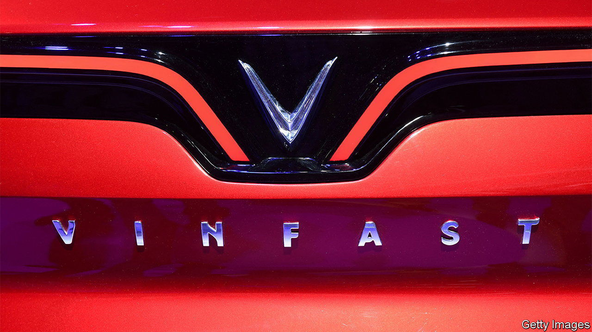

###### The fast and the dubious

# Is Vietnam’s EV darling heading for a crash? 

##### After an explosive trading debut, VinFast looks wildly overvalued 

 

> Aug 17th 2023 

On August 15th VinFast, a Vietnamese electric-vehicle (EV) manufacturer, made its trading debut on the Nasdaq, an American stock exchange. It was quite the entrance: the company’s share price rocketed, pushing its market capitalisation from $23bn to $85bn. That is almost as much as Ford and General Motors, two giant American carmakers, combined, and seven times that of Vingroup, its parent company. On August 16th it fell a little, to $69bn.

Investors are racing to get a stake in VinFast. The company is still a minnow in the EV business, but has big ambitions. In May Pham Nhat Vuong, the company’s founder and Vietnam’s richest man, said it hoped to sell 50,000 cars this year, up from 7,400 last. Although most of its vehicles are currently sold in Vietnam, it has its eyes set on the American market. Last month it broke ground on a factory in North Carolina, and has already begun selling imported vehicles in California, where it has 13 dealerships.

The reviews have not been glowing. The VF8 model VinFast is selling in California is “simply not ready for America”, says Kevin Williams, an industry journalist. “Yikes,” is how Steven Ewing, another reviewer, titled his assessment of the car, citing a poor steering experience. At $46,000, it is not much, if any, cheaper than the entry-level models offered by rivals like Tesla, America’s EV goliath. A mere 128 VF8s were sold in America between February and May, according to Experian, a data-analytics firm. 

Even if VinFast achieves its lofty growth targets for the year, its valuation will continue to strain belief. It made a $2.1bn net loss last year, and has said it will break even, at the earliest, at the end of next year. AlixPartners, a consultancy, reckons EV makers need to produce around 400,000 cars a year before they start turning a profit. After that, the company would still have a long way to go before it caught up with the industry’s leaders. Last year Tesla sold 1.3m EVs. BYD, a fast-growing Chinese carmaker, sold 1.9m, around half fully electric and half plug-in hybrid.

With a mere 1% of its shares put up for trading, VinFast’s lofty market valuation is vulnerable to rapid swings. Investors in the company may be in for a bumpy ride.■


