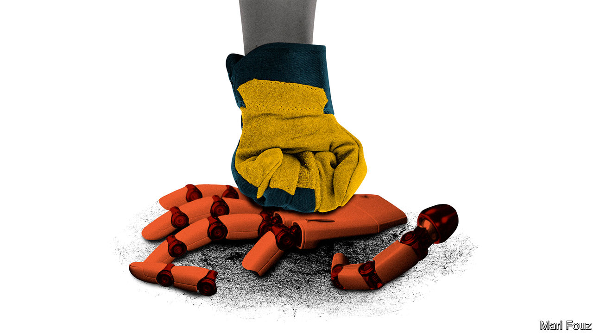

###### Schumpeter

# The battle between American workers and technology heats up 

##### The flashpoints are AI and electric vehicles 

 

> Aug 15th 2023 

For more than 200 years Luddites have received bad press—worse even than the British Members of Parliament who voted in 1812 to put to death convicted machine-breakers. Yet even at the time, the aggrieved weavers won popular sympathy, including that of Lord Byron. In an “Ode to Framers of the Frame Bill” the poet wrote: “Some folks for certain have thought it was shocking/ When Famine appeals, and when Poverty groans/ That life should be valued at less than a stocking/ And breaking of frames lead to breaking of bones.” He used his maiden speech in the House of Lords to urge for a mixture of “conciliation and firmness” in dealing with the mob, rather than lopping off its “superfluous heads”. 

Once again, technological upheaval is rife and there is a widespread feeling that the old ways are in danger of being trampled under foot by the march of progress. In America two big labour disputes—one looming, the other well under way—are, among other things, grappling with potentially seismic transformations caused by decarbonisation and  (AI).

The United Auto Workers (UAW) union, representing employees of Ford, General Motors and Stellantis (maker of Chrysler and Fiat), is threatening a strike when labour contracts end on September 14th. As well as fighting for sharply higher pay, one of its goals is to extend wages and other benefits offered in conventional car manufacturing to people working on electric vehicles (EVs), the production of which typically uses more robots and fewer blue-collar workers. Over in , writers and actors are at an impasse with studios over pay and conditions in the streaming era, a dispute that has been muddied by the vexing question of how AI will reshape the industry if new tools can be used to write scripts or simulate actors. Such struggles may shape how workers in other industries view the impact of technology on their jobs.

A new generation of union leaders has come out swinging. Shawn Fain is the first president of the UAW in 70 years to emerge from outside the union’s ruling clique. He was elected in March by the rank and file, after a years-long corruption scandal led to a change in the union’s voting procedures. From the start, Mr Fain has cast himself as a firebrand. He publicly threw a bargaining proposal from Stellantis into the bin. (The biggest shareholder in the firm, Exor, part-owns’s parent company.) Meanwhile, the Writers Guild of America and SAG-AFTRA, which represents actors, have gone on strike simultaneously for the first time in more than 60 years. Fran Drescher, leader of the actors’ guild (and star of “The Nanny”, a 1990s sitcom) has made clear that the showdown is part of a wider struggle. “The eyes of labour are upon us,” she said in a thundering speech announcing the strike.

The fights are taking place in an unusually supportive environment for unions. Late last month more than half of the Senate’s Democrats signed a letter to the “Big Three” carmakers arguing that workers at their battery plants should be eligible for the same deal offered to other UAW members. President Joe Biden, who equates “good” jobs with union jobs, has just reinstated a rule shelved during the Reagan administration that will, in effect, boost wages for construction workers on government-backed projects. Nationwide, public support for unions is at 71%, its highest level since the mid-1960s, according to Gallup, a pollster. Both in Detroit and in Hollywood, unions are tapping into growing popular disquiet over ballooning pay for CEOs. Even the Republicans, though vehemently anti-union, are trying to rebrand their relationship with workers. American Compass, a conservative think-tank, calls for the creation of worker-management committees, similar to Europe’s “work councils”, which give employees a voice in how a business is run.

Some academics contend that workers are right to be wary of technological change. “Power and Progress”, a newish book by Daron Acemoglu and Simon Johnson, both of the Massachusetts Institute of Technology, wades through a thousand years of history to argue that new technologies lead to better livelihoods only when they create jobs, rather than just cost savings, and when countervailing forces, such as unions, shape their effect. It berates techno-optimism, and at times sounds like a Luddites’ manifesto. 

Speaking to your columnist, Mr Johnson expresses optimism that the UAW and the Big Three can find a way to ensure the switch to EVs does not lead to widespread job losses. He points to the eventual embrace by unions of the containerisation of shipping, which saved countless hours of labour at ports but also led to a surge in the amount of cargo that passed through them, preserving jobs and benefits for dockers. In theory, as EV production scales up, prices will come down and more drivers will buy them. If they put their feet on the gas the Big Three may even be able to reverse the decline in America’s car exports, fuelling demand for even more workers. Massive subsidies handed out by the Biden administration to promote EV production afford the industry a rare opportunity to regain the initiative.

Bish, bash, bot

By contrast, Mr Johnson’s prognosis for writers and actors in the age of AI is darker, likening their plight to that of the weavers-cum-Luddites whose jobs were rendered unnecessary by machines. That view helps explain why they are seeking to curtail studios’ use of AI. Yet the technology’s impact on Tinseltown need not be zero-sum. By speeding up the writing process, for instance, AI could lower costs and allow more content to be created.

What’s more, the gales of creative destruction can be held back only for so long. For unions to secure their members’ livelihoods they need to work with technological change, rather than against it. That means using a Byronesque combination of conciliation and firmness to ensure that it is used to grow the pie for everyone, rather than doubling down on anti-corporate rage. If not they may end up, like the Luddites, on the wrong side of history. ■


