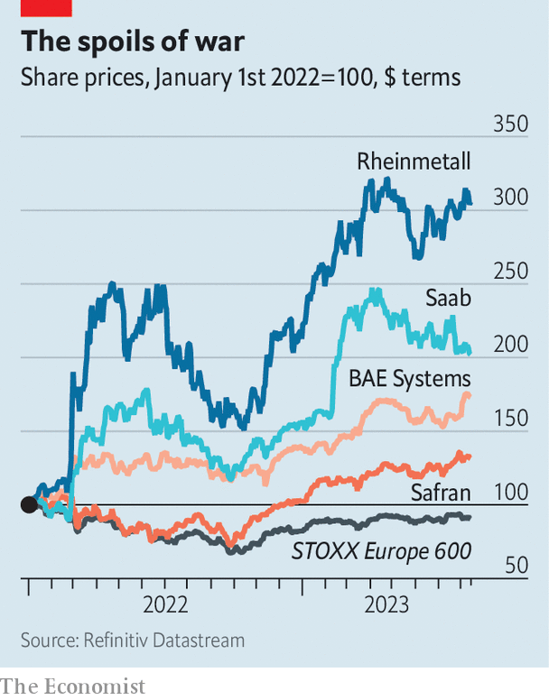

###### Dusting off the guns

# War in Ukraine has triggered a boom in Europe’s defence industry 

##### It is still dogged by inefficiencies 

 

> Aug 17th 2023 


“WE ARE WORKING flat-out,” says Armin Papperger, chief executive of Rheinmetall, Germany’s biggest arms-maker. Ever since Russia invaded Ukraine in February last year, the Düsseldorf-based maker of tanks, ammunition and other military kit has been inundated with orders. On August 10th the firm reported that sales of its military ware in the first half of the year had risen by 12% compared with the same period in 2022, and Mr Papperger expects growth to hit 20-30% for the year as a whole. A few days later the company said it had secured an order from the Ukrainian army for drones, and on August 18th it is due to inaugurate a large new factory in Hungary. Its share price has roughly tripled since the start of last year.

In the decades after the end of the cold war Western defence budgets dwindled, procurement decisions were put on ice and the industry scaled back its production. The war in Ukraine has jolted it back into action. “Defence budgets move with the geopolitical threat,” says George Zhao of Bernstein, a broker. That threat is now all too clear to governments, leading to a deluge of demand for arms. Nowhere is that more true than in Europe.

 


Last year military budgets worldwide rose by 3.7%, to $2.2trn. In Europe they increased by 13%, faster than in any other region. Growth was particularly pronounced in countries nearest to Russia. Finland’s military budget rose by 36%, Lithuania’s by 27%, Sweden’s by 12% and Poland’s by 11%. Germany, the continent’s largest economy, is at last reversing its decades-long miserliness over military spending. In February last year the government pledged to increase the country’s defence expenditure from around 1.4% of GDP to 2% and announced a €100bn ($110bn) “special fund” for the armed forces. 

That is translating into big business for European defence contractors, who have secured a flurry of new contracts for military ware in recent months. In April the British arm of MBDA, a pan-European maker of missiles, signed a £1.9bn ($2.4bn) contract to supply air-defence systems to Poland. In June Safran, a French arms-maker, sold several tactical drones to the Greek army. In July BAE Systems, a British defence firm, struck a deal to replenish the British army’s stock of artillery shells. That same month Rheinmetall won a contract for munitions from the German government worth up to €4bn and a €1.9bn contract to supply the Germans and Dutch with more than 3,000 airborne vehicles. “This will be our best year for orders ever,” rejoices Rheinmetall’s Mr Papperger.

Industry analysts expect order books to keep getting fatter as the continent upgrades its armies. If anything, European governments expect the security environment to become more threatening in the years ahead. “The upwards trend of defence expenditure will last,” predicts Lucie Béraud-Sudreau of the Stockholm International Peace Research Institute (SIPRI), a think-tank. Last year Rheinmetall added 2,000 staff to its almost 30,000 workers, and plans to continue hiring. Saab, a Swedish peer, added 1,000 to its 18,000. 

Yet not all is rosy for Europe’s arms-makers. In June the industry’s bosses met European defence ministers at NATO’s headquarters in Brussels to air a number of grievances about how the industry operates on the continent.

One problem is a lack of visibility. Michael Schöllhorn, head of the defence division of Airbus, a European aerospace giant, complains that many countries offer little guidance on their long-term spending plans, making it hard for companies to invest. Micael Johansson, boss of Saab, grumbles that his firm has so far taken on all the risk of increasing production.

Bosses also bemoan the red tape that drags out defence procurement. In Germany, any defence contract worth more than a paltry €25m must be approved by the Bundestag’s budget committee, leading to painful delays. After Olaf Scholz, Germany’s chancellor, announced the country’s new military fund in February last year, it took until December for lawmakers to approve a €13bn spending package for fighter jets and other military equipment.

A final problem is the lack of co-ordination among European allies. Many governments opt to buy tanks and other bits of their war apparatus either from national champions or American firms, limiting the potential for economies of scale among the continent’s defence contractors. While there is much talk of “European defence”, the reality is much more fragmented, says Airbus’s Mr Schöllhorn. Saab’s Mr Johansson argues that, after years of under-investment, European defence contractors will need to work together on issues such as supply-chain bottlenecks in order to meet booming demand.

These difficulties, however, may ease over time. European governments are already tidying up their defence procurement. Boris Pistorius, Germany’s newish defence minister, has teamed up with Christian Freuding, an army general, to cut red tape. France’s defence minister, Sébastien Lecornu, is on a similar mission. There are signs of improved co-ordination, too. In November France, Spain and Germany at last struck a deal to build a European fighter jet. And consolidation in Europe’s fragmented defence industry could help. On August 1st Rheinmetall completed its acquisition of Expal, a Spanish maker of ammunition. Mr Johansson thinks that more such tie-ups are likely. 

The war in Ukraine marked a sharp reversal from decades of peace in Europe. For the continent’s armsmakers, who languished during the geopolitical calm, it points to a more profitable future. ■


