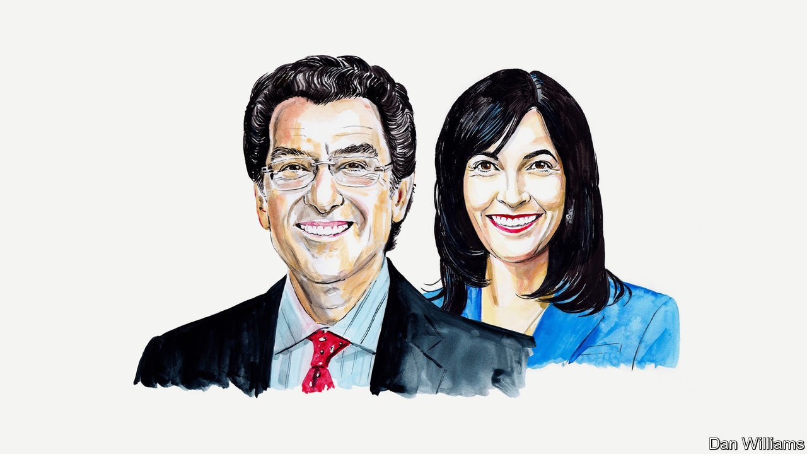

###### American politics

# Hold Donald Trump and his allies accountable at every level, say Norm Eisen and Joanna Lydgate 

##### The pair believe that both state and federal investigations are necessary to protect American democracy 

 

> Aug 14th 2023 


A PROSECUTOR IN Georgia appears ready to unveil criminal charges against Donald Trump, for attempting to reverse his loss in that state in the presidential election of 2020. These charges will land not long after Jack Smith, the Justice Department’s special counsel, filed his historic four-count indictment of the former president for trying to overthrow the entire national election and remain in power. And last month Dana Nessel, Michigan’s attorney-general, filed conspiracy and forgery charges against the 16 people who pretended to be Michigan’s representatives to the electoral college in order to vote for Mr Trump, even though Joe Biden won the state.

The federal indictment has rightly been interpreted as a grave legal threat to the former president (though he denies any wrongdoing). But the forthcoming charges in Georgia, the existing ones in Michigan and others which may follow are equally important to defend voters in those jurisdictions and to achieve true accountability.

With Mr Smith’s federal case moving along at a brisk clip, eyes are now turning to the Georgia prosecutor, Fani Willis, the district attorney of Fulton County. As soon as this week, she is widely expected to go well beyond Mr Trump in her own charging documents; there are reported to be more than a dozen defendants, possibly including pro-Trump imposter electors and Georgia Republican Party officials. The federal indictment may yet expand, and the special counsel’s investigation continues. But the 2020 plot had dozens of foot soldiers, and state and local prosecutors are pursuing consequences for them. An alleged crime that caused harm nationally and in numerous states deserves both a federal and a state-by-state response.

This is because state and local prosecutors have different goals. They swear oaths to uphold the laws of their own jurisdictions, on behalf of the people. That means defending people’s right to have their votes counted, and defending the results of our free and fair elections. And it’s why state and local prosecutors are justified in bringing charges for the pieces of the 2020 plot relevant to their own states.

Mr Smith has focused his federal case squarely on Mr Trump and the conspiracy he allegedly led to obstruct the electoral count and defraud the country. The special counsel has evidently done so because he wants a quick trial. That is for good reason: the American people deserve to know as soon as possible whether the former president—and leading candidate for a major party’s nomination in 2024—is a felon.

However, the federal indictment also describes Mr Trump’s attempts to subvert legitimate election results in seven states, including Georgia and Michigan. So it is fair to ask, as some observers have, whether we are now going to have seven separate state and local indictments on top of the federal one.

It appears not, as a number of states do not seem to be moving forward. But it is fair for different states to make different decisions—and if several decide to address the harm within their borders, that is fine, too. In the decentralised American system, elections are guided by state and local laws. State and local leaders, including attorneys-general and district attorneys, have a responsibility to defend those laws and the voters they represent.

In each of the seven states, Mr Trump and his associates were allegedly trying to take away the voices of voters—their freedom to decide elections for themselves. State and local prosecutors are defending that most fundamental freedom. By bringing charges, they are sending a message: don’t try this in our state ever again.

Ms Nessel put it simply: the fake electors “plainly violated the laws by which we administer our elections in Michigan”. It would be dereliction of duty, she explained, to fail to address “overwhelming evidence of an organised effort to circumvent the lawfully cast ballots of millions of Michigan voters in a presidential election”.

Mr Trump disrupted the peaceful transfer of power for the first time in American history. We must make sure no future president tries anything like that ever again. Our guiding principles must be no tolerance of attacks on our elections, and accountability at every level. No dimension of this assault on democracy should be left unexamined.

As Mr Trump’s indictments pile up, the numerous cases will inevitably collide with the 2024 political calendar. But as the judge in the federal election case wisely observed, the administration of justice must proceed regardless of any defendant’s schedule or “day job”—even if that job is a presidential campaign.

If he is indicted in Georgia, Mr Trump may lean on the same defences he plans to use in the federal case. They don’t hold up. He may claim, for example, that the First Amendment’s free-speech protections apply to his phone call demanding that Georgia’s secretary of state find enough votes to give him a victory. But criminal conduct, including the pressuring of state officials, is not protected speech. He may argue that he genuinely believed the election was stolen from him in Georgia, but such a belief would not allow him to break the law.

Mr Trump and his enablers in the media may well react to any indictment in Georgia by claiming (once again) that it is part of a political feeding frenzy and attacking the credibility of duty-bound officials. But those attacks will be in bad faith. They are part of a strategy to threaten and scare state and local prosecutors into shying away from taking on tough cases like these.

This is not personal, and it is not political. It is not about getting Mr Trump at all costs. It’s about taking every possible step to protect American democracy and the rule of law. Ms Willis will be the latest to take that step, and she will be walking on solid ground when she does—and paving the way for others. ■


